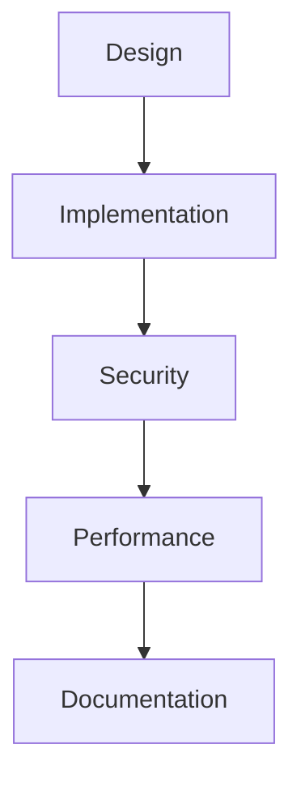
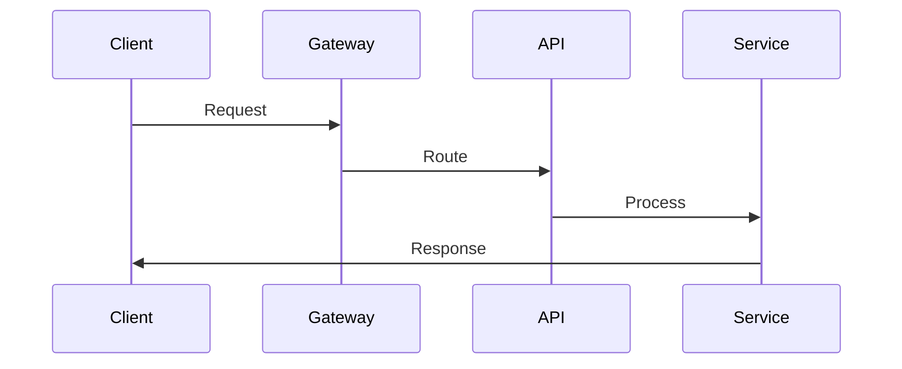

# API Architecture

## Overview

This document outlines our API architecture, establishing patterns and practices for building and maintaining our service interfaces.

## Components

### API Stack


### Key Components
1. API Design
   - REST principles
   - GraphQL schemas
   - Versioning
   - Resource modeling

2. Implementation
   - Endpoints
   - Controllers
   - Middleware
   - Error handling

3. Security
   - Authentication
   - Authorization
   - Rate limiting
   - Input validation

4. Performance
   - Caching
   - Optimization
   - Load balancing
   - Monitoring

## Interactions

### API Flow


## Implementation Details

### API Configuration
```typescript
interface APIConfig {
  design: DesignConfig;
  implementation: ImplementationConfig;
  security: SecurityConfig;
  performance: PerformanceConfig;
}

interface DesignConfig {
  version: string;
  resources: Resource[];
  schemas: Schema[];
  standards: Standard[];
}
```

### Performance Rules
```typescript
interface PerformanceRule {
  endpoint: string;
  threshold: number;
  optimization: OptimizationMethod;
  priority: number;
}
```

### API Standards
- Design principles
- Implementation patterns
- Security requirements
- Performance targets
- Documentation standards

## Related Documentation
- [Standards](./standards.md)
- [Security Architecture](../security/security-architecture.md)
- [Performance](../infrastructure/performance.md)
- [Documentation](../infrastructure/documentation.md)
