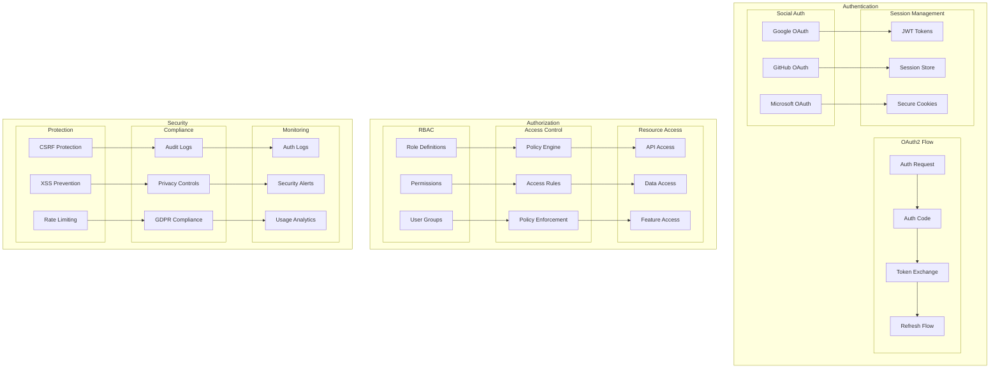

# Authentication and Authorization Architecture

This diagram illustrates our comprehensive auth system including OAuth2, RBAC, and security measures.

## Auth Architecture Diagram

## Component Description

### Authentication

1. **OAuth2 Flow**

   - Authorization requests
   - Code exchange
   - Token management
   - Refresh mechanism

2. **Social Auth**

   - Provider integration
   - Profile mapping
   - Scope management

3. **Session Management**
   - Token handling
   - Session storage
   - Cookie security

### Authorization

1. **RBAC System**

   - Role management
   - Permission sets
   - Group hierarchy

2. **Access Control**

   - Policy definition
   - Rule evaluation
   - Access enforcement

3. **Resource Access**
   - API security
   - Data protection
   - Feature gates

## Implementation Guidelines

1. **Auth Flow**

   - OAuth2 setup
   - Token lifecycle
   - Session handling
   - Error flows

2. **Security**

   - CSRF protection
   - XSS prevention
   - Rate limiting
   - Input validation

3. **Compliance**

   - Audit logging
   - Privacy controls
   - GDPR compliance
   - Data retention

4. **Best Practices**

   - Secure defaults
   - Least privilege
   - Regular audits
   - Token rotation

5. **Monitoring**

   - Auth logging
   - Alert system
   - Usage tracking
   - Anomaly detection

6. **Documentation**
   - Flow diagrams
   - Security guides
   - API documentation
   - Compliance docs
