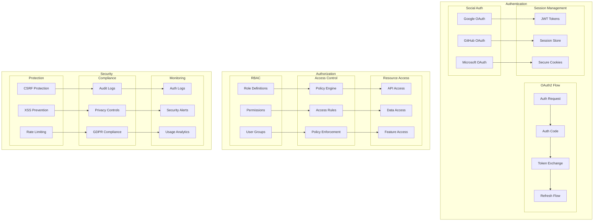
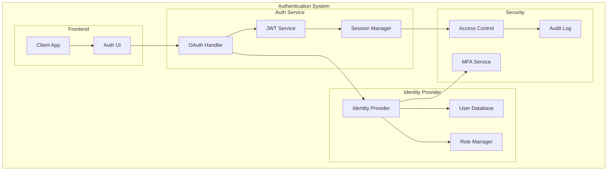
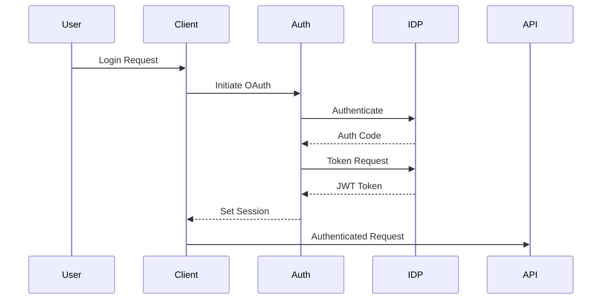

# Authentication and Authorization Architecture

This diagram illustrates our comprehensive auth system including OAuth2, RBAC, and security measures.

## Auth Architecture Diagram



## Component Description

### Authentication

1. **OAuth2 Flow**

   - Authorization requests
   - Code exchange
   - Token management
   - Refresh mechanism

2. **Social Auth**

   - Provider integration
   - Profile mapping
   - Scope management

3. **Session Management**
   - Token handling
   - Session storage
   - Cookie security

### Authorization

1. **RBAC System**

   - Role management
   - Permission sets
   - Group hierarchy

2. **Access Control**

   - Policy definition
   - Rule evaluation
   - Access enforcement

3. **Resource Access**
   - API security
   - Data protection
   - Feature gates

## Implementation Guidelines

1. **Auth Flow**

   - OAuth2 setup
   - Token lifecycle
   - Session handling
   - Error flows

2. **Security**

   - CSRF protection
   - XSS prevention
   - Rate limiting
   - Input validation

3. **Compliance**

   - Audit logging
   - Privacy controls
   - GDPR compliance
   - Data retention

4. **Best Practices**

   - Secure defaults
   - Least privilege
   - Regular audits
   - Token rotation

5. **Monitoring**

   - Auth logging
   - Alert system
   - Usage tracking
   - Anomaly detection

6. **Documentation**
   - Flow diagrams
   - Security guides
   - API documentation
   - Compliance docs

## Authentication Architecture

This document outlines the authentication system architecture, detailing how user authentication and session management are implemented across our applications.

### Overview

Our authentication architecture implements a secure, scalable OAuth2-based system with JWT tokens for session management. It provides single sign-on capabilities across our applications while maintaining strict security standards and user privacy.

### Components

- **Identity Provider**: OAuth2/OpenID Connect service
- **Auth Service**: Authentication and token management
- **Session Manager**: User session handling
- **Security Layer**: Access control and protection



### Interactions

The authentication flow follows these key interactions:

1. User initiates authentication
2. OAuth2 flow handles authorization
3. JWT tokens manage sessions
4. Access control enforces permissions



### Implementation Details

#### Technical Stack

- OAuth2/OpenID Connect: Authentication protocol
- JWT: Token management
- Redis: Session storage
- PostgreSQL: User data storage
- Passport.js: Authentication middleware

#### Key Configurations

```typescript
// auth.config.ts
export const authConfig = {
  oauth: {
    clientId: process.env.OAUTH_CLIENT_ID,
    clientSecret: process.env.OAUTH_CLIENT_SECRET,
    callbackUrl: '/auth/callback',
    scope: ['openid', 'profile', 'email']
  },
  jwt: {
    expiresIn: '1h',
    algorithm: 'RS256'
  },
  session: {
    store: 'redis',
    ttl: 86400
  }
};
```

#### Error Handling

- **Authentication Failures**: Clear error messages and recovery flows
- **Token Expiration**: Automatic refresh mechanisms
- **Invalid Sessions**: Graceful session termination
- **Rate Limiting**: Prevent brute force attacks

#### Performance Considerations

- **Token Caching**: Reduce authentication overhead
- **Session Distribution**: Scale across multiple nodes
- **Connection Pooling**: Optimize database connections
- **Request Throttling**: Prevent DoS attacks

## Related Documentation

- [Security Architecture](../security/security-layers.md)
- [OAuth2 Flow](../security/oauth2-flow.md)
- [Authorization](../security/authorization.md)
