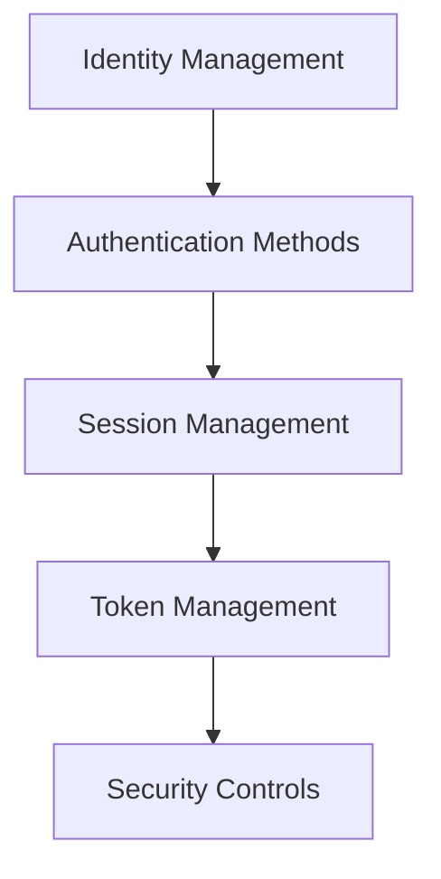
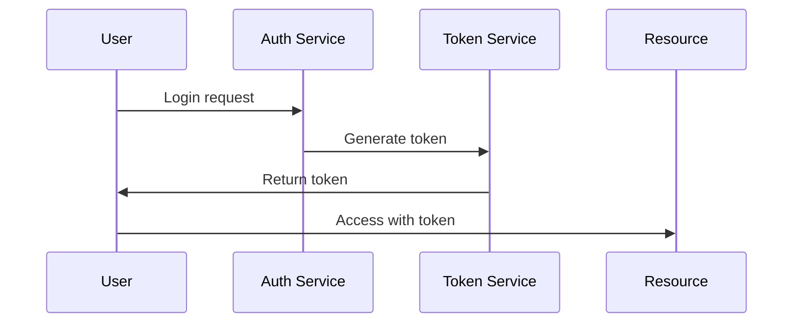

# Authentication Architecture

## Overview

This document outlines our authentication architecture, establishing secure and scalable user authentication across our system.

## Components

### Authentication Stack


### Key Components
1. Identity Management
   - User registration
   - Profile management
   - Identity verification
   - Account recovery

2. Authentication Methods
   - Password-based
   - Multi-factor
   - SSO integration
   - Biometric auth

3. Session Management
   - Session creation
   - Session validation
   - Session expiry
   - Session refresh

4. Token Management
   - Token generation
   - Token validation
   - Token refresh
   - Token revocation

## Interactions

### Authentication Flow


## Implementation Details

### Authentication Configuration
```typescript
interface AuthConfig {
  identity: IdentityConfig;
  methods: AuthMethod[];
  session: SessionConfig;
  tokens: TokenConfig;
}

interface IdentityConfig {
  providers: Provider[];
  verification: VerificationMethod[];
  recovery: RecoveryOption[];
  storage: StorageConfig;
}
```

### Security Rules
```typescript
interface SecurityRule {
  type: SecurityType;
  requirements: Requirement[];
  validation: ValidationMethod;
  action: SecurityAction;
}
```

### Authentication Standards
- Identity verification
- Password requirements
- Session policies
- Token management
- Security controls

## Related Documentation
- [Authorization](./authorization.md)
- [Security Architecture](../security/security-architecture.md)
- [Session Management](../data-flow/session-management.md)
- [Key Management](./key-management.md)
