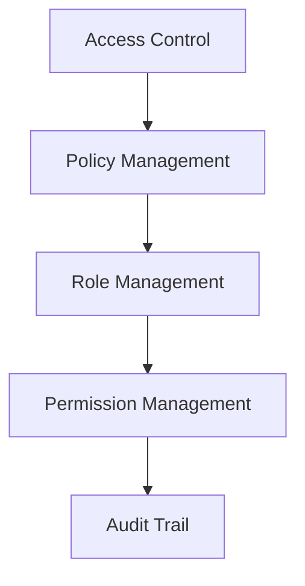
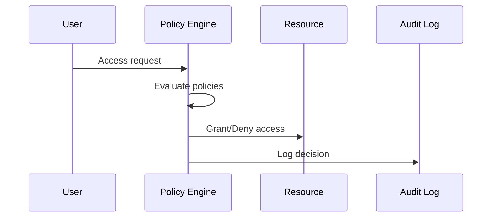

# Authorization Architecture

## Overview

This document outlines our authorization architecture, establishing secure and granular access control across our system.

## Components

### Authorization Stack


### Key Components
1. Access Control
   - Access decisions
   - Resource protection
   - Context evaluation
   - Access enforcement

2. Policy Management
   - Policy definition
   - Policy evaluation
   - Policy versioning
   - Policy distribution

3. Role Management
   - Role definition
   - Role hierarchy
   - Role assignment
   - Role review

4. Permission Management
   - Permission definition
   - Permission grouping
   - Permission assignment
   - Permission review

## Interactions

### Authorization Flow


## Implementation Details

### Authorization Configuration
```typescript
interface AuthzConfig {
  access: AccessConfig;
  policies: PolicyConfig;
  roles: RoleConfig;
  permissions: PermissionConfig;
}

interface PolicyConfig {
  rules: PolicyRule[];
  evaluators: Evaluator[];
  conditions: Condition[];
  actions: Action[];
}
```

### Access Rules
```typescript
interface AccessRule {
  resource: Resource;
  conditions: Condition[];
  permissions: Permission[];
  effect: Effect;
}
```

### Authorization Standards
- Access control models
- Policy requirements
- Role definitions
- Permission scopes
- Audit requirements

## Related Documentation
- [Authentication](./authentication.md)
- [Security Architecture](../security/security-architecture.md)
- [Access Control](../security/access-control.md)
- [Audit Logging](../infrastructure/audit-logging.md)
