# Caching Architecture

This diagram illustrates our multi-level caching strategy across the application.

## Caching Architecture Diagram

```mermaid
graph TB
    subgraph "Cache Layers"
        subgraph "Browser Cache"
            LocalStorage[Local Storage]
            SessionStorage[Session Storage]
            ServiceWorker[Service Worker]
        end

        subgraph "CDN Cache"
            EdgeCache[Edge Cache]
            StaticCache[Static Assets]
            ImageCache[Image Cache]
        end

        subgraph "Application Cache"
            RedisCache[Redis Cache]
            MemoryCache[Memory Cache]
            QueryCache[Query Cache]
        end

        subgraph "Database Cache"
            DBCache[DB Cache]
            QueryPlan[Query Plan]
            ResultSet[Result Set]
        end
    end

    subgraph "Cache Strategies"
        subgraph "Patterns"
            CacheAside[Cache Aside]
            WriteThrough[Write Through]
            WriteBack[Write Back]
            ReadThrough[Read Through]
        end

        subgraph "Policies"
            TTL[Time To Live]
            LRU[LRU Policy]
            Eviction[Eviction Rules]
        end
    end

    subgraph "Implementation"
        subgraph "Client Side"
            ReactQuery[React Query]
            SWR[SWR]
            Apollo[Apollo Cache]
        end

        subgraph "Server Side"
            NextCache[Next.js Cache]
            APICache[API Cache]
            DataCache[Data Cache]
        end
    end

    subgraph "Monitoring"
        subgraph "Metrics"
            HitRate[Hit Rate]
            MissRate[Miss Rate]
            LatencyStats[Latency]
        end

        subgraph "Health"
            Memory[Memory Usage]
            Fragmentation[Fragmentation]
            Throughput[Throughput]
        end
    end

    %% Cache Layer Flow
    LocalStorage --> EdgeCache
    SessionStorage --> StaticCache
    ServiceWorker --> ImageCache

    EdgeCache --> RedisCache
    StaticCache --> MemoryCache
    ImageCache --> QueryCache

    RedisCache --> DBCache
    MemoryCache --> QueryPlan
    QueryCache --> ResultSet

    %% Strategy Flow
    CacheAside --> TTL
    WriteThrough --> LRU
    WriteBack --> Eviction
    ReadThrough --> TTL

    %% Implementation Flow
    ReactQuery --> NextCache
    SWR --> APICache
    Apollo --> DataCache

    %% Monitoring Flow
    HitRate --> Memory
    MissRate --> Fragmentation
    LatencyStats --> Throughput
```

## Component Description

### Cache Layers

1. **Browser Cache**

   - Local storage
   - Session storage
   - Service worker

2. **CDN Cache**

   - Edge caching
   - Static assets
   - Image optimization

3. **Application Cache**

   - Redis caching
   - Memory caching
   - Query caching

4. **Database Cache**
   - Database cache
   - Query planning
   - Result sets

### Cache Strategies

1. **Patterns**

   - Cache aside
   - Write through
   - Write back
   - Read through

2. **Policies**
   - TTL management
   - LRU implementation
   - Eviction rules

## Implementation Guidelines

1. **Cache Design**

   - Layer selection
   - Strategy choice
   - Policy definition
   - Key structure

2. **Data Flow**

   - Write patterns
   - Read patterns
   - Invalidation
   - Consistency

3. **Performance**

   - Hit rates
   - Miss penalties
   - Latency goals
   - Memory usage

4. **Best Practices**

   - Key naming
   - TTL settings
   - Memory limits
   - Monitoring

5. **Optimization**

   - Prefetching
   - Warm-up
   - Compression
   - Sharding

6. **Documentation**
   - Cache topology
   - Strategy guides
   - Key schemas
   - Metrics guide
