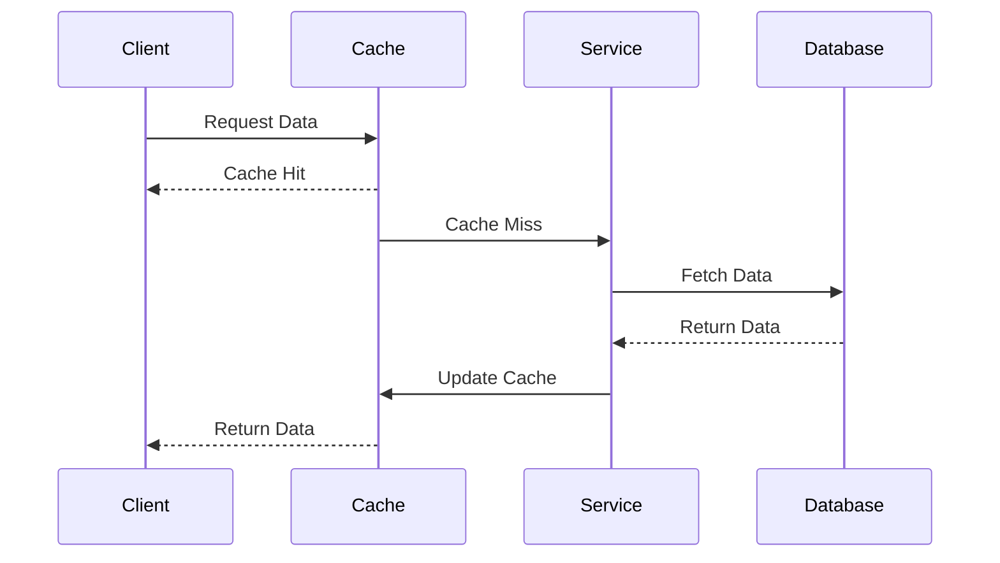
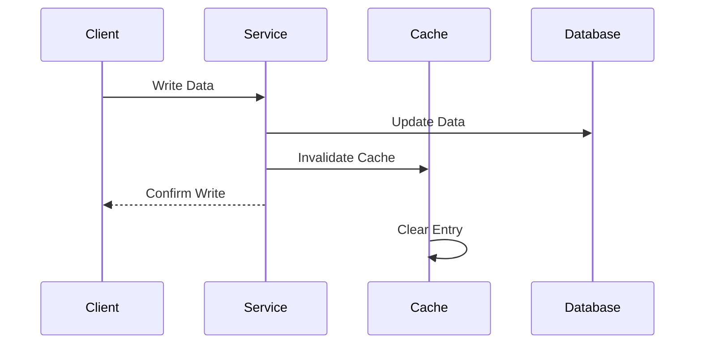
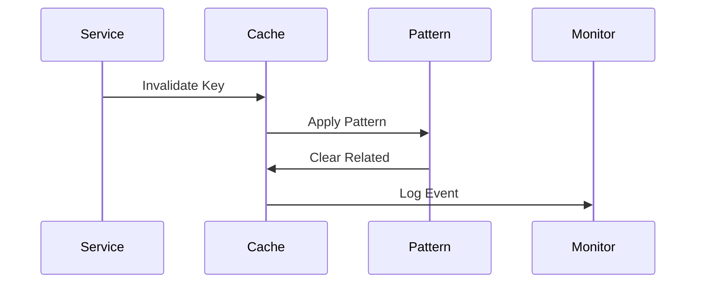

# Caching Architecture

## Overview

The Caching Architecture provides a multi-layered caching strategy to optimize performance and reduce load across the entire application stack. This architecture implements various caching patterns and policies to ensure efficient data access and delivery.

Key Features:
- Multi-level caching
- Distributed caching
- Cache invalidation
- Performance monitoring
- Automatic optimization

Benefits:
- Reduced latency
- Lower server load
- Better scalability
- Cost efficiency
- Improved UX

## Components

### Cache Layers
1. **Browser Cache**

   - Local storage
   - Session storage
   - Service worker
   - Memory cache

2. **CDN Cache**

   - Edge caching
   - Static assets
   - Image optimization
   - Content delivery

3. **Application Cache**

   - Redis cache
   - Memory cache
   - Query cache
   - Data cache

4. **Database Cache**
   - Database cache
   - Query planning
   - Result sets

### Cache Strategies

1. **Patterns**

   - Cache aside
   - Write through
   - Write back
   - Read through

2. **Policies**
   - TTL management
   - LRU eviction
   - Cache invalidation
   - Consistency rules

3. **Cache Monitoring**
   - Hit/miss rates
   - Memory usage
   - Cache efficiency
   - Performance metrics

## Interactions

The caching system follows these key workflows:

1. Read Flow


2. Write Flow


3. Invalidation Flow


## Implementation Details

### Cache Manager Implementation
```typescript
interface CacheConfig {
  ttl: number;
  maxSize: number;
  policy: CachePolicy;
  patterns: CachePattern[];
}

class CacheManager {
  private config: CacheConfig;
  private store: CacheStore;
  private monitor: CacheMonitor;
  
  constructor(config: CacheConfig) {
    this.config = config;
    this.store = new CacheStore();
    this.monitor = new CacheMonitor();
  }
  
  async get<T>(
    key: string,
    fetcher: DataFetcher<T>
  ): Promise<T> {
    const cached = await this.store.get(key);
    
    if (cached && !this.isStale(cached)) {
      await this.monitor.recordHit(key);
      return cached.data;
    }
    
    const data = await this.fetchAndCache(
      key,
      fetcher
    );
    
    await this.monitor.recordMiss(key);
    return data;
  }
  
  private isStale(
    entry: CacheEntry
  ): boolean {
    const age = Date.now() - entry.timestamp;
    return age > this.config.ttl;
  }
}
```

### Invalidation Manager Implementation
```typescript
interface InvalidationConfig {
  patterns: InvalidationPattern[];
  cascade: boolean;
  delay: number;
}

class InvalidationManager {
  private config: InvalidationConfig;
  private patterns: Map<string, InvalidationPattern>;
  private queue: InvalidationQueue;
  
  constructor(config: InvalidationConfig) {
    this.config = config;
    this.patterns = new Map();
    this.queue = new InvalidationQueue();
  }
  
  async invalidate(
    key: string,
    options?: InvalidateOptions
  ): Promise<void> {
    const pattern = this.findPattern(key);
    
    if (!pattern) {
      await this.invalidateKey(key);
      return;
    }
    
    await this.invalidatePattern(
      pattern,
      key,
      options
    );
  }
  
  private async invalidatePattern(
    pattern: InvalidationPattern,
    key: string,
    options?: InvalidateOptions
  ): Promise<void> {
    const keys = await pattern.getRelatedKeys(key);
    
    if (this.config.cascade) {
      await this.cascadeInvalidation(keys);
    } else {
      await this.batchInvalidation(keys);
    }
  }
}
```

### Monitoring Manager Implementation
```typescript
interface MonitoringConfig {
  metrics: MetricConfig[];
  alerts: AlertConfig[];
  reporting: ReportConfig;
}

class CacheMonitor {
  private config: MonitoringConfig;
  private metrics: MetricCollector;
  private alerts: AlertManager;
  
  constructor(config: MonitoringConfig) {
    this.config = config;
    this.metrics = new MetricCollector();
    this.alerts = new AlertManager();
  }
  
  async recordMetrics(
    event: CacheEvent
  ): Promise<void> {
    await this.metrics.collect(event);
    
    const stats = await this.calculateStats(
      event.cache
    );
    
    await this.checkThresholds(stats);
  }
  
  private async calculateStats(
    cache: string
  ): Promise<CacheStats> {
    const data = await this.metrics.query({
      cache,
      period: this.config.reporting.period
    });
    
    return this.computeStatistics(data);
  }
}
```

## Caching Architecture Diagram

```mermaid
graph TB
    subgraph "Cache Layers"
        subgraph "Browser Cache"
            LocalStorage[Local Storage]
            SessionStorage[Session Storage]
            ServiceWorker[Service Worker]
        end

        subgraph "CDN Cache"
            EdgeCache[Edge Cache]
            StaticCache[Static Assets]
            ImageCache[Image Cache]
        end

        subgraph "Application Cache"
            RedisCache[Redis Cache]
            MemoryCache[Memory Cache]
            QueryCache[Query Cache]
        end

        subgraph "Database Cache"
            DBCache[DB Cache]
            QueryPlan[Query Plan]
            ResultSet[Result Set]
        end
    end

    subgraph "Cache Strategies"
        subgraph "Patterns"
            CacheAside[Cache Aside]
            WriteThrough[Write Through]
            WriteBack[Write Back]
            ReadThrough[Read Through]
        end

        subgraph "Policies"
            TTL[Time To Live]
            LRU[LRU Policy]
            Eviction[Eviction Rules]
        end
    end

    subgraph "Implementation"
        subgraph "Client Side"
            ReactQuery[React Query]
            SWR[SWR]
            Apollo[Apollo Cache]
        end

        subgraph "Server Side"
            NextCache[Next.js Cache]
            APICache[API Cache]
            DataCache[Data Cache]
        end
    end

    subgraph "Monitoring"
        subgraph "Metrics"
            HitRate[Hit Rate]
            MissRate[Miss Rate]
            LatencyStats[Latency]
        end

        subgraph "Health"
            Memory[Memory Usage]
            Fragmentation[Fragmentation]
            Throughput[Throughput]
        end
    end

    %% Cache Layer Flow
    LocalStorage --> EdgeCache
    SessionStorage --> StaticCache
    ServiceWorker --> ImageCache

    EdgeCache --> RedisCache
    StaticCache --> MemoryCache
    ImageCache --> QueryCache

    RedisCache --> DBCache
    MemoryCache --> QueryPlan
    QueryCache --> ResultSet

    %% Strategy Flow
    CacheAside --> TTL
    WriteThrough --> LRU
    WriteBack --> Eviction
    ReadThrough --> TTL

    %% Implementation Flow
    ReactQuery --> NextCache
    SWR --> APICache
    Apollo --> DataCache

    %% Monitoring Flow
    HitRate --> Memory
    MissRate --> Fragmentation
    LatencyStats --> Throughput
```



## Component Description

### Cache Layers

1. **Browser Cache**

   - Local storage
   - Session storage
   - Service worker

2. **CDN Cache**

   - Edge caching
   - Static assets
   - Image optimization

3. **Application Cache**

   - Redis caching
   - Memory caching
   - Query caching

4. **Database Cache**
   - Database cache
   - Query planning
   - Result sets

### Cache Strategies

1. **Patterns**

   - Cache aside
   - Write through
   - Write back
   - Read through

2. **Policies**
   - TTL management
   - LRU implementation
   - Eviction rules

## Implementation Guidelines

1. **Cache Design**

   - Layer selection
   - Strategy choice
   - Policy definition
   - Key structure

2. **Data Flow**

   - Write patterns
   - Read patterns
   - Invalidation
   - Consistency

3. **Performance**

   - Hit rates
   - Miss penalties
   - Latency goals
   - Memory usage

4. **Best Practices**

   - Key naming
   - TTL settings
   - Memory limits
   - Monitoring

5. **Optimization**

   - Prefetching
   - Warm-up
   - Compression
   - Sharding

6. **Documentation**
   - Cache topology
   - Strategy guides
   - Key schemas
   - Metrics guide
