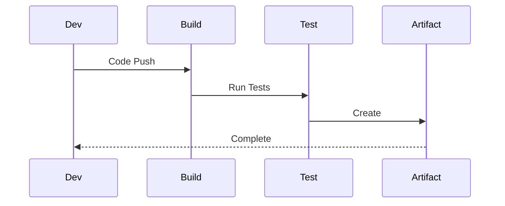
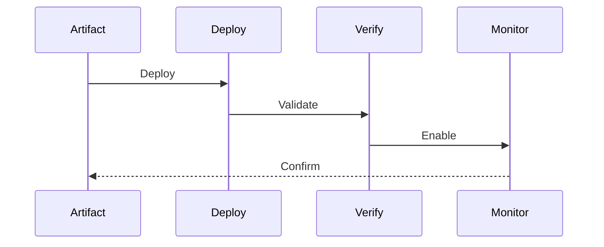
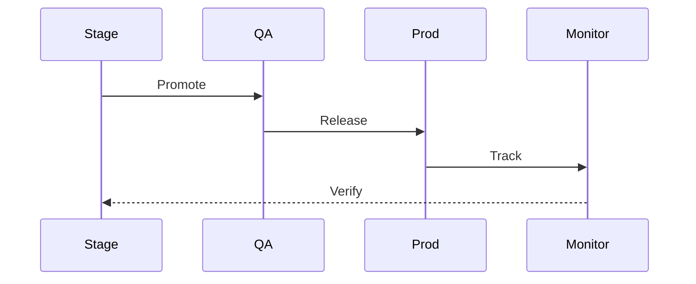
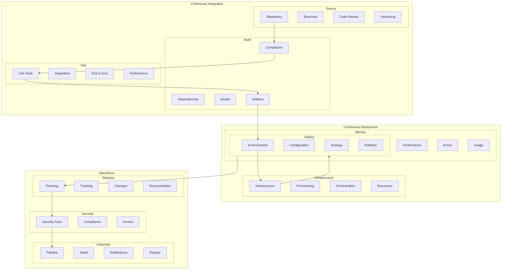

# CI/CD Architecture

## Overview

The CI/CD Architecture provides a comprehensive system for automating the build, test, and deployment processes of our application. This architecture implements modern DevOps practices and ensures reliable software delivery.

Key Features:
- Automated pipelines
- Continuous integration
- Continuous deployment
- Quality gates
- Release management

Benefits:
- Rapid delivery
- Quality assurance
- Process automation
- Risk reduction
- Team efficiency

## Components

### CI Layer
1. Source Control
   - Code repository
   - Branch management
   - Code review
   - Version control

2. Build Process
   - Code compilation
   - Dependency management
   - Asset building
   - Artifact creation

3. Testing Process
   - Unit testing
   - Integration testing
   - E2E testing
   - Performance testing

### CD Layer
1. Deployment Process
   - Environment management
   - Configuration management
   - Release strategy
   - Rollback process

2. Infrastructure
   - Infrastructure as Code
   - Environment provisioning
   - Service orchestration
   - Resource management

3. Monitoring
   - Deployment monitoring
   - Performance monitoring
   - Error tracking
   - Usage analytics

### Operations Layer
1. Release Management
   - Release planning
   - Version management
   - Change tracking
   - Documentation

2. Security
   - Security scanning
   - Dependency scanning
   - Compliance checking
   - Access control

3. Automation
   - Pipeline automation
   - Task automation
   - Notification system
   - Report generation

## Interactions

The CI/CD system follows these key workflows:

1. CI Pipeline Flow


2. CD Pipeline Flow


3. Release Process Flow


## Implementation Details

### Pipeline Manager Implementation
```typescript
interface PipelineConfig {
  stages: StageConfig[];
  triggers: TriggerConfig[];
  notifications: NotificationConfig[];
}

class PipelineManager {
  private config: PipelineConfig;
  private stages: PipelineStage[];
  private triggers: PipelineTrigger[];
  
  constructor(config: PipelineConfig) {
    this.config = config;
    this.stages = this.initStages();
    this.triggers = this.initTriggers();
  }
  
  async execute(
    pipeline: Pipeline,
    options?: ExecuteOptions
  ): Promise<PipelineResult> {
    const triggered = await this.trigger(
      pipeline
    );
    
    const executed = await this.runStages(
      triggered,
      options
    );
    
    return this.notify(executed);
  }
  
  private async runStages(
    pipeline: Pipeline,
    options?: ExecuteOptions
  ): Promise<StageResults> {
    for (const stage of this.stages) {
      await stage.execute(pipeline);
    }
    
    return pipeline.results;
  }
}
```

### Deployment Manager Implementation
```typescript
interface DeployConfig {
  environments: EnvironmentConfig[];
  strategies: StrategyConfig[];
  validations: ValidationConfig[];
}

class DeploymentManager {
  private config: DeployConfig;
  private environments: Environment[];
  private strategies: DeployStrategy[];
  
  constructor(config: DeployConfig) {
    this.config = config;
    this.environments = this.initEnvironments();
    this.strategies = this.initStrategies();
  }
  
  async deploy(
    release: Release,
    options?: DeployOptions
  ): Promise<DeployResult> {
    const environment = await this.selectEnvironment(
      release
    );
    
    const deployed = await this.executeStrategy(
      release,
      environment
    );
    
    return this.validate(deployed);
  }
  
  private async executeStrategy(
    release: Release,
    environment: Environment
  ): Promise<Deployment> {
    return this.strategies.execute(
      release,
      environment
    );
  }
}
```

### Release Manager Implementation
```typescript
interface ReleaseConfig {
  versions: VersionConfig[];
  changes: ChangeConfig[];
  approvals: ApprovalConfig[];
}

class ReleaseManager {
  private config: ReleaseConfig;
  private versions: VersionManager[];
  private changes: ChangeTracker[];
  
  constructor(config: ReleaseConfig) {
    this.config = config;
    this.versions = this.initVersions();
    this.changes = this.initChanges();
  }
  
  async release(
    version: Version,
    options?: ReleaseOptions
  ): Promise<ReleaseResult> {
    const prepared = await this.prepare(
      version
    );
    
    const approved = await this.approve(
      prepared,
      options
    );
    
    return this.publish(approved);
  }
  
  private async approve(
    version: PreparedVersion,
    options?: ReleaseOptions
  ): Promise<ApprovedVersion> {
    return this.config.approvals.approve(
      version,
      options
    );
  }
}
```

## CI/CD Architecture Diagram


