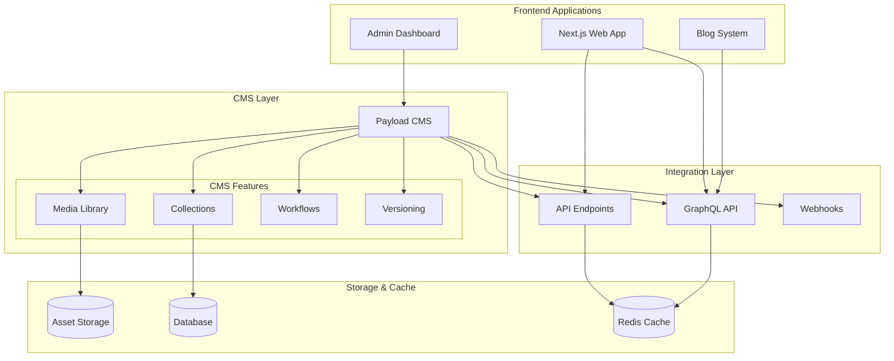

# CMS Integration Architecture

This diagram illustrates the integration of Payload CMS with our system, including the admin dashboard and content delivery architecture.

## CMS Architecture Diagram

## Component Description

### Frontend Layer

- **Next.js Web App**: Main application
- **Admin Dashboard**: CMS management interface
- **Blog System**: Content-driven blog platform

### CMS Core (Payload)

- **Collections**: Content type definitions
- **Media Library**: Asset management
- **Workflows**: Content approval flows
- **Versioning**: Content version control

### Integration Points

- **API Endpoints**: RESTful content API
- **GraphQL API**: Flexible content queries
- **Webhooks**: Event-driven integrations

### Storage Solutions

- **Asset Storage**: Media file storage
- **Database**: Content and metadata storage
- **Cache Layer**: Performance optimization

## Implementation Notes

1. **Content Types**

   - Blog posts
   - Pages
   - Media assets
   - User-generated content
   - Product information

2. **Access Control**

   - Role-based permissions
   - API access control
   - Media access rules
   - Draft/publish workflow

3. **Performance**

   - Content caching
   - Asset optimization
   - Query optimization
   - CDN integration

4. **Integration Features**

   - Preview mode
   - Draft content
   - Scheduled publishing
   - Content relationships

5. **Development Workflow**
   - Content modeling
   - Schema migrations
   - Development/production parity
   - Backup strategies
