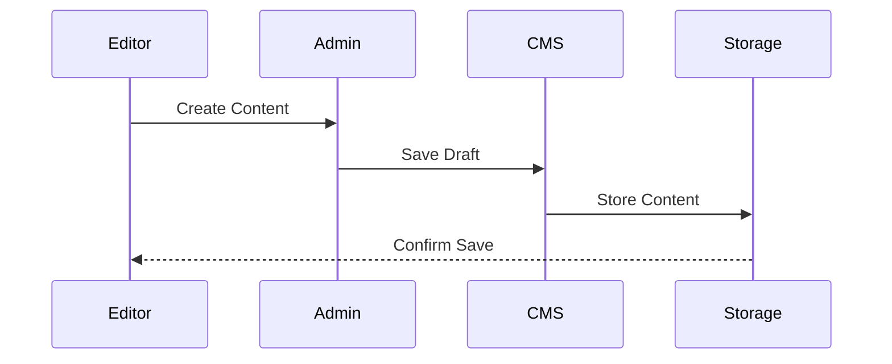
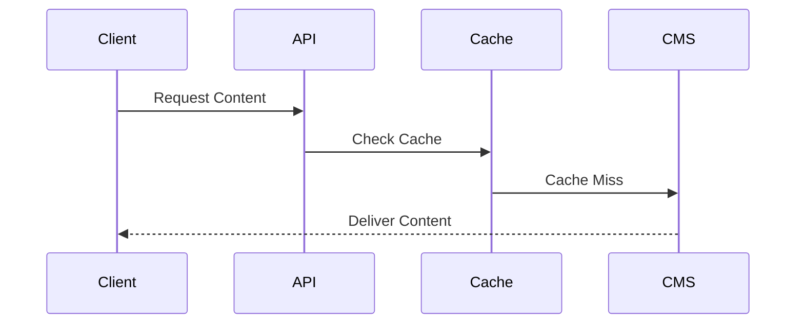
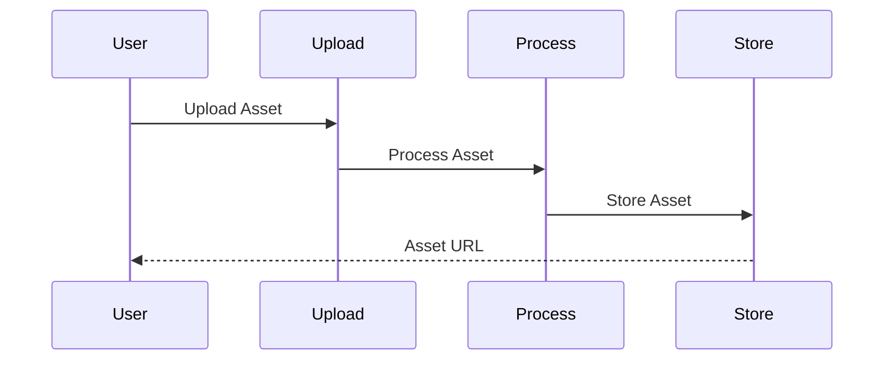
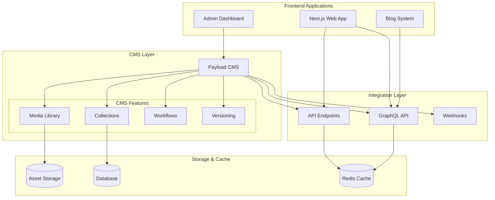

# CMS Integration Architecture

## Overview

The CMS Integration Architecture provides a robust and flexible content management solution built around Payload CMS. This architecture enables seamless content creation, management, and delivery across multiple frontend applications while ensuring high performance, scalability, and developer experience.

Key Features:
- Headless CMS architecture
- GraphQL-first API design
- Real-time content updates
- Asset management system
- Versioning and workflows

Benefits:
- Flexible content modeling
- Improved content delivery
- Developer-friendly APIs
- Scalable architecture
- Enhanced security

## Components

### Frontend Layer
1. Web Applications
   - Next.js web application
   - Admin dashboard interface
   - Blog platform
   - Content preview system

2. Client Libraries
   - GraphQL clients
   - REST API clients
   - Asset loaders
   - Cache managers

3. UI Components
   - Rich text editors
   - Media uploaders
   - Content forms
   - Preview renderers

### CMS Layer
1. Core Features
   - Collections management
   - Media library
   - Workflow engine
   - Version control
   - Access control

2. Integration Features
   - REST API endpoints
   - GraphQL API
   - Webhook system
   - SSR support

3. Storage Systems
   - Asset storage
   - Database storage
   - Cache layer
   - CDN integration

## Interactions

The CMS integration system follows these key workflows:

1. Content Creation Flow


2. Content Delivery Flow


3. Asset Management Flow


## Implementation Details

### Collection Type Implementation
```typescript
interface CollectionConfig {
  slug: string;
  fields: Field[];
  hooks?: {
    beforeChange?: Hook[];
    afterChange?: Hook[];
  };
  access: {
    read: Access;
    create: Access;
    update: Access;
    delete: Access;
  };
  versions?: {
    max?: number;
    drafts?: boolean;
  };
}

class Collection implements CollectionConfig {
  constructor(config: CollectionConfig) {
    this.slug = config.slug;
    this.fields = this.processFields(config.fields);
    this.hooks = this.setupHooks(config.hooks);
    this.access = this.configureAccess(config.access);
    this.versions = config.versions;
  }
  
  private processFields(fields: Field[]): ProcessedField[] {
    return fields.map(field => ({
      ...field,
      hooks: this.setupFieldHooks(field),
      validation: this.setupValidation(field)
    }));
  }
}
```

### API Client Implementation
```typescript
interface APIConfig {
  endpoint: string;
  token?: string;
  cache?: {
    ttl: number;
    invalidation: string[];
  };
}

class CMSClient {
  private cache: Cache;
  private graphql: GraphQLClient;
  
  constructor(config: APIConfig) {
    this.cache = new Cache(config.cache);
    this.graphql = new GraphQLClient(config.endpoint);
  }
  
  async getContent<T>(
    query: string,
    variables?: Record<string, any>
  ): Promise<T> {
    const cacheKey = this.getCacheKey(query, variables);
    const cached = await this.cache.get(cacheKey);
    
    if (cached) {
      return cached as T;
    }
    
    const result = await this.graphql.request<T>(query, variables);
    await this.cache.set(cacheKey, result);
    
    return result;
  }
  
  async mutateContent<T>(
    mutation: string,
    variables: Record<string, any>
  ): Promise<T> {
    const result = await this.graphql.request<T>(mutation, variables);
    await this.invalidateCache(variables);
    return result;
  }
}
```

### Media Handler Implementation
```typescript
interface MediaConfig {
  storage: {
    type: 'local' | 's3' | 'cloudinary';
    config: Record<string, any>;
  };
  images: {
    sizes: ImageSize[];
    formats: ImageFormat[];
  };
}

class MediaHandler {
  private storage: StorageAdapter;
  private processor: ImageProcessor;
  
  constructor(config: MediaConfig) {
    this.storage = this.createStorage(config.storage);
    this.processor = new ImageProcessor(config.images);
  }
  
  async uploadMedia(
    file: File,
    options?: UploadOptions
  ): Promise<MediaAsset> {
    const processed = await this.processor.process(file, options);
    const stored = await this.storage.store(processed);
    
    return {
      url: stored.url,
      meta: stored.meta,
      variants: stored.variants
    };
  }
  
  private createStorage(config: StorageConfig): StorageAdapter {
    switch (config.type) {
      case 's3':
        return new S3Storage(config.config);
      case 'cloudinary':
        return new CloudinaryStorage(config.config);
      default:
        return new LocalStorage(config.config);
    }
  }
}
```

## CMS Architecture Diagram



## Component Description

### Frontend Layer

- **Next.js Web App**: Main application
- **Admin Dashboard**: CMS management interface
- **Blog System**: Content-driven blog platform

### CMS Core (Payload)

- **Collections**: Content type definitions
- **Media Library**: Asset management
- **Workflows**: Content approval flows
- **Versioning**: Content version control

### Integration Points

- **API Endpoints**: RESTful content API
- **GraphQL API**: Flexible content queries
- **Webhooks**: Event-driven integrations

### Storage Solutions

- **Asset Storage**: Media file storage
- **Database**: Content and metadata storage
- **Cache Layer**: Performance optimization

## Implementation Notes

1. **Content Types**

   - Blog posts
   - Pages
   - Media assets
   - User-generated content
   - Product information

2. **Access Control**

   - Role-based permissions
   - API access control
   - Media access rules
   - Draft/publish workflow

3. **Performance**

   - Content caching
   - Asset optimization
   - Query optimization
   - CDN integration

4. **Integration Features**

   - Preview mode
   - Draft content
   - Scheduled publishing
   - Content relationships

5. **Development Workflow**
   - Content modeling
   - Schema migrations
   - Development/production parity
   - Backup strategies
