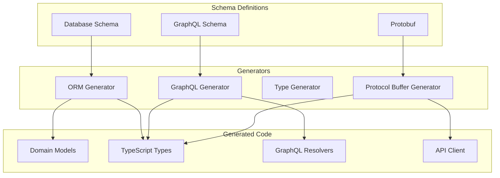

# Code Generation Architecture

This diagram illustrates our code generation pipeline, showing how we generate type-safe code from various schema definitions.

## Components

### Schema Definitions

- Protocol Buffers
- GraphQL Schema
- Database Schema
- Type Definitions

### Code Generators

- Protocol Buffer Generator
- GraphQL Code Generator
- TypeScript Generator
- ORM Generator

### Generated Artifacts

- Domain Models
- TypeScript Types
- GraphQL Resolvers
- API Client Code

## Implementation Details

### Protocol Buffers

- Service definitions
- Message types
- RPC endpoints
- Client/server stubs

### GraphQL

- Type definitions
- Resolvers
- Mutations
- Subscriptions

### Database

- Entity models
- Migrations
- Relationships
- Indices

### Type System

- Type safety
- Code completion
- Documentation
- Validation
