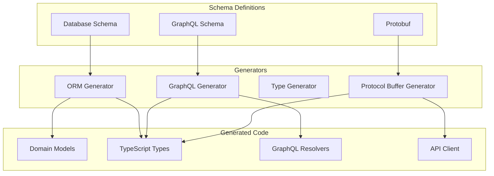
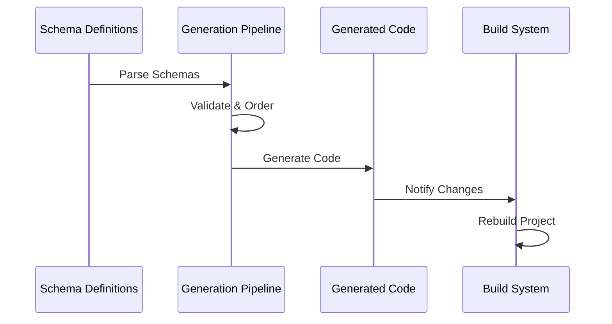

# Code Generation Architecture

## Overview

The code generation architecture is a critical system component that automates the creation of type-safe code artifacts from various schema definitions. This system ensures consistency between different layers of the application while maintaining type safety and reducing manual coding efforts. The architecture supports multiple schema types including Protocol Buffers, GraphQL, and database schemas, generating corresponding TypeScript types, API clients, and domain models.

Key benefits:
- Automated type-safe code generation
- Consistency across different application layers
- Reduced manual coding effort
- Single source of truth for data structures
- Improved development velocity

This diagram illustrates our code generation pipeline, showing how we generate type-safe code from various schema definitions.

## Components

### Schema Definitions

- Protocol Buffers
- GraphQL Schema
- Database Schema
- Type Definitions

### Code Generators

- Protocol Buffer Generator
- GraphQL Code Generator
- TypeScript Generator
- ORM Generator

### Generated Artifacts

- Domain Models
- TypeScript Types
- GraphQL Resolvers
- API Client Code

## Implementation Details

### Protocol Buffers

- Service definitions
- Message types
- RPC endpoints
- Client/server stubs

### GraphQL

- Type definitions
- Resolvers
- Mutations
- Subscriptions

### Database

- Entity models
- Migrations
- Relationships
- Indices

### Type System

- Type safety
- Code completion
- Documentation
- Validation

## Interactions

The code generation system follows a multi-step process:

1. Schema Processing
   - Schema files are validated for correctness
   - Dependencies are resolved and ordered
   - Schema versions are checked for compatibility

2. Generation Pipeline
   - Each generator is executed in dependency order
   - Generated code is validated for correctness
   - Type conflicts are detected and reported
   - Documentation is automatically generated

3. Integration Flow
   - Generated code is written to designated locations
   - Source maps are created for debugging
   - Build system is notified of changes
   - IDE is refreshed to recognize new types

