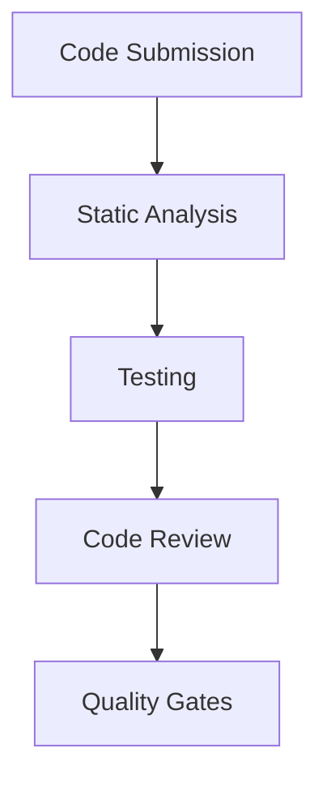
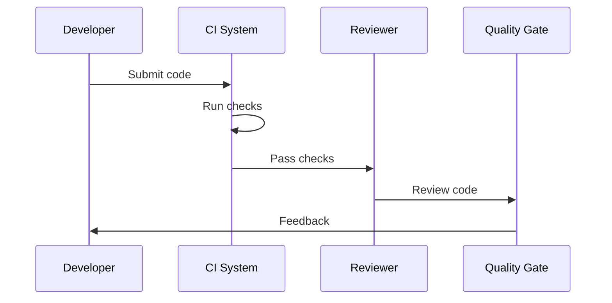

# Code Quality Architecture

## Overview

This document outlines our code quality architecture, designed to maintain high standards of code quality through automated checks, reviews, and continuous improvement processes.

## Components

### Quality Pipeline


### Key Components
1. Static Analysis
   - Linting
   - Code style
   - Complexity metrics
   - Security scanning

2. Testing Framework
   - Unit tests
   - Integration tests
   - Coverage analysis
   - Performance tests

3. Review Process
   - Peer review
   - Automated checks
   - Documentation review
   - Architecture review

4. Quality Gates
   - Metrics thresholds
   - Coverage requirements
   - Performance criteria
   - Security standards

## Interactions

### Quality Flow


## Implementation Details

### Quality Configuration
```typescript
interface QualityConfig {
  metrics: QualityMetric[];
  thresholds: Threshold[];
  checks: QualityCheck[];
  gates: QualityGate[];
}

interface QualityMetric {
  name: string;
  type: MetricType;
  threshold: number;
  weight: number;
}
```

### Check Rules
```typescript
interface QualityCheck {
  name: string;
  type: 'static' | 'dynamic' | 'manual';
  rules: Rule[];
  severity: 'error' | 'warning' | 'info';
}
```

### Quality Standards
- Code style guide
- Testing requirements
- Documentation standards
- Performance criteria
- Security guidelines

## Related Documentation
- [Testing Strategy](./testing-strategy.md)
- [Code Review](../infrastructure/code-review.md)
- [Development Standards](./standards.md)
- [Security Guidelines](../security/security-architecture.md)
