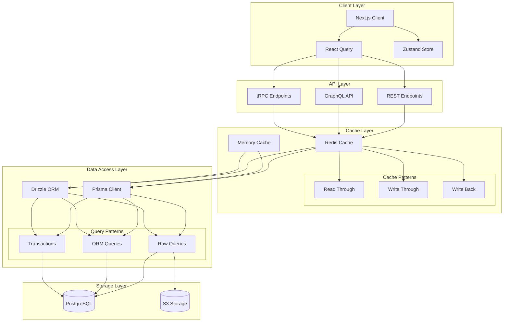

# Data Access Layer Architecture

This diagram illustrates the comprehensive data access layer architecture, including API integration, caching, and database access patterns.

## Architecture Diagram

## Component Description

### Client Layer

- **Next.js Client**: Main application client
- **React Query**: Data fetching, caching, and state management
- **Zustand**: Global state management

### API Layer

- **REST Endpoints**: Traditional REST API endpoints
- **GraphQL API**: GraphQL interface for flexible queries
- **tRPC Endpoints**: Type-safe API layer

### Cache Layer

- **Redis Cache**: Distributed caching system
- **Memory Cache**: Local in-memory caching
- **Cache Patterns**: Various caching strategies for different use cases

### Data Access Layer

- **Prisma Client**: Primary ORM for database access
- **Drizzle ORM**: Secondary ORM for specific use cases
- **Query Patterns**: Different approaches to data access

### Storage Layer

- **PostgreSQL**: Primary database
- **S3 Storage**: Object storage for files and assets

## Implementation Notes

1. **Caching Strategy**

   - Use Redis for distributed caching
   - Implement read-through and write-through patterns
   - Cache invalidation based on data change events

2. **Data Access Patterns**

   - Use Prisma as primary ORM
   - Implement Drizzle for specific performance-critical operations
   - Maintain transaction integrity across operations

3. **API Strategy**

   - REST for simple CRUD operations
   - GraphQL for complex queries and data aggregation
   - tRPC for type-safe internal services

4. **Performance Considerations**

   - Implement connection pooling
   - Use appropriate indexing strategies
   - Monitor query performance

5. **Security Measures**
   - Implement rate limiting
   - Use prepared statements
   - Regular security audits
