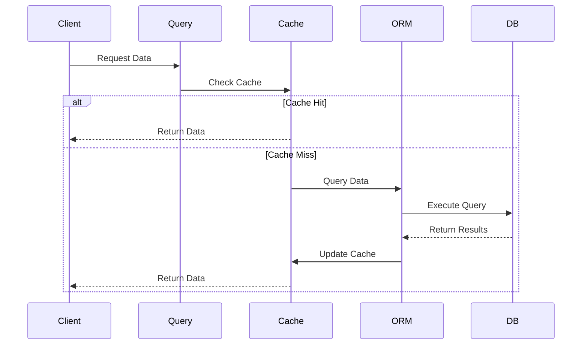
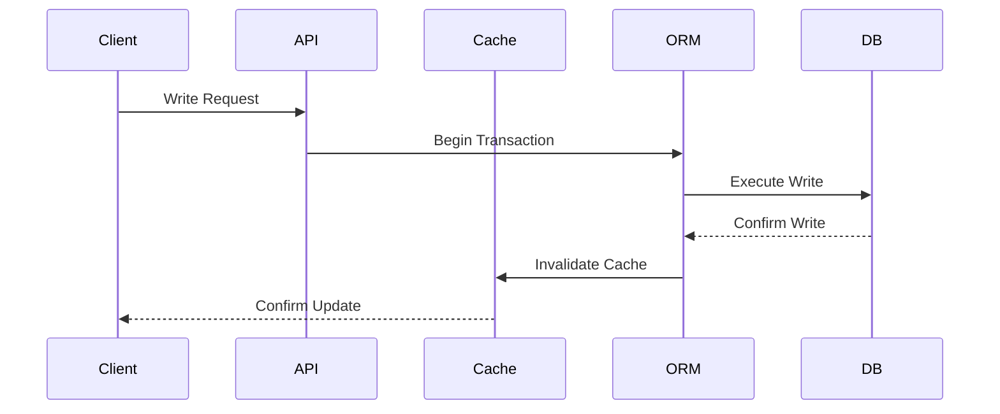
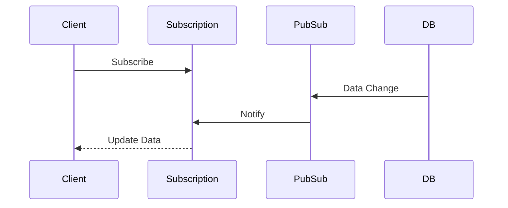
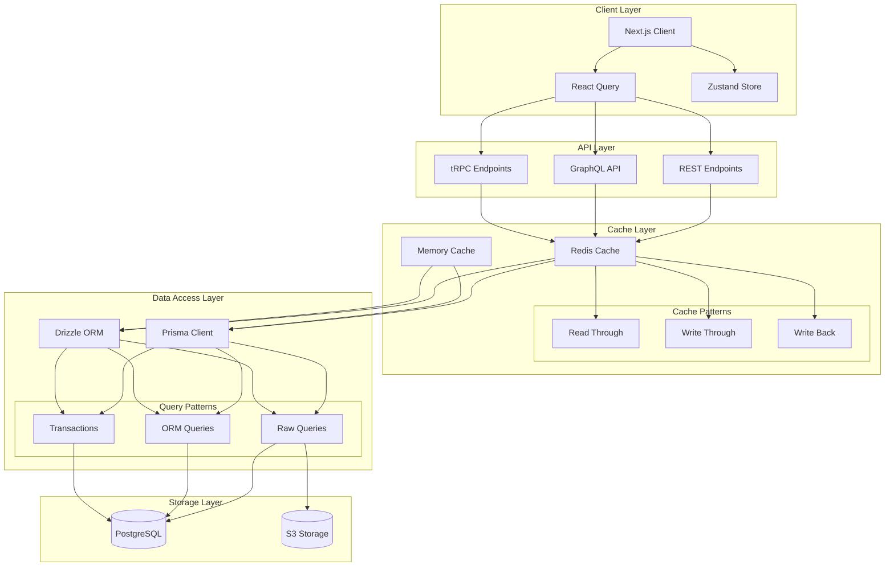

# Data Access Layer Architecture

## Overview

The Data Access Layer Architecture provides a robust and scalable system for managing data operations across the application. This architecture implements type-safe, efficient, and maintainable patterns for data access, caching, and state management.

Key Features:
- Type-safe data access
- Multi-layer caching
- Optimized queries
- Transaction support
- Real-time updates

Benefits:
- Type safety
- Performance
- Scalability
- Maintainability
- Data consistency

## Components

### Client Layer
1. Next.js Client
   - Server-side rendering
   - Client-side navigation
   - Data prefetching
   - Route handling

2. React Query
   - Data fetching
   - Cache management
   - Optimistic updates
   - Background refetching

3. Zustand Store
   - Global state
   - Middleware support
   - Persistence
   - State slicing

### API Layer
1. REST Endpoints
   - Resource-based routes
   - HTTP methods
   - Status codes
   - Response formats

2. GraphQL API
   - Schema definition
   - Resolvers
   - Type generation
   - Query optimization

3. tRPC Endpoints
   - Type-safe procedures
   - Input validation
   - Error handling
   - Middleware

### Cache Layer
1. Redis Cache
   - Distributed caching
   - Pub/sub
   - Data structures
   - Expiration policies

2. Memory Cache
   - In-memory storage
   - Quick access
   - Cache invalidation
   - Size limits

### Data Access Layer
1. Prisma Client
   - Type-safe queries
   - Migrations
   - Relations
   - Middleware

2. Drizzle ORM
   - SQL builder
   - Schema definition
   - Query optimization
   - Type inference

## Interactions

The data access system follows these key workflows:

1. Read Flow


2. Write Flow


3. Real-time Flow


## Implementation Details

### Data Manager Implementation
```typescript
interface DataConfig {
  cache: CacheConfig;
  database: DatabaseConfig;
  api: ApiConfig;
}

class DataManager {
  private config: DataConfig;
  private cache: CacheManager;
  private orm: ORMClient;
  
  constructor(config: DataConfig) {
    this.config = config;
    this.cache = new CacheManager();
    this.orm = new ORMClient();
  }
  
  async query<T>(
    query: QueryInput,
    options?: QueryOptions
  ): Promise<T> {
    const cached = await this.checkCache(query);
    
    if (cached) {
      return cached;
    }
    
    const result = await this.executeQuery(
      query,
      options
    );
    
    await this.updateCache(query, result);
    return result;
  }
  
  private async checkCache(
    query: QueryInput
  ): Promise<any> {
    return this.cache.get(this.getCacheKey(query));
  }
}
```

### Query Manager Implementation
```typescript
interface QueryConfig {
  timeout: number;
  retries: number;
  batchSize: number;
}

class QueryManager {
  private config: QueryConfig;
  private builder: QueryBuilder;
  private optimizer: QueryOptimizer;
  
  constructor(config: QueryConfig) {
    this.config = config;
    this.builder = new QueryBuilder();
    this.optimizer = new QueryOptimizer();
  }
  
  async execute<T>(
    query: Query,
    options?: ExecuteOptions
  ): Promise<T> {
    const optimized = this.optimizer.optimize(query);
    const plan = await this.builder.build(optimized);
    
    return this.executeWithRetry(
      plan,
      options
    );
  }
  
  private async executeWithRetry(
    plan: QueryPlan,
    options?: ExecuteOptions
  ): Promise<any> {
    for (let i = 0; i < this.config.retries; i++) {
      try {
        return await this.executePlan(plan);
      } catch (error) {
        if (!this.shouldRetry(error)) {
          throw error;
        }
      }
    }
  }
}
```

### Cache Manager Implementation
```typescript
interface CacheConfig {
  ttl: number;
  maxSize: number;
  strategy: CacheStrategy;
}

class CacheManager {
  private config: CacheConfig;
  private store: CacheStore;
  private policy: CachePolicy;
  
  constructor(config: CacheConfig) {
    this.config = config;
    this.store = new CacheStore();
    this.policy = new CachePolicy();
  }
  
  async get(
    key: string,
    options?: GetOptions
  ): Promise<any> {
    const entry = await this.store.get(key);
    
    if (!entry || this.isStale(entry)) {
      return null;
    }
    
    await this.updateAccess(key);
    return entry.value;
  }
  
  private isStale(
    entry: CacheEntry
  ): boolean {
    return Date.now() - entry.timestamp > this.config.ttl;
  }
}

## Architecture Diagram



## Component Description

### Client Layer

- **Next.js Client**: Main application client
- **React Query**: Data fetching, caching, and state management
- **Zustand**: Global state management

### API Layer

- **REST Endpoints**: Traditional REST API endpoints
- **GraphQL API**: GraphQL interface for flexible queries
- **tRPC Endpoints**: Type-safe API layer

### Cache Layer

- **Redis Cache**: Distributed caching system
- **Memory Cache**: Local in-memory caching
- **Cache Patterns**: Various caching strategies for different use cases

### Data Access Layer

- **Prisma Client**: Primary ORM for database access
- **Drizzle ORM**: Secondary ORM for specific use cases
- **Query Patterns**: Different approaches to data access

### Storage Layer

- **PostgreSQL**: Primary database
- **S3 Storage**: Object storage for files and assets

## Implementation Notes

1. **Caching Strategy**

   - Use Redis for distributed caching
   - Implement read-through and write-through patterns
   - Cache invalidation based on data change events

2. **Data Access Patterns**

   - Use Prisma as primary ORM
   - Implement Drizzle for specific performance-critical operations
   - Maintain transaction integrity across operations

3. **API Strategy**

   - REST for simple CRUD operations
   - GraphQL for complex queries and data aggregation
   - tRPC for type-safe internal services

4. **Performance Considerations**

   - Implement connection pooling
   - Use appropriate indexing strategies
   - Monitor query performance

5. **Security Measures**
   - Implement rate limiting
   - Use prepared statements
   - Regular security audits
