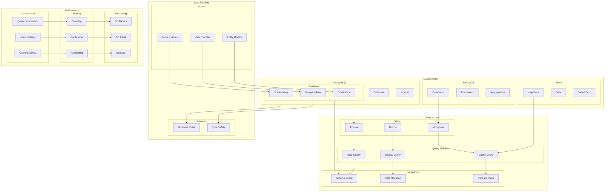

# Database and Data Modeling Architecture

This diagram illustrates our database architecture using PostgreSQL, MongoDB, Redis, and our data modeling approach.

## Database Architecture Diagram

## Component Description

### Data Storage

1. **PostgreSQL**

   - Relational data
   - Schema design
   - Index strategy

2. **MongoDB**

   - Document storage
   - Collection design
   - Aggregation pipelines

3. **Redis**
   - Cache storage
   - Data structures
   - Expiration policies

### Data Access

1. **ORMs**

   - Prisma setup
   - Drizzle config
   - Mongoose models

2. **Query Builders**

   - SQL generation
   - NoSQL queries
   - Cache operations

3. **Migrations**
   - Schema changes
   - Data transforms
   - Rollback strategy

## Implementation Guidelines

1. **Data Modeling**

   - Schema design
   - Model relations
   - Validation rules
   - Type safety

2. **Performance**

   - Query optimization
   - Index strategy
   - Cache patterns
   - Connection pooling

3. **Scaling**

   - Sharding approach
   - Replication setup
   - Partitioning strategy
   - Load balancing

4. **Best Practices**

   - Schema versioning
   - Migration patterns
   - Error handling
   - Connection management

5. **Monitoring**

   - Performance metrics
   - Query analysis
   - Error tracking
   - Health checks

6. **Documentation**
   - Schema docs
   - Query patterns
   - Migration guides
   - Performance tips
