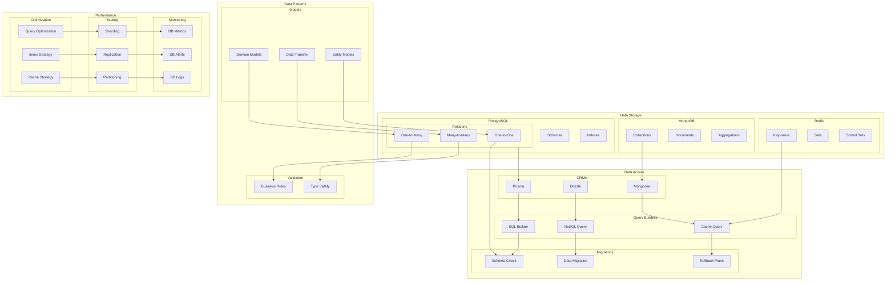
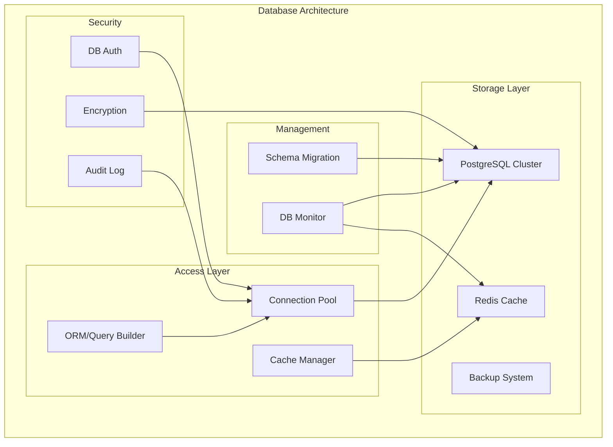
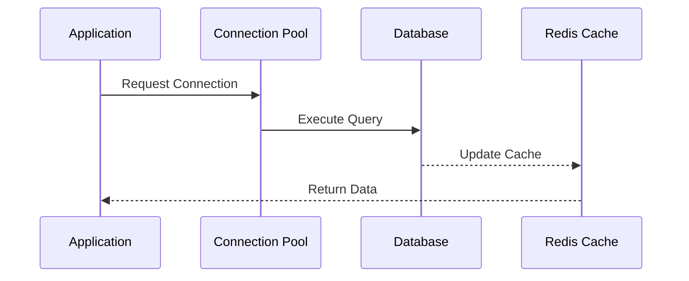

# Database and Data Modeling Architecture

This diagram illustrates our database architecture using PostgreSQL, MongoDB, Redis, and our data modeling approach.

## Database Architecture Diagram



## Component Description

### Data Storage

1. **PostgreSQL**

   - Relational data
   - Schema design
   - Index strategy

2. **MongoDB**

   - Document storage
   - Collection design
   - Aggregation pipelines

3. **Redis**
   - Cache storage
   - Data structures
   - Expiration policies

### Data Access

1. **ORMs**

   - Prisma setup
   - Drizzle config
   - Mongoose models

2. **Query Builders**

   - SQL generation
   - NoSQL queries
   - Cache operations

3. **Migrations**
   - Schema changes
   - Data transforms
   - Rollback strategy

## Implementation Guidelines

1. **Data Modeling**

   - Schema design
   - Model relations
   - Validation rules
   - Type safety

2. **Performance**

   - Query optimization
   - Index strategy
   - Cache patterns
   - Connection pooling

3. **Scaling**

   - Sharding approach
   - Replication setup
   - Partitioning strategy
   - Load balancing

4. **Best Practices**

   - Schema versioning
   - Migration patterns
   - Error handling
   - Connection management

5. **Monitoring**

   - Performance metrics
   - Query analysis
   - Error tracking
   - Health checks

6. **Documentation**
   - Schema docs
   - Query patterns
   - Migration guides
   - Performance tips

## Database Architecture

This document outlines our database architecture, detailing how data is stored, accessed, and managed across our system.

## Overview

Our database architecture implements a multi-model approach, combining PostgreSQL for structured data and Redis for caching and real-time operations. The system is designed for high availability, scalability, and data integrity.

## Components

- **Primary Database**: PostgreSQL cluster for persistent storage
- **Cache Layer**: Redis for performance optimization
- **Query Layer**: Database abstraction and query management
- **Migration System**: Database schema version control



## Interactions

The database system operates through these key interactions:

1. Connection management and pooling
2. Query execution and optimization
3. Cache invalidation and updates
4. Schema migration process



## Implementation Details

### Technical Stack

- PostgreSQL 15+: Primary database
- Redis 7+: Caching layer
- Prisma: ORM and migrations
- PgBouncer: Connection pooling
- Nx: Build and deployment

### Key Configurations

```typescript
// database.config.ts
export const dbConfig = {
  postgres: {
    host: process.env.DB_HOST,
    port: 5432,
    database: 'acme_db',
    maxConnections: 20,
    idleTimeout: '30s'
  },
  redis: {
    host: process.env.REDIS_HOST,
    port: 6379,
    maxMemory: '2gb',
    evictionPolicy: 'allkeys-lru'
  },
  pool: {
    min: 2,
    max: 10,
    idle: 10000
  }
};
```

### Error Handling

- **Connection Failures**: Automatic retry with exponential backoff
- **Query Timeouts**: Circuit breaker pattern implementation
- **Deadlocks**: Detection and resolution strategy
- **Data Corruption**: Integrity checks and recovery

### Performance Considerations

- **Connection Pooling**: Optimize connection management
- **Query Optimization**: Regular EXPLAIN analysis
- **Index Management**: Strategic index creation and maintenance
- **Cache Strategy**: Efficient cache invalidation

## Related Documentation

- [Data Flow Architecture](../data-flow/data-flow.md)
- [Caching Strategy](./caching-strategy.md)
- [Backup and Recovery](../infrastructure/backup-recovery.md)
