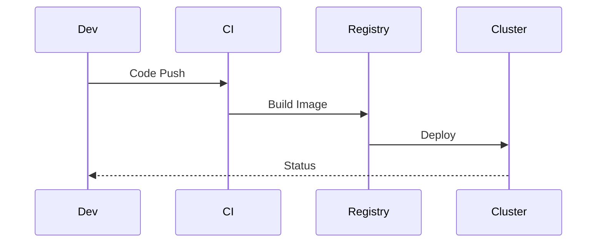
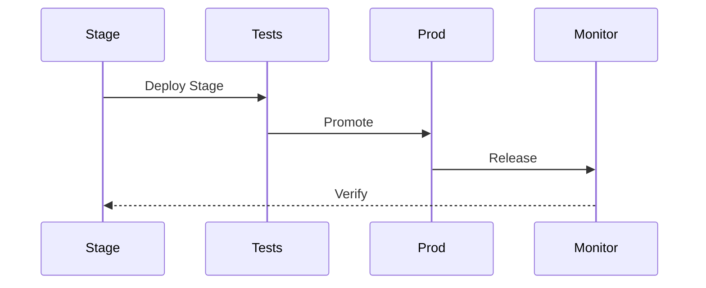
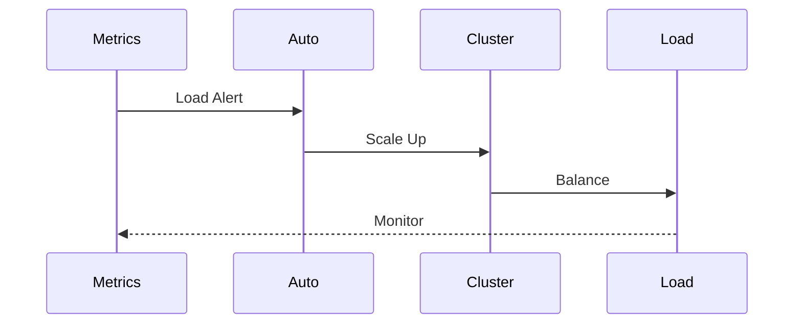
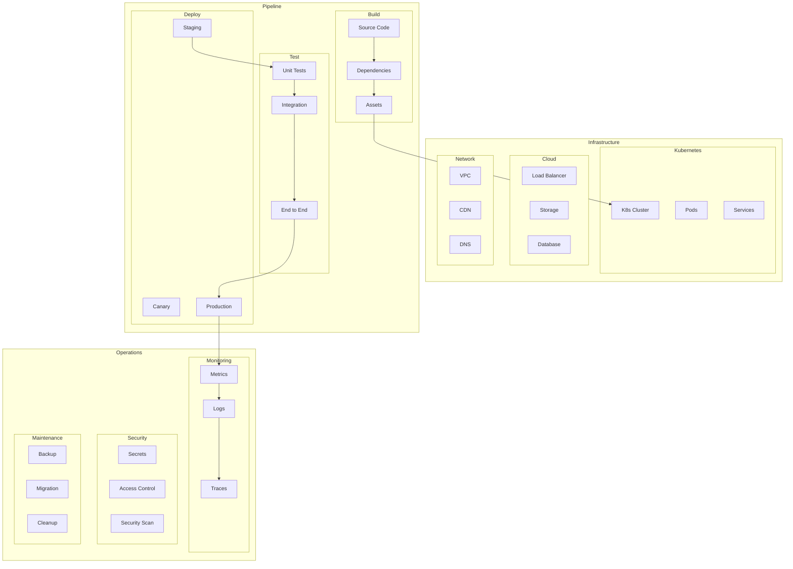

# Deployment Architecture

## Overview

The Deployment Architecture outlines our comprehensive strategy for deploying, scaling, and managing our application infrastructure across multiple environments. This architecture ensures reliable, secure, and efficient deployment processes.

Key Features:
- Containerized deployments
- Infrastructure as Code
- CI/CD automation
- Multi-environment support
- Zero-downtime updates

Benefits:
- Consistent environments
- Rapid deployment
- Infrastructure scalability
- Automated rollbacks
- Resource optimization

## Components

### Infrastructure Layer
1. Container Orchestration
   - Kubernetes clusters
   - Container registry
   - Service mesh
   - Auto-scaling

2. Cloud Services
   - Load balancers
   - Storage systems
   - Database clusters
   - Message queues

3. Network Infrastructure
   - VPC configuration
   - Security groups
   - CDN setup
   - DNS management

### Deployment Pipeline
1. Build Process
   - Source control
   - Dependency management
   - Asset compilation
   - Container builds

2. Testing Strategy
   - Unit tests
   - Integration tests
   - E2E tests
   - Performance tests

3. Deployment Process
   - Environment promotion
   - Blue-green deployment
   - Canary releases
   - Rollback procedures

### Monitoring & Operations
1. Observability
   - Metrics collection
   - Log aggregation
   - Distributed tracing
   - Error tracking

2. Security
   - Secret management
   - Access control
   - Vulnerability scanning
   - Compliance checks

3. Maintenance
   - Backup strategies
   - Database migrations
   - Version management
   - Resource cleanup

## Interactions

The deployment system follows these key workflows:

1. Deployment Pipeline Flow


2. Release Process Flow


3. Scaling Process Flow


## Implementation Details

### Deployment Manager Implementation
```typescript
interface DeploymentConfig {
  environments: EnvironmentConfig[];
  strategy: StrategyConfig;
  resources: ResourceConfig;
}

class DeploymentManager {
  private config: DeploymentConfig;
  private cluster: ClusterManager;
  private registry: ContainerRegistry;
  
  constructor(config: DeploymentConfig) {
    this.config = config;
    this.cluster = new ClusterManager();
    this.registry = new ContainerRegistry();
  }
  
  async deploy(
    release: Release,
    options?: DeployOptions
  ): Promise<DeploymentStatus> {
    const prepared = await this.prepare(
      release
    );
    
    const deployed = await this.executeStrategy(
      prepared,
      options
    );
    
    return this.monitor(deployed);
  }
  
  private async executeStrategy(
    release: PreparedRelease,
    options?: DeployOptions
  ): Promise<Deployment> {
    return this.config.strategy.execute(
      release,
      options
    );
  }
}
```

### Resource Manager Implementation
```typescript
interface ResourceConfig {
  limits: ResourceLimits;
  scaling: ScalingConfig;
  cleanup: CleanupConfig;
}

class ResourceManager {
  private config: ResourceConfig;
  private resources: ResourcePool;
  private scaling: AutoScaler;
  
  constructor(config: ResourceConfig) {
    this.config = config;
    this.resources = new ResourcePool();
    this.scaling = new AutoScaler();
  }
  
  async allocate(
    request: ResourceRequest,
    options?: AllocateOptions
  ): Promise<ResourceAllocation> {
    const available = await this.checkAvailability(
      request
    );
    
    const allocated = await this.provision(
      available,
      options
    );
    
    return this.track(allocated);
  }
  
  private async provision(
    request: ResourceRequest,
    options?: AllocateOptions
  ): Promise<Resource> {
    return this.resources.provision(
      request,
      this.config.limits
    );
  }
}
```

### Environment Manager Implementation
```typescript
interface EnvironmentConfig {
  stages: StageConfig[];
  promotion: PromotionConfig;
  rollback: RollbackConfig;
}

class EnvironmentManager {
  private config: EnvironmentConfig;
  private stages: StageManager;
  private promotion: PromotionManager;
  
  constructor(config: EnvironmentConfig) {
    this.config = config;
    this.stages = new StageManager();
    this.promotion = new PromotionManager();
  }
  
  async promote(
    release: Release,
    options?: PromoteOptions
  ): Promise<PromotionResult> {
    const validated = await this.validatePromotion(
      release
    );
    
    const promoted = await this.executePromotion(
      validated,
      options
    );
    
    return this.verifyPromotion(promoted);
  }
  
  private async executePromotion(
    release: ValidatedRelease,
    options?: PromoteOptions
  ): Promise<Promotion> {
    return this.promotion.execute(
      release,
      this.config.promotion
    );
  }
}
```

## Deployment Architecture Diagram


