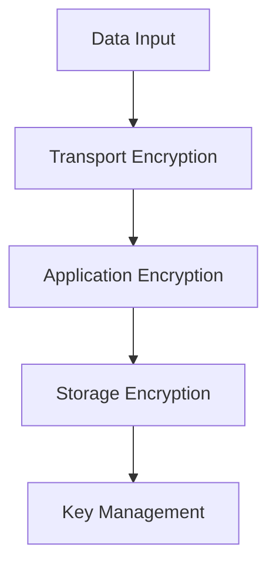
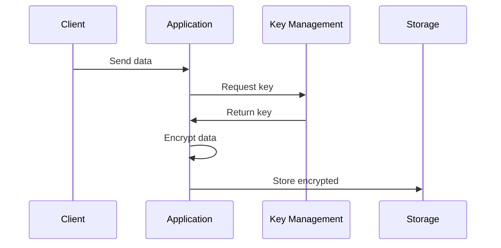

# Encryption Architecture

## Overview

This document outlines our encryption architecture, designed to protect sensitive data throughout its lifecycle in our system.

## Components

### Encryption Layers


### Key Components
1. Transport Security
   - TLS/SSL
   - Protocol versions
   - Cipher suites
   - Certificate management

2. Application Security
   - End-to-end encryption
   - Field-level encryption
   - Message encryption
   - Signature verification

3. Storage Security
   - Data at rest
   - Backup encryption
   - Volume encryption
   - Database encryption

4. Key Management
   - Key generation
   - Key rotation
   - Key storage
   - Access control

## Interactions

### Encryption Flow


## Implementation Details

### Encryption Configuration
```typescript
interface EncryptionConfig {
  algorithm: string;
  keySize: number;
  mode: EncryptionMode;
  padding: PaddingScheme;
  version: number;
}

interface KeyConfig {
  type: 'symmetric' | 'asymmetric';
  rotation: RotationPolicy;
  storage: KeyStorage;
  access: AccessControl[];
}
```

### Security Standards
```typescript
interface SecurityStandard {
  name: string;
  version: string;
  requirements: Requirement[];
  compliance: ComplianceCheck[];
}
```

### Encryption Policies
- Key rotation schedules
- Algorithm standards
- Storage requirements
- Access controls
- Audit logging

## Related Documentation
- [Security Architecture](./security.md)
- [Key Management](./key-management.md)
- [Data Protection](../data-flow/data-protection.md)
- [Compliance](../infrastructure/compliance.md)
