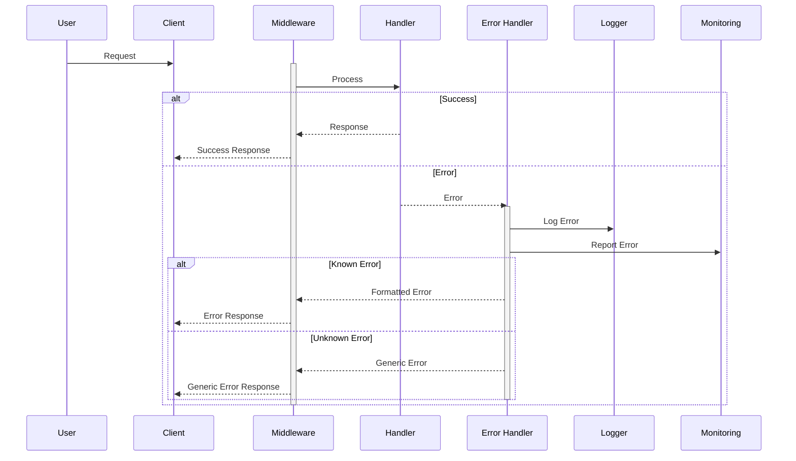

# Error Handling Flow

This diagram illustrates our error handling strategy, including error detection, logging, monitoring, and client response handling.

## Component Implementation

Our error handling implementation uses Error Boundary particles as defined in our [Atomic Design Structure](../components/atomic-design.md#particles) to wrap components and catch UI errors.

## Components

### Error Handler

- Centralizes error handling logic
- Formats error responses
- Routes errors to appropriate services

### Logger

- Structured logging
- Error context capture
- Log level management

### Monitoring

- Real-time error tracking
- Error aggregation
- Alert triggering

## Error Types

### Known Errors

- Validation errors
- Business logic errors
- Authentication errors
- Authorization errors

### Unknown Errors

- System failures
- Network issues
- Third-party service failures

## Error Response Strategy

### Client Responses

- Clear error messages
- Appropriate HTTP status codes
- Error codes for client handling

### Security Considerations

- No sensitive information in errors
- Stack traces only in logs
- Rate limiting for error endpoints
