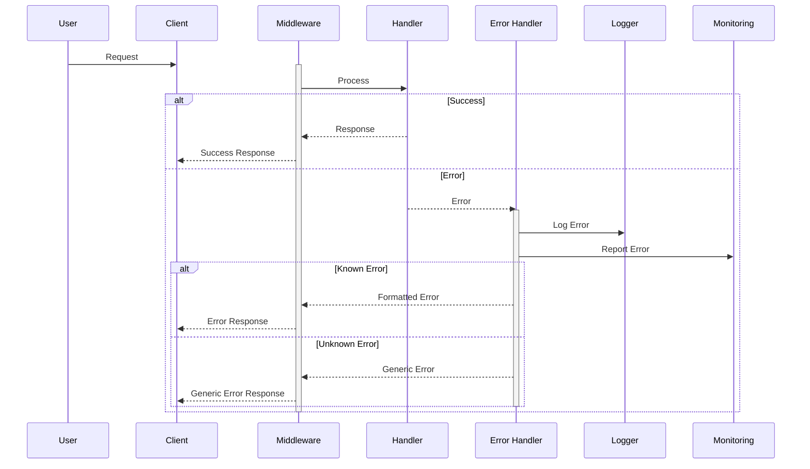
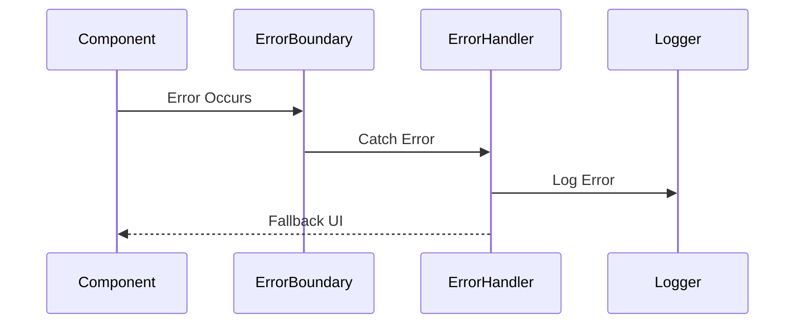
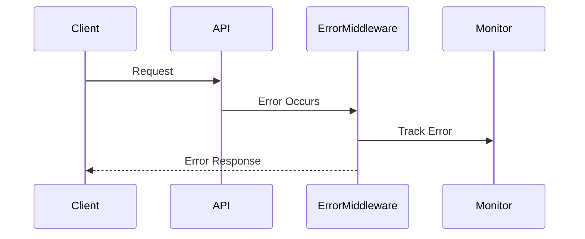
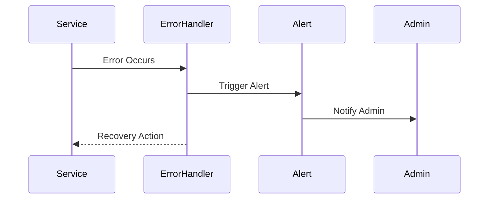

# Error Handling Flow

This diagram illustrates our error handling strategy, including error detection, logging, monitoring, and client response handling.

## Overview

The Error Handling Architecture provides a comprehensive system for detecting, handling, logging, and monitoring errors across the application. This architecture implements robust error management patterns to ensure system reliability and maintainable error handling.

Key Features:
- Centralized error handling
- Structured error logging
- Real-time monitoring
- Error boundary components
- Graceful degradation

Benefits:
- Improved reliability
- Better debugging
- User-friendly errors
- Security compliance
- System resilience

## Component Implementation

Our error handling implementation uses Error Boundary particles as defined in our [Atomic Design Structure](../components/atomic-design.md#particles) to wrap components and catch UI errors.



## Components

### Error Handler

- Centralizes error handling logic
- Formats error responses
- Routes errors to appropriate services

### Logger

- Structured logging
- Error context capture
- Log level management

### Monitoring

- Real-time error tracking
- Error aggregation
- Alert triggering

## Error Types

### Known Errors

- Validation errors
- Business logic errors
- Authentication errors
- Authorization errors

### Unknown Errors

- System failures
- Network issues
- Third-party service failures

## Error Response Strategy

### Client Responses

- Clear error messages
- Appropriate HTTP status codes
- Error codes for client handling

### Security Considerations

- No sensitive information in errors
- Stack traces only in logs
- Rate limiting for error endpoints

## Interactions

The error handling system follows these key workflows:

1. Client-Side Error Flow


2. API Error Flow


3. Background Error Flow


## Implementation Details

### Error Handler Implementation
```typescript
interface ErrorConfig {
  logLevel: LogLevel;
  notifications: NotificationConfig;
  monitoring: MonitoringConfig;
}

class ErrorHandler {
  private config: ErrorConfig;
  private logger: ErrorLogger;
  private monitor: ErrorMonitor;
  
  constructor(config: ErrorConfig) {
    this.config = config;
    this.logger = new ErrorLogger();
    this.monitor = new ErrorMonitor();
  }
  
  async handleError(
    error: Error,
    context: ErrorContext
  ): Promise<ErrorResponse> {
    await this.logError(error, context);
    await this.trackError(error, context);
    
    return this.formatResponse(error);
  }
  
  private async logError(
    error: Error,
    context: ErrorContext
  ): Promise<void> {
    await this.logger.log({
      error,
      context,
      level: this.getLogLevel(error)
    });
  }
}
```

### Error Boundary Implementation
```typescript
interface ErrorBoundaryProps {
  fallback: React.ReactNode;
  onError?: ErrorHandler;
  children: React.ReactNode;
}

class ErrorBoundary extends React.Component<
  ErrorBoundaryProps,
  { hasError: boolean }
> {
  constructor(props: ErrorBoundaryProps) {
    super(props);
    this.state = { hasError: false };
  }
  
  static getDerivedStateFromError(
    error: Error
  ): { hasError: boolean } {
    return { hasError: true };
  }
  
  componentDidCatch(
    error: Error,
    info: React.ErrorInfo
  ): void {
    if (this.props.onError) {
      this.props.onError.handleError(error, {
        componentStack: info.componentStack
      });
    }
  }
  
  render(): React.ReactNode {
    if (this.state.hasError) {
      return this.props.fallback;
    }
    
    return this.props.children;
  }
}
```

### Error Monitor Implementation
```typescript
interface MonitorConfig {
  alerts: AlertConfig[];
  thresholds: ThresholdConfig[];
  reporting: ReportConfig;
}

class ErrorMonitor {
  private config: MonitorConfig;
  private alerts: AlertManager;
  private metrics: MetricCollector;
  
  constructor(config: MonitorConfig) {
    this.config = config;
    this.alerts = new AlertManager();
    this.metrics = new MetricCollector();
  }
  
  async trackError(
    error: Error,
    context: ErrorContext
  ): Promise<void> {
    await this.metrics.record(error);
    
    const threshold = await this.checkThresholds(
      error
    );
    
    if (threshold.exceeded) {
      await this.alerts.trigger(threshold);
    }
  }
  
  private async checkThresholds(
    error: Error
  ): Promise<ThresholdResult> {
    const stats = await this.metrics.query({
      error,
      period: this.config.reporting.period
    });
    
    return this.evaluateThresholds(stats);
  }
}
