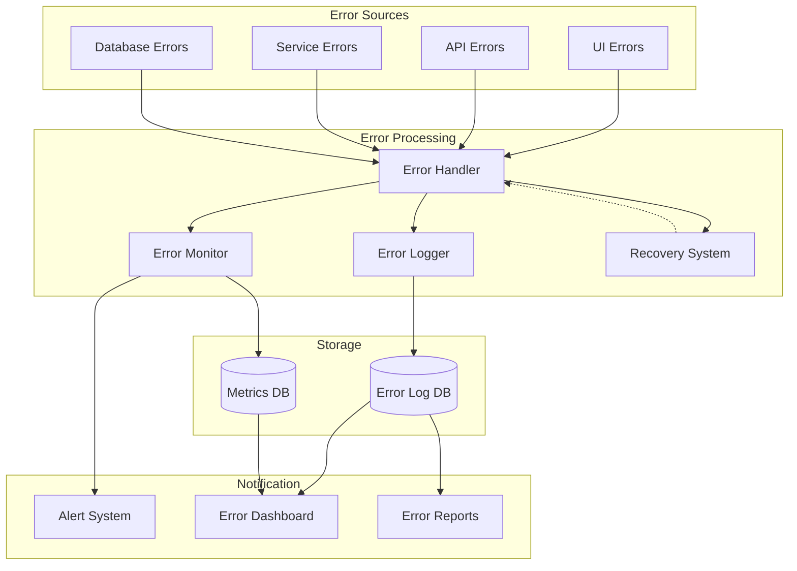

# Error Handling Architecture

This diagram illustrates our comprehensive error handling and recovery strategy.

## Error Handling Flow

## Description

Our error handling architecture includes:

1. **Error Collection**

   - UI error boundary
   - API error middleware
   - Service error handlers
   - Database error handlers

2. **Error Processing**

   - Centralized error handling
   - Error classification
   - Error logging
   - Recovery strategies

3. **Monitoring & Alerting**

   - Real-time error monitoring
   - Error rate tracking
   - Alert thresholds
   - Error patterns detection

4. **Recovery Mechanisms**
   - Automatic retries
   - Circuit breakers
   - Fallback strategies
   - Graceful degradation

## Implementation Details

- Uses structured error logging
- Implements retry mechanisms
- Provides error tracking
- Supports error analytics
- Includes error reporting
