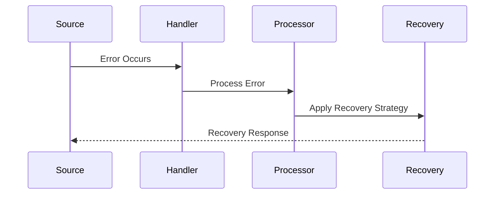
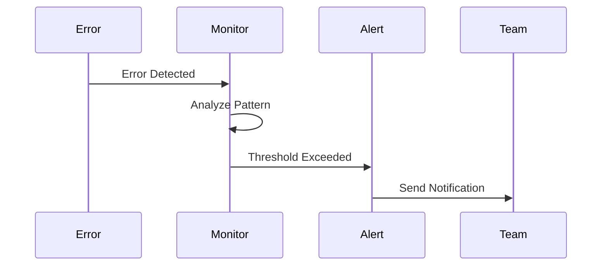
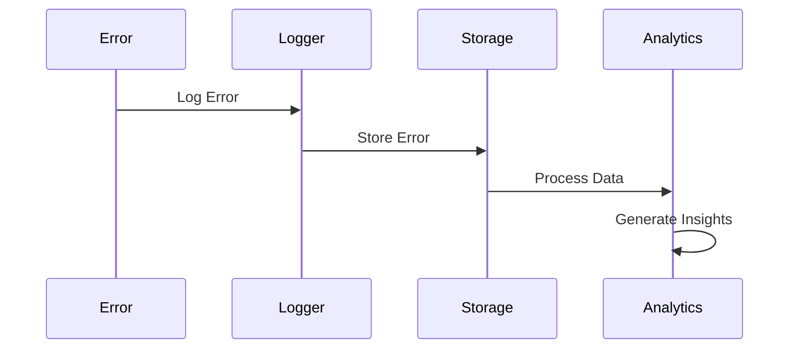
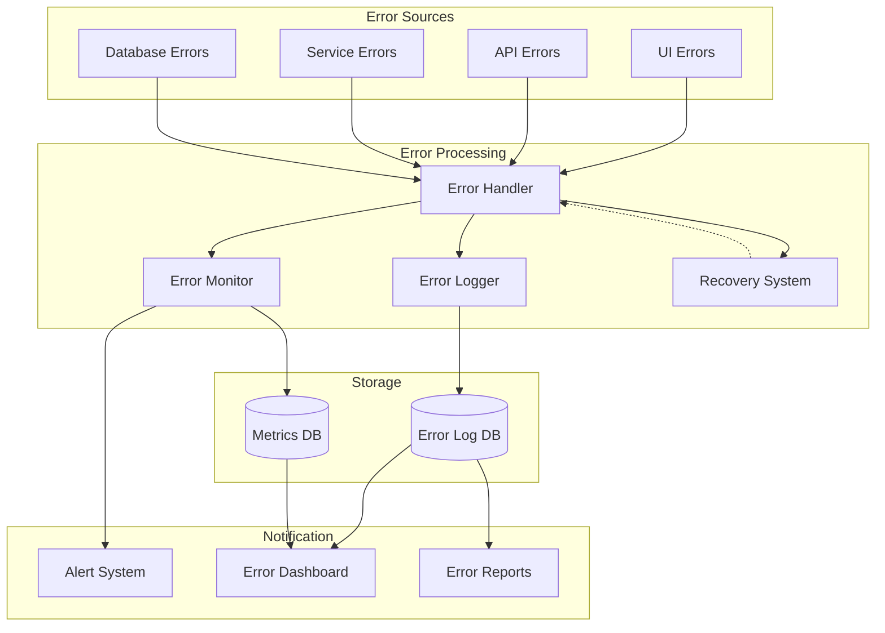

# Error Handling Architecture

## Overview

The Error Handling Architecture provides a robust and comprehensive system for managing, tracking, and recovering from errors across all application layers. This system ensures reliability, maintainability, and optimal user experience through intelligent error management and recovery strategies.

Key capabilities:
- Centralized error handling and logging
- Intelligent error recovery mechanisms
- Real-time monitoring and alerting
- Error analytics and reporting
- Graceful degradation strategies

Benefits:
- Improved system reliability
- Better user experience
- Faster issue resolution
- Proactive problem detection
- Data-driven error management

## Components

### Error Collection Layer
1. UI Error Handlers
   - React Error Boundary
   - Global window.onerror
   - Promise rejection handlers
   - Custom hook error handlers

2. API Error Handlers
   - Request interceptors
   - Response interceptors
   - Validation error handlers
   - Rate limit handlers

3. Service Error Handlers
   - Business logic error handlers
   - Integration error handlers
   - Timeout handlers
   - Resource error handlers

4. Database Error Handlers
   - Connection error handlers
   - Query error handlers
   - Transaction error handlers
   - Constraint violation handlers

### Processing Layer
1. Error Processor
   - Error classification
   - Error enrichment
   - Error normalization
   - Recovery strategy selection

2. Logging System
   - Structured logging
   - Log aggregation
   - Log rotation
   - Log retention

3. Monitoring System
   - Real-time monitors
   - Metric collectors
   - Pattern detectors
   - Threshold managers

### Recovery Layer
1. Retry System
   - Exponential backoff
   - Circuit breakers
   - Fallback handlers
   - Retry policies

2. Alert System
   - Alert rules
   - Notification channels
   - Escalation policies
   - Alert grouping

3. Analytics System
   - Error trends
   - Impact analysis
   - Root cause analysis
   - Performance impact

## Interactions

The error handling system follows these primary workflows:

1. Error Detection and Processing Flow


2. Monitoring and Alerting Flow


3. Logging and Analytics Flow


## Error Handling Flow



## Description

Our error handling architecture includes:

1. **Error Collection**

   - UI error boundary
   - API error middleware
   - Service error handlers
   - Database error handlers

2. **Error Processing**

   - Centralized error handling
   - Error classification
   - Error logging
   - Recovery strategies

3. **Monitoring & Alerting**

   - Real-time error monitoring
   - Error rate tracking
   - Alert thresholds
   - Error patterns detection

4. **Recovery Mechanisms**
   - Automatic retries
   - Circuit breakers
   - Fallback strategies
   - Graceful degradation

## Implementation Details

- Uses structured error logging
- Implements retry mechanisms
- Provides error tracking
- Supports error analytics
- Includes error reporting

### Error Handler Implementation
```typescript
interface ErrorConfig {
  retryable: boolean;
  maxRetries: number;
  fallback?: () => Promise<any>;
  severity: 'low' | 'medium' | 'high' | 'critical';
}

class ErrorHandler {
  async handleError(error: Error, config: ErrorConfig): Promise<void> {
    const enrichedError = this.enrichError(error);
    await this.logError(enrichedError);
    
    if (config.retryable && config.maxRetries > 0) {
      return this.retryOperation(config);
    }
    
    if (config.fallback) {
      return config.fallback();
    }
    
    throw enrichedError;
  }
}
```

### Recovery Strategy Implementation
```typescript
interface RetryStrategy {
  maxAttempts: number;
  backoffMs: number;
  timeout: number;
}

class RecoveryManager {
  async executeWithRetry<T>(
    operation: () => Promise<T>,
    strategy: RetryStrategy
  ): Promise<T> {
    let attempt = 0;
    
    while (attempt < strategy.maxAttempts) {
      try {
        return await operation();
      } catch (error) {
        attempt++;
        if (attempt === strategy.maxAttempts) throw error;
        await this.delay(strategy.backoffMs * attempt);
      }
    }
  }
}
```

### Monitoring Implementation
```typescript
interface AlertConfig {
  threshold: number;
  timeWindow: number;
  channels: string[];
}

class ErrorMonitor {
  async monitorErrors(config: AlertConfig): Promise<void> {
    const errorCount = await this.getErrorCount(config.timeWindow);
    
    if (errorCount > config.threshold) {
      await this.triggerAlert({
        message: `Error threshold exceeded: ${errorCount} errors in ${config.timeWindow}ms`,
        channels: config.channels,
        severity: this.calculateSeverity(errorCount)
      });
    }
  }
}
