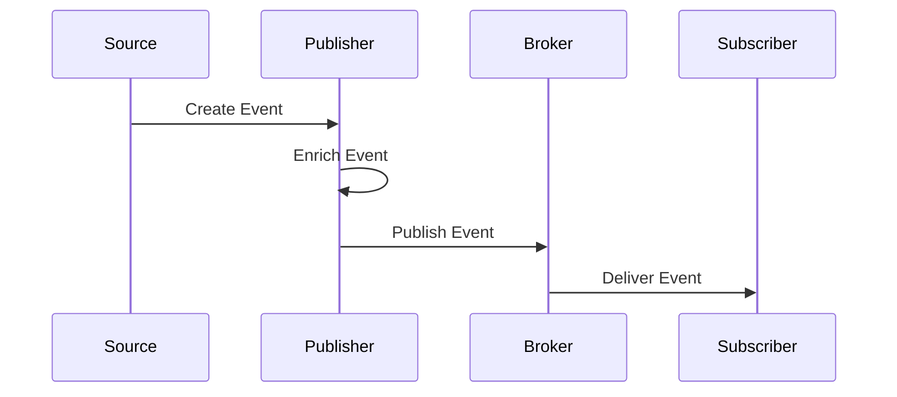
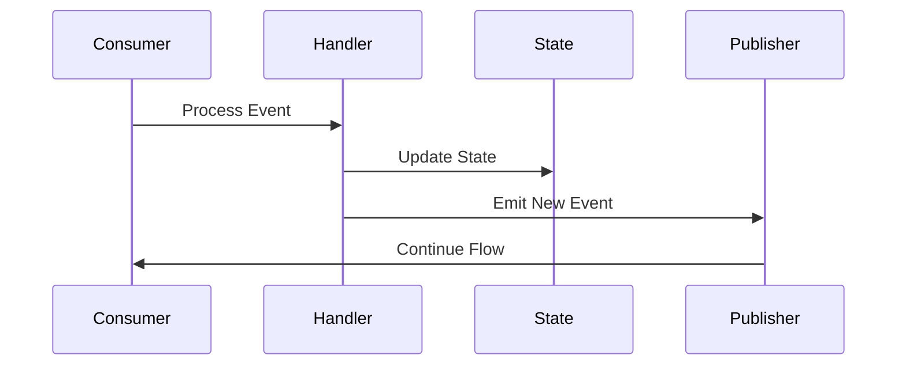
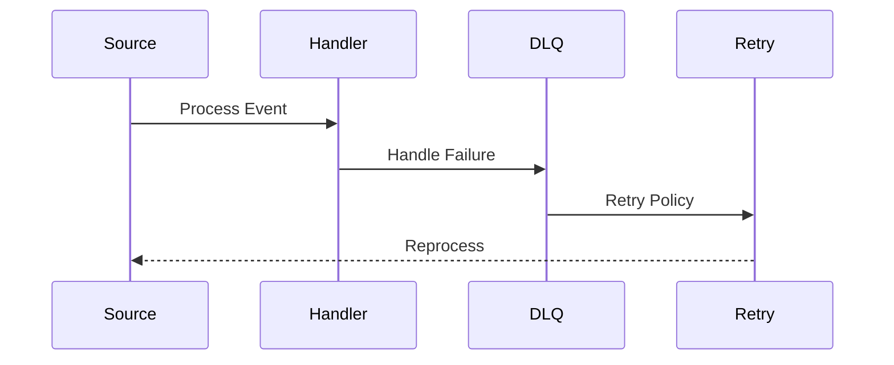
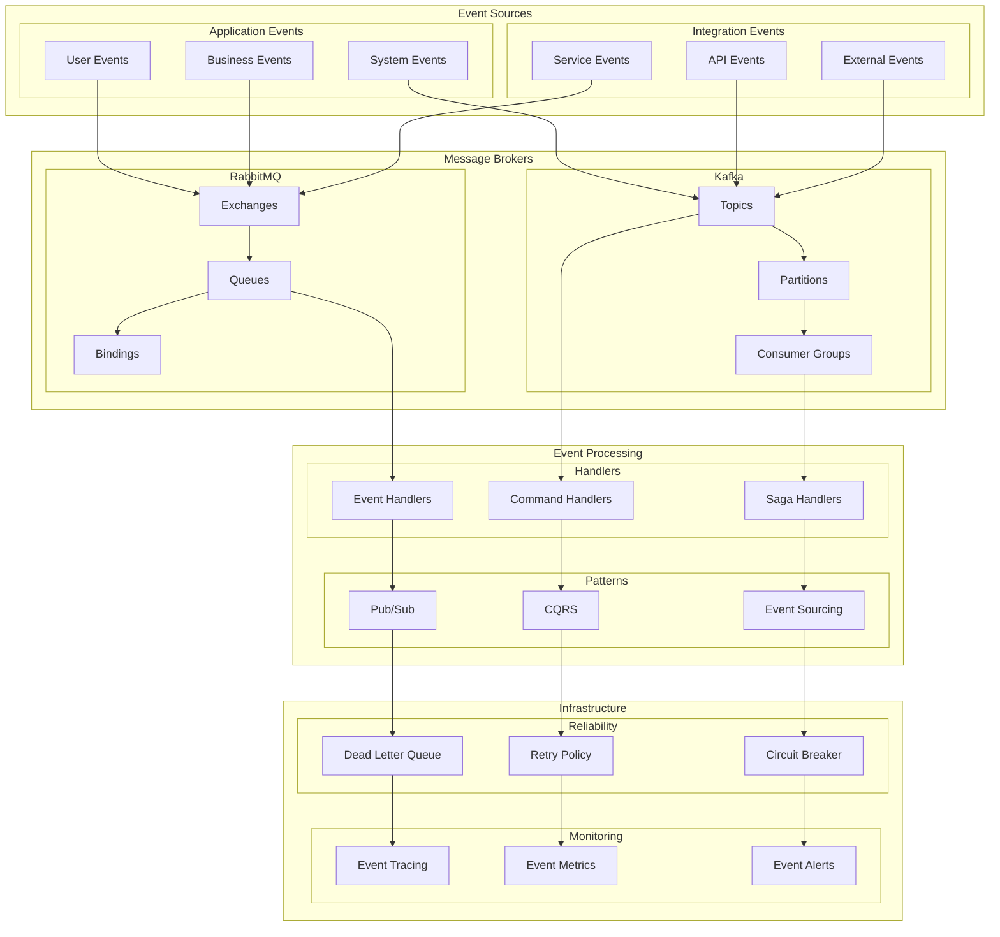

# Event-Driven Architecture

## Overview

The Event-Driven Architecture provides a scalable and loosely coupled system for handling asynchronous operations and integrations across the application. This architecture enables real-time processing, system resilience, and maintainable event flows while ensuring reliable message delivery and processing.

Key capabilities:
- Asynchronous event processing
- Distributed system integration
- Event sourcing and CQRS
- Message reliability and ordering
- Real-time event monitoring

Benefits:
- Loose coupling between services
- Improved scalability
- Better fault tolerance
- Real-time data processing
- System extensibility

## Components

### Event Layer
1. Event Sources
   - User events (UI interactions)
   - System events (internal operations)
   - Business events (domain changes)
   - Integration events (external systems)

2. Event Types
   - Command events
   - Domain events
   - Integration events
   - Notification events

3. Event Metadata
   - Event ID and type
   - Timestamp and version
   - Source and correlation IDs
   - Custom attributes

### Message Layer
1. Message Brokers
   - RabbitMQ configuration
   - Kafka setup
   - Exchange/Topic mapping
   - Queue management

2. Message Patterns
   - Publish/Subscribe
   - Request/Reply
   - Competing Consumers
   - Message Routing

3. Message Processing
   - Message serialization
   - Schema validation
   - Message transformation
   - Error handling

### Infrastructure Layer
1. Reliability Components
   - Dead letter queues
   - Retry policies
   - Circuit breakers
   - Message persistence

2. Monitoring Components
   - Event tracing
   - Performance metrics
   - Health checks
   - Alerting system

## Interactions

The event-driven system follows these primary workflows:

1. Event Publishing Flow


2. Event Processing Flow


3. Error Handling Flow


## Implementation Details

### Event Publisher Implementation
```typescript
interface EventMetadata {
  id: string;
  type: string;
  timestamp: Date;
  source: string;
  correlationId?: string;
  causationId?: string;
}

interface EventConfig {
  broker: 'rabbitmq' | 'kafka';
  exchange?: string;
  topic?: string;
  partition?: number;
  headers?: Record<string, string>;
}

class EventPublisher {
  async publish<T>(
    event: T,
    metadata: EventMetadata,
    config: EventConfig
  ): Promise<void> {
    const message = this.createMessage(event, metadata);
    const broker = this.getBroker(config.broker);
    
    await broker.connect();
    await broker.publish(message, config);
    await this.confirmDelivery(message.id);
  }
  
  private createMessage<T>(
    event: T,
    metadata: EventMetadata
  ): EventMessage<T> {
    return {
      id: metadata.id,
      payload: event,
      metadata,
      timestamp: new Date()
    };
  }
}
```

### Event Consumer Implementation
```typescript
interface ConsumerConfig {
  queue: string;
  prefetch: number;
  retry: {
    attempts: number;
    delay: number;
    backoff: 'linear' | 'exponential';
  };
}

class EventConsumer {
  async subscribe<T>(
    handler: (event: T) => Promise<void>,
    config: ConsumerConfig
  ): Promise<Subscription> {
    const consumer = await this.createConsumer(config);
    
    consumer.on('message', async (message) => {
      try {
        await this.processMessage(message, handler);
        await message.ack();
      } catch (error) {
        await this.handleError(message, error, config.retry);
      }
    });
    
    return consumer;
  }
  
  private async handleError(
    message: Message,
    error: Error,
    retry: RetryConfig
  ): Promise<void> {
    const attempts = message.getHeader('retry-count') || 0;
    
    if (attempts < retry.attempts) {
      await message.retry({
        delay: this.calculateDelay(attempts, retry),
        headers: { 'retry-count': attempts + 1 }
      });
    } else {
      await message.deadLetter();
    }
  }
}
```

### Event Handler Implementation
```typescript
interface HandlerConfig {
  eventType: string;
  version: number;
  idempotent: boolean;
  timeout: number;
}

class EventHandler {
  async handle<T>(
    event: EventMessage<T>,
    config: HandlerConfig
  ): Promise<void> {
    if (config.idempotent) {
      await this.ensureIdempotency(event.id);
    }
    
    const context = await this.createContext(event);
    
    try {
      await this.processEvent(event.payload, context);
      await this.completeProcessing(event.id);
    } catch (error) {
      await this.handleFailure(event, error);
      throw error;
    }
  }
  
  private async ensureIdempotency(eventId: string): Promise<void> {
    const processed = await this.storage.hasProcessed(eventId);
    if (processed) {
      throw new EventAlreadyProcessedError(eventId);
    }
  }
}
```

## Event Architecture Diagram



## Component Description

### Event Sources

1. **Application Events**

   - User interactions
   - System operations
   - Business processes

2. **Integration Events**
   - API integrations
   - Service communications
   - External systems

### Message Brokers

1. **RabbitMQ**

   - Exchange types
   - Queue management
   - Binding patterns

2. **Kafka**
   - Topic organization
   - Partition strategy
   - Consumer groups

### Event Processing

1. **Event Handlers**

   - Event processing
   - Command handling
   - Saga coordination

2. **Patterns**
   - Pub/Sub model
   - CQRS implementation
   - Event sourcing

## Implementation Guidelines

1. **Event Design**

   - Event schema
   - Versioning strategy
   - Payload structure
   - Event routing

2. **Message Flow**

   - Routing patterns
   - Queue design
   - Consumer patterns
   - Error handling

3. **Reliability**

   - Dead letter queues
   - Retry policies
   - Circuit breakers
   - Fault tolerance

4. **Best Practices**

   - Event idempotency
   - Message ordering
   - Scalability
   - Monitoring

5. **Performance**

   - Throughput
   - Latency
   - Resource usage
   - Optimization

6. **Documentation**
   - Event catalog
   - Flow diagrams
   - Handler patterns
   - Integration guides
