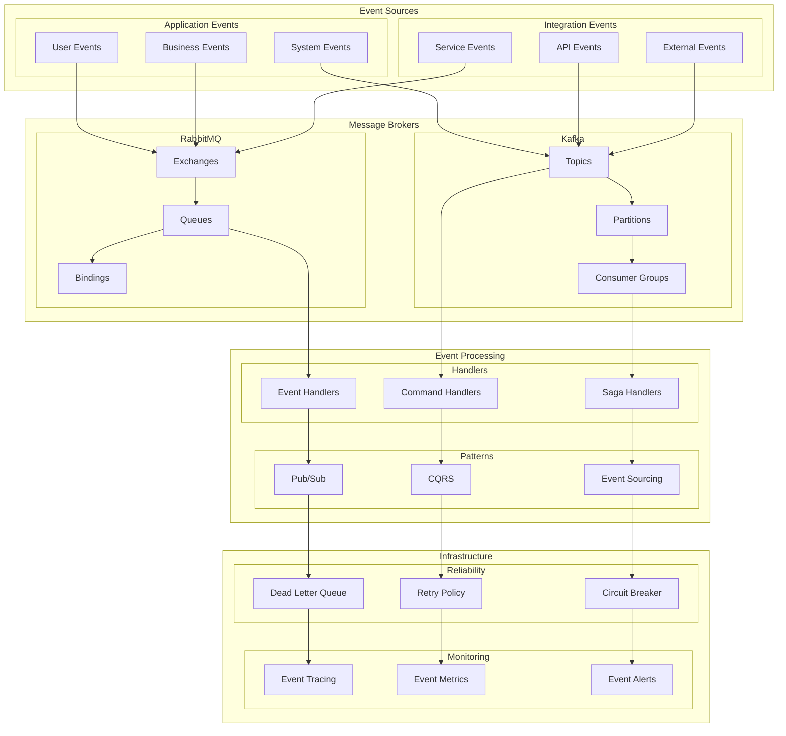

# Event-Driven Architecture

This diagram illustrates our event-driven architecture using message brokers and event handling patterns.

## Event Architecture Diagram

## Component Description

### Event Sources

1. **Application Events**

   - User interactions
   - System operations
   - Business processes

2. **Integration Events**
   - API integrations
   - Service communications
   - External systems

### Message Brokers

1. **RabbitMQ**

   - Exchange types
   - Queue management
   - Binding patterns

2. **Kafka**
   - Topic organization
   - Partition strategy
   - Consumer groups

### Event Processing

1. **Event Handlers**

   - Event processing
   - Command handling
   - Saga coordination

2. **Patterns**
   - Pub/Sub model
   - CQRS implementation
   - Event sourcing

## Implementation Guidelines

1. **Event Design**

   - Event schema
   - Versioning strategy
   - Payload structure
   - Event routing

2. **Message Flow**

   - Routing patterns
   - Queue design
   - Consumer patterns
   - Error handling

3. **Reliability**

   - Dead letter queues
   - Retry policies
   - Circuit breakers
   - Fault tolerance

4. **Best Practices**

   - Event idempotency
   - Message ordering
   - Scalability
   - Monitoring

5. **Performance**

   - Throughput
   - Latency
   - Resource usage
   - Optimization

6. **Documentation**
   - Event catalog
   - Flow diagrams
   - Handler patterns
   - Integration guides
