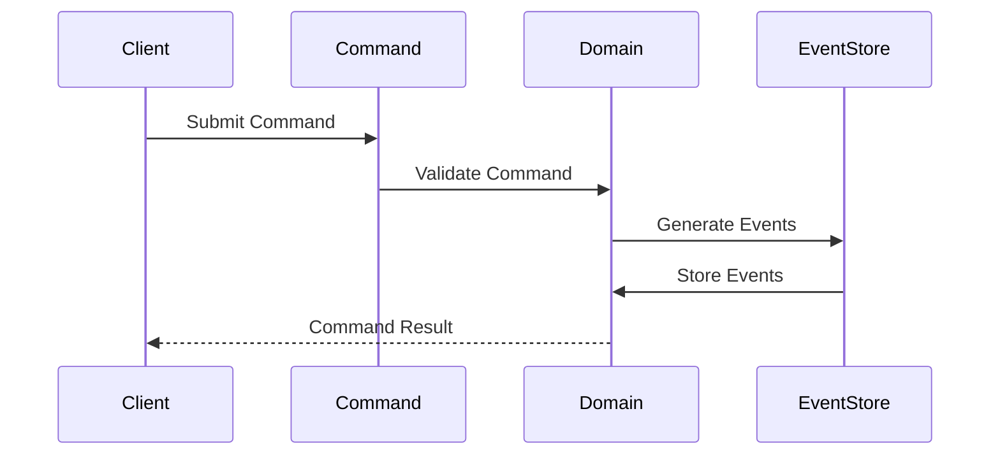
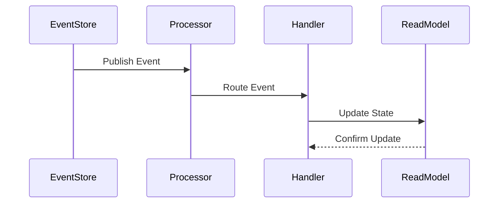
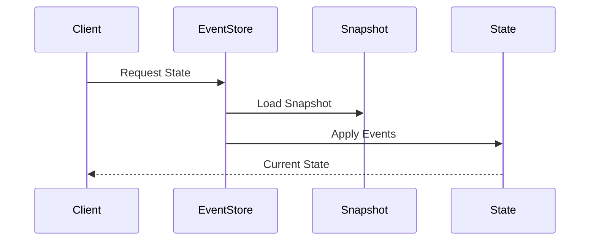
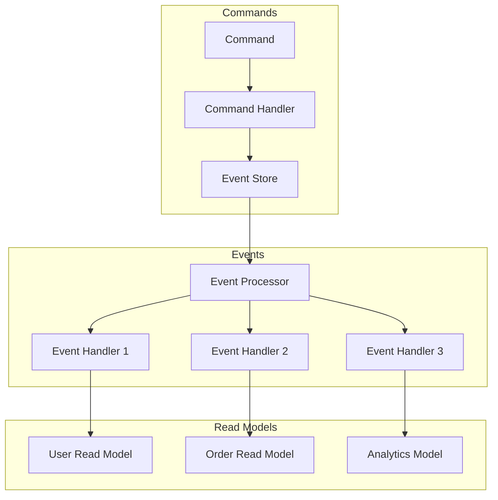

# Event Sourcing Architecture

## Overview

The Event Sourcing Architecture provides a robust system for capturing, storing, and processing all state changes as a sequence of events. This architecture implements event-driven patterns to maintain a complete history of all domain changes while enabling powerful querying and auditing capabilities.

Key Features:
- Event-driven state management
- Complete audit history
- Temporal querying
- Event replay capability
- State reconstruction

Benefits:
- Data consistency
- Audit compliance
- System debugging
- Time travel queries
- Event replay

## Interactions

The event sourcing system follows these key workflows:

1. Command Processing Flow

2. Event Processing Flow

3. State Reconstruction Flow

# Event Sourcing Diagram

This diagram illustrates our event sourcing architecture, including command handling, event processing, and read model updates.

## Components

### Command Handling

- Command validation
- Business logic execution
- Event generation
- Consistency checks

### Event Store

- Event persistence
- Event versioning
- Event replay
- Snapshot management

### Event Processing

- Event distribution
- Event handlers
- Parallel processing
- Error handling

### Read Models

- Materialized views
- Query optimization
- Real-time updates
- Cache management

## Implementation Details

### Command Flow

1. Command validation
2. Business rules check
3. Event generation
4. Event persistence

### Event Flow

1. Event publication
2. Handler distribution
3. Read model updates
4. Cache invalidation

### Read Model Updates

1. Event consumption
2. State projection
3. Cache updates
4. Query optimization
