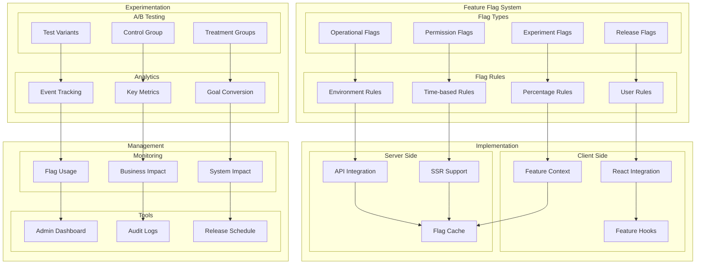

# Feature Flag and Experimentation Architecture

This diagram illustrates our feature flag system and A/B testing infrastructure.

## Feature Management Diagram

## Implementation

Feature flags are implemented using Context Provider particles as described in our [Atomic Design Structure](../components/atomic-design.md#particles) to efficiently manage and propagate feature state throughout the application.

## Component Description

### Feature Flag System

1. **Flag Types**

   - Release toggles
   - Experiment flags
   - Operational toggles
   - Permission flags

2. **Flag Rules**
   - User targeting
   - Environment rules
   - Time-based rules
   - Percentage rollouts

### Experimentation

1. **A/B Testing**

   - Variant management
   - Control groups
   - Treatment groups

2. **Analytics**
   - Event tracking
   - Metric collection
   - Goal conversion

### Implementation

1. **Client Side**

   - React integration
   - Context providers
   - Custom hooks

2. **Server Side**
   - API integration
   - SSR compatibility
   - Caching strategy

## Implementation Guidelines

1. **Flag Management**

   - Naming conventions
   - Flag lifecycle
   - Clean-up process
   - Documentation

2. **Testing Strategy**

   - Variant design
   - Sample size
   - Duration planning
   - Success metrics

3. **Development Flow**

   - Feature isolation
   - Flag dependencies
   - Default behaviors
   - Fallback handling

4. **Best Practices**

   - Progressive rollouts
   - Kill switches
   - Performance impact
   - Technical debt

5. **Monitoring**

   - Usage tracking
   - Impact analysis
   - System health
   - Alert thresholds

6. **Documentation**
   - Flag inventory
   - Test results
   - Implementation guides
   - Release notes
