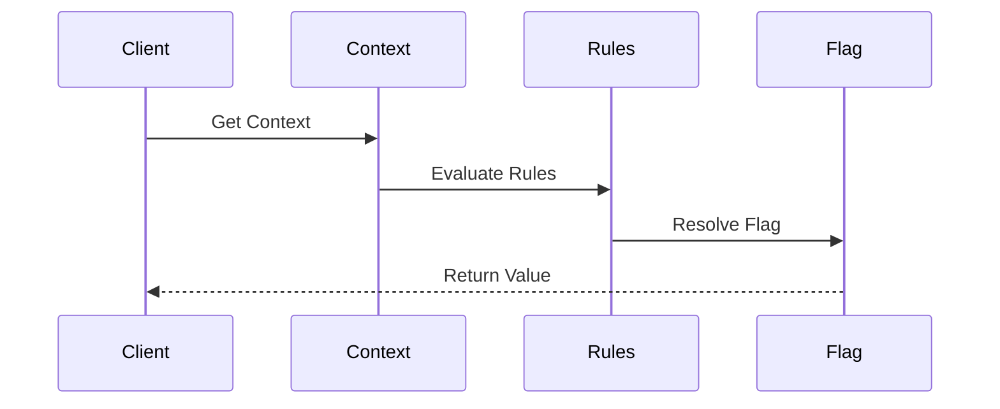
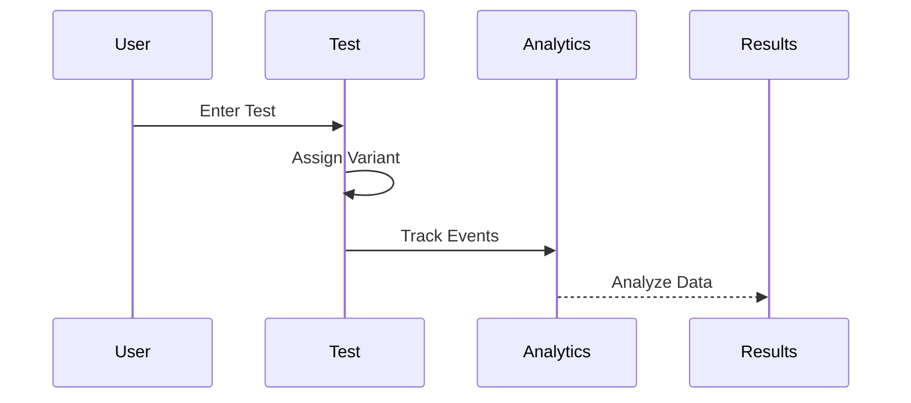
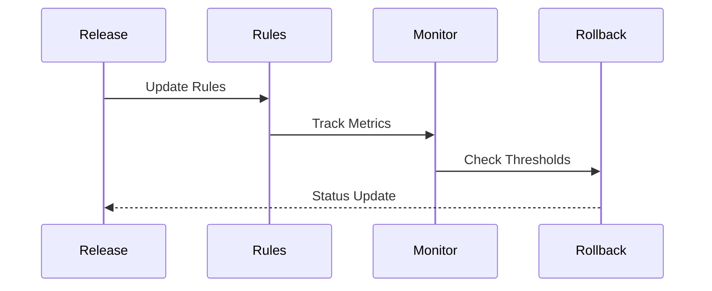
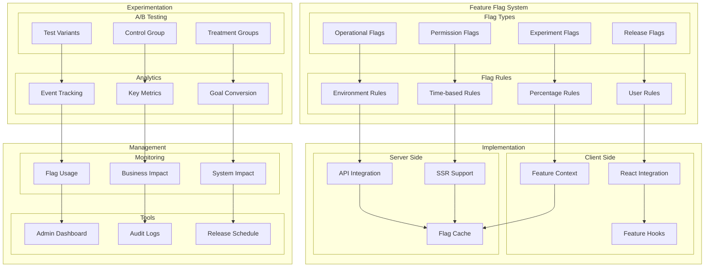

# Feature Flag and Experimentation Architecture

## Overview

The Feature Flag and Experimentation Architecture provides a comprehensive system for managing feature releases, conducting A/B tests, and controlling feature access across different environments and user segments. This architecture enables gradual rollouts, experimentation, and quick feature toggles.

Key Features:
- Feature flag management
- A/B testing
- Gradual rollouts
- User targeting
- Analytics integration

Benefits:
- Controlled releases
- Risk mitigation
- Data-driven decisions
- Quick rollbacks
- User segmentation

## Components

### Flag Components
1. Flag Types
   - Release flags
   - Experiment flags
   - Operational flags
   - Permission flags

2. Flag Rules
   - User rules
   - Environment rules
   - Time-based rules
   - Percentage rules

3. Flag Context
   - User context
   - Environment context
   - Device context
   - Location context

### Experimentation Components
1. Test Configuration
   - Variants
   - Control groups
   - Treatment groups
   - Sample sizes

2. Analytics
   - Event tracking
   - Key metrics
   - Goal conversion
   - Statistical analysis

3. Monitoring
   - Usage tracking
   - Impact analysis
   - Performance monitoring
   - Error tracking

## Interactions

The feature flag system follows these key workflows:

1. Flag Resolution Flow


2. Experiment Flow


3. Rollout Flow


## Implementation Details

### Flag Manager Implementation
```typescript
interface FlagConfig {
  key: string;
  type: FlagType;
  rules: FlagRule[];
  defaultValue: boolean;
}

class FeatureFlag {
  private config: FlagConfig;
  private context: FlagContext;
  private rules: RuleEngine;
  
  constructor(config: FlagConfig) {
    this.config = config;
    this.context = new FlagContext();
    this.rules = new RuleEngine();
  }
  
  async evaluate(
    context: EvalContext
  ): Promise<boolean> {
    const enrichedContext = await this.context.enrich(
      context
    );
    
    const result = await this.rules.evaluate(
      this.config.rules,
      enrichedContext
    );
    
    await this.trackEvaluation(result);
    return result;
  }
  
  private async trackEvaluation(
    result: boolean
  ): Promise<void> {
    await analytics.track({
      flag: this.config.key,
      result,
      context: this.context
    });
  }
}
```

### Experiment Manager Implementation
```typescript
interface ExperimentConfig {
  key: string;
  variants: Variant[];
  audience: AudienceRule;
  metrics: ExperimentMetric[];
}

class Experiment {
  private config: ExperimentConfig;
  private assignment: AssignmentStrategy;
  private analytics: Analytics;
  
  constructor(config: ExperimentConfig) {
    this.config = config;
    this.assignment = new AssignmentStrategy();
    this.analytics = new Analytics();
  }
  
  async assign(
    user: User
  ): Promise<Variant> {
    if (!await this.isEligible(user)) {
      return this.config.variants[0];
    }
    
    const variant = await this.assignment.assign(
      user,
      this.config.variants
    );
    
    await this.trackAssignment(user, variant);
    return variant;
  }
  
  private async isEligible(
    user: User
  ): Promise<boolean> {
    return this.config.audience.evaluate(user);
  }
}
```

### Analytics Manager Implementation
```typescript
interface AnalyticsConfig {
  metrics: MetricConfig[];
  goals: GoalConfig[];
  significance: number;
}

class ExperimentAnalytics {
  private config: AnalyticsConfig;
  private storage: MetricStorage;
  private calculator: StatsCalculator;
  
  constructor(config: AnalyticsConfig) {
    this.config = config;
    this.storage = new MetricStorage();
    this.calculator = new StatsCalculator();
  }
  
  async trackEvent(
    event: ExperimentEvent
  ): Promise<void> {
    await this.storage.store(event);
    
    const metrics = await this.calculateMetrics(
      event
    );
    
    await this.checkSignificance(metrics);
  }
  
  private async calculateMetrics(
    event: ExperimentEvent
  ): Promise<MetricResults> {
    const data = await this.storage.query(
      event.experiment
    );
    
    return this.calculator.calculate(
      data,
      this.config.metrics
    );
  }
}
```

## Feature Management Diagram



## Implementation

Feature flags are implemented using Context Provider particles as described in our [Atomic Design Structure](../components/atomic-design.md#particles) to efficiently manage and propagate feature state throughout the application.

## Component Description

### Feature Flag System

1. **Flag Types**

   - Release toggles
   - Experiment flags
   - Operational toggles
   - Permission flags

2. **Flag Rules**
   - User targeting
   - Environment rules
   - Time-based rules
   - Percentage rollouts

### Experimentation

1. **A/B Testing**

   - Variant management
   - Control groups
   - Treatment groups

2. **Analytics**
   - Event tracking
   - Metric collection
   - Goal conversion

### Implementation

1. **Client Side**

   - React integration
   - Context providers
   - Custom hooks

2. **Server Side**
   - API integration
   - SSR compatibility
   - Caching strategy

## Implementation Guidelines

1. **Flag Management**

   - Naming conventions
   - Flag lifecycle
   - Clean-up process
   - Documentation

2. **Testing Strategy**

   - Variant design
   - Sample size
   - Duration planning
   - Success metrics

3. **Development Flow**

   - Feature isolation
   - Flag dependencies
   - Default behaviors
   - Fallback handling

4. **Best Practices**

   - Progressive rollouts
   - Kill switches
   - Performance impact
   - Technical debt

5. **Monitoring**

   - Usage tracking
   - Impact analysis
   - System health
   - Alert thresholds

6. **Documentation**
   - Flag inventory
   - Test results
   - Implementation guides
   - Release notes
