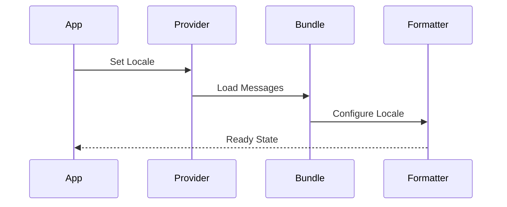
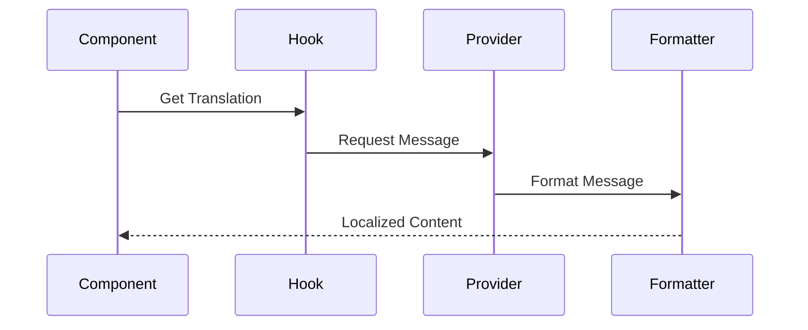
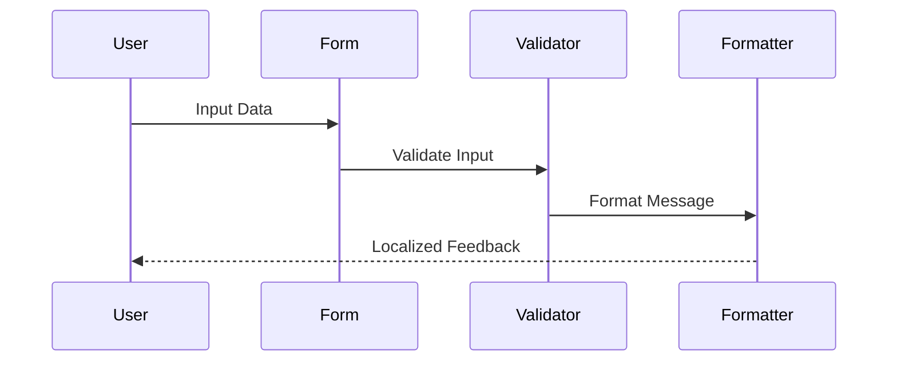
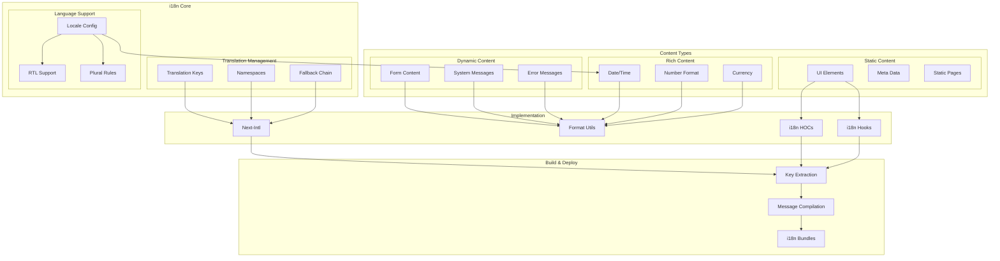

# Internationalization (i18n) Architecture

## Overview

The Internationalization (i18n) Architecture provides a comprehensive solution for managing multilingual content, localization, and cultural adaptations across the application. This system ensures consistent user experience across different languages and regions while maintaining development efficiency and content management flexibility.

Key capabilities:
- Dynamic language switching
- Locale-aware formatting
- RTL language support
- Automated translation management
- Context-aware pluralization

Benefits:
- Consistent user experience across locales
- Simplified content management
- Reduced translation overhead
- Improved accessibility
- Scalable localization process

## Components

### Translation Layer
1. Message Management
   - Translation key system
   - Namespace organization
   - Fallback chains
   - Dynamic interpolation

2. Locale Support
   - Language configuration
   - Regional settings
   - RTL text handling
   - Plural rules

3. Formatting System
   - Date/time formatting
   - Number formatting
   - Currency handling
   - Unit conversions

### Content Layer
1. Static Content
   - UI elements
   - Meta information
   - Static pages
   - Error messages

2. Dynamic Content
   - Form content
   - System messages
   - User-generated content
   - Notifications

3. Rich Content
   - Date/time display
   - Number presentation
   - Currency display
   - Measurement units

### Infrastructure Layer
1. Build System
   - Key extraction
   - Message compilation
   - Bundle generation
   - Source maps

2. Runtime System
   - Context providers
   - Format utilities
   - HOC wrappers
   - Custom hooks

## Interactions

The i18n system follows these primary workflows:

1. Translation Loading Flow


2. Content Rendering Flow


3. Dynamic Content Flow


## Implementation Details

### Translation Provider Implementation
```typescript
interface I18nConfig {
  defaultLocale: string;
  supportedLocales: string[];
  fallbackChain: string[];
  loadPath: string;
}

class I18nProvider {
  async initialize(config: I18nConfig): Promise<void> {
    const messages = await this.loadMessages(config.loadPath);
    const formatter = new IntlMessageFormat(messages);
    
    return this.setupProvider(formatter, config);
  }
  
  translate(key: string, params?: Record<string, any>): string {
    return this.formatter.format(key, params, this.currentLocale);
  }
}
```

### Format Utility Implementation
```typescript
interface FormatConfig {
  locale: string;
  timezone?: string;
  currency?: string;
  numberSystem?: string;
}

class FormatUtils {
  constructor(private config: FormatConfig) {}
  
  formatDate(date: Date, format?: Intl.DateTimeFormatOptions): string {
    return new Intl.DateTimeFormat(
      this.config.locale,
      { timeZone: this.config.timezone, ...format }
    ).format(date);
  }
  
  formatNumber(
    value: number,
    format?: Intl.NumberFormatOptions
  ): string {
    return new Intl.NumberFormat(
      this.config.locale,
      { numberingSystem: this.config.numberSystem, ...format }
    ).format(value);
  }
}
```

### Translation Hook Implementation
```typescript
interface TranslationHook {
  t: (key: string, params?: object) => string;
  locale: string;
  setLocale: (locale: string) => Promise<void>;
  isRTL: boolean;
}

function useTranslation(namespace?: string): TranslationHook {
  const context = useI18nContext();
  const [locale, setLocale] = useState(context.locale);
  
  const t = useCallback(
    (key: string, params?: object) => {
      const fullKey = namespace ? `${namespace}:${key}` : key;
      return context.translate(fullKey, params);
    },
    [context, namespace]
  );
  
  const changeLocale = async (newLocale: string) => {
    await context.loadMessages(newLocale);
    setLocale(newLocale);
  };
  
  return {
    t,
    locale,
    setLocale: changeLocale,
    isRTL: context.isRTL(locale)
  };
}
```

## i18n Architecture Diagram



## Component Description

### i18n Core

1. **Translation Management**

   - Key organization
   - Namespace structure
   - Fallback strategy

2. **Language Support**
   - Locale configuration
   - RTL text handling
   - Plural forms

### Content Types

1. **Static Content**

   - UI elements
   - Meta information
   - Static pages

2. **Dynamic Content**

   - Form elements
   - System messages
   - Error handling

3. **Rich Content**
   - Date/time formatting
   - Number formatting
   - Currency handling

## Implementation Guidelines

1. **Translation Strategy**

   - Key naming conventions
   - Context management
   - Variable handling
   - Pluralization rules

2. **Development Workflow**

   - Translation extraction
   - Message compilation
   - Bundle optimization
   - Hot reloading

3. **Component Integration**

   - HOC patterns
   - Hook usage
   - Formatter utilities
   - Context providers

4. **Build Process**

   - Key extraction
   - Bundle generation
   - Optimization
   - Lazy loading

5. **Best Practices**

   - Key organization
   - Context usage
   - Performance optimization
   - Maintenance strategy

6. **Quality Assurance**

   - Translation validation
   - Context verification
   - RTL testing
   - Format testing

7. **Performance**
   - Bundle size
   - Load time
   - Runtime performance
   - Memory usage
