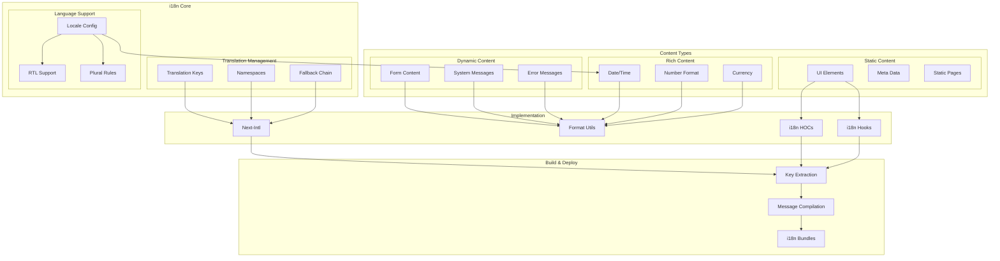

# Internationalization (i18n) Architecture

This diagram illustrates our comprehensive internationalization and localization strategy across the application.

## Implementation

Our i18n system is built using Context Provider particles as defined in our [Atomic Design Structure](../components/atomic-design.md#particles). These providers manage locale state, translations, and formatting rules throughout the component tree.

## i18n Architecture Diagram

## Component Description

### i18n Core

1. **Translation Management**

   - Key organization
   - Namespace structure
   - Fallback strategy

2. **Language Support**
   - Locale configuration
   - RTL text handling
   - Plural forms

### Content Types

1. **Static Content**

   - UI elements
   - Meta information
   - Static pages

2. **Dynamic Content**

   - Form elements
   - System messages
   - Error handling

3. **Rich Content**
   - Date/time formatting
   - Number formatting
   - Currency handling

## Implementation Guidelines

1. **Translation Strategy**

   - Key naming conventions
   - Context management
   - Variable handling
   - Pluralization rules

2. **Development Workflow**

   - Translation extraction
   - Message compilation
   - Bundle optimization
   - Hot reloading

3. **Component Integration**

   - HOC patterns
   - Hook usage
   - Formatter utilities
   - Context providers

4. **Build Process**

   - Key extraction
   - Bundle generation
   - Optimization
   - Lazy loading

5. **Best Practices**

   - Key organization
   - Context usage
   - Performance optimization
   - Maintenance strategy

6. **Quality Assurance**

   - Translation validation
   - Context verification
   - RTL testing
   - Format testing

7. **Performance**
   - Bundle size
   - Load time
   - Runtime performance
   - Memory usage
