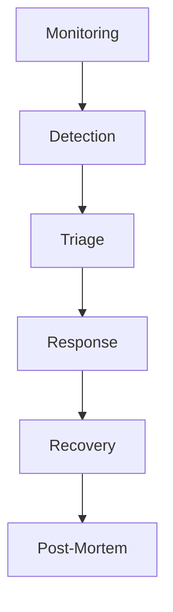
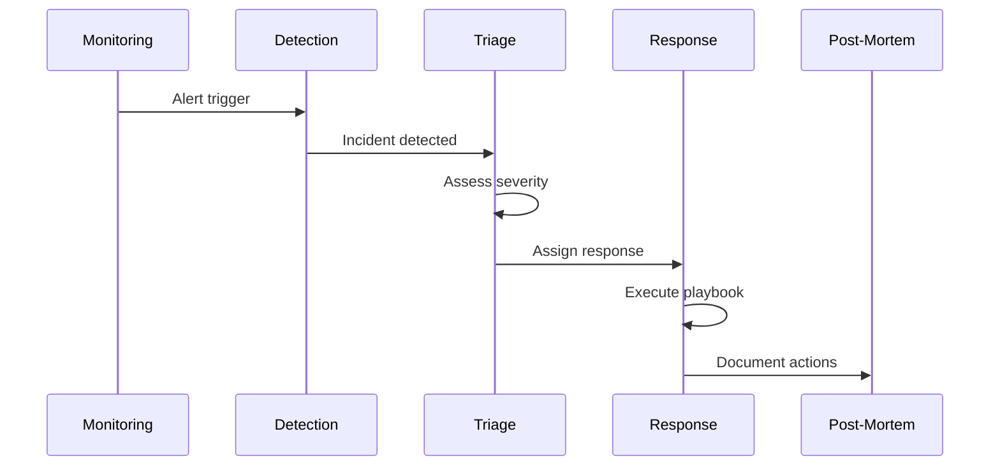

# Incident Response Architecture

## Overview

This document outlines our incident response architecture, designed to effectively detect, respond to, and recover from security incidents and system outages.

## Components

### Incident Management System


### Key Components
1. Detection System
   - Alert correlation
   - Anomaly detection
   - Threat intelligence
   - User reports

2. Triage System
   - Severity assessment
   - Impact analysis
   - Resource allocation
   - Team notification

3. Response System
   - Playbook execution
   - Communication
   - Containment
   - Mitigation

4. Recovery System
   - Service restoration
   - Data recovery
   - System hardening
   - Verification

## Interactions

### Incident Flow


## Implementation Details

### Incident Configuration
```typescript
interface IncidentConfig {
  severity: 'critical' | 'high' | 'medium' | 'low';
  type: IncidentType;
  responders: Responder[];
  playbook: PlaybookStep[];
  communication: CommunicationPlan;
}

interface PlaybookStep {
  action: string;
  owner: string;
  timeframe: number;
  verification: string;
}
```

### Response Automation
```typescript
interface AutomatedResponse {
  trigger: TriggerCondition;
  actions: ResponseAction[];
  verification: VerificationStep[];
  rollback: RollbackPlan;
}
```

### Communication Templates
- Incident notification
- Status updates
- Resolution notice
- Post-mortem report

## Related Documentation
- [Security Monitoring](../security/security-monitoring.md)
- [Disaster Recovery](../infrastructure/disaster-recovery.md)
- [Alert Management](../system/monitoring-architecture.md)
