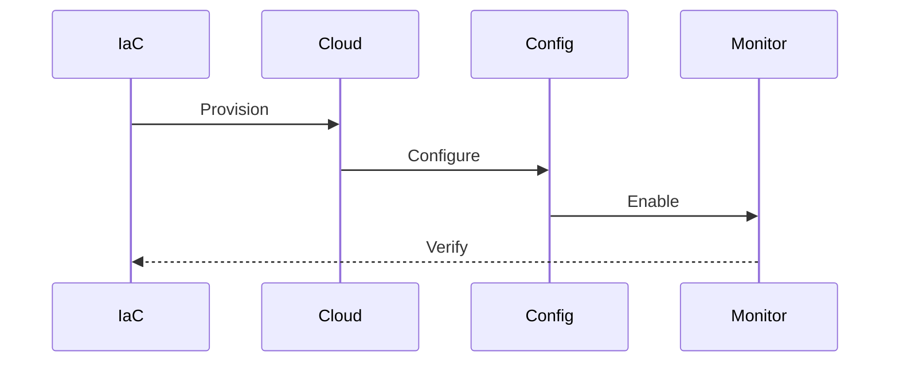
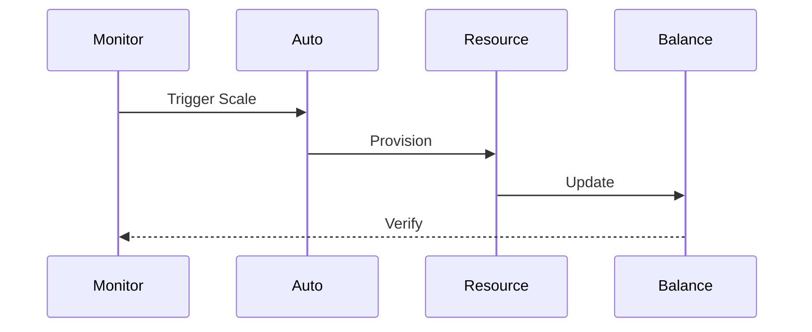
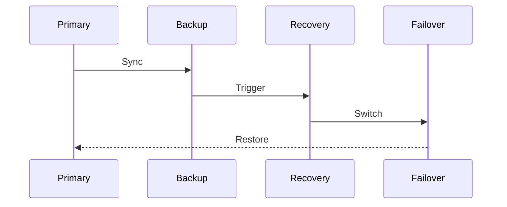
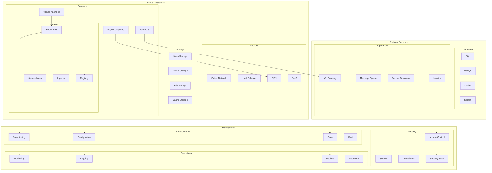

# Infrastructure Architecture

## Overview

The Infrastructure Architecture provides a comprehensive system for managing our cloud-based infrastructure, ensuring scalability, reliability, and security. This architecture implements infrastructure as code principles and modern cloud-native practices.

Key Features:
- Infrastructure as Code
- Multi-cloud support
- Auto-scaling
- High availability
- Disaster recovery

Benefits:
- Operational efficiency
- Cost optimization
- Resource management
- Security compliance
- System reliability

## Components

### Cloud Layer
1. Compute Resources
   - Virtual machines
   - Containers
   - Serverless functions
   - Edge computing

2. Storage Resources
   - Block storage
   - Object storage
   - File storage
   - Cache storage

3. Network Resources
   - Virtual networks
   - Load balancers
   - CDN
   - DNS management

### Platform Layer
1. Container Platform
   - Kubernetes clusters
   - Container registry
   - Service mesh
   - Ingress control

2. Database Platform
   - Relational databases
   - NoSQL databases
   - Cache databases
   - Search databases

3. Application Platform
   - API gateway
   - Message queues
   - Service discovery
   - Identity management

### Management Layer
1. Infrastructure Management
   - Resource provisioning
   - Configuration management
   - State management
   - Cost management

2. Security Management
   - Access control
   - Secret management
   - Compliance monitoring
   - Security scanning

3. Operations Management
   - Monitoring
   - Logging
   - Backup
   - Recovery

## Interactions

The infrastructure system follows these key workflows:

1. Resource Provisioning Flow


2. Scaling Process Flow


3. Disaster Recovery Flow


## Implementation Details

### Resource Manager Implementation
```typescript
interface ResourceConfig {
  providers: ProviderConfig[];
  resources: ResourceSpec[];
  policies: PolicyConfig[];
}

class ResourceManager {
  private config: ResourceConfig;
  private providers: CloudProvider[];
  private policies: ResourcePolicy[];
  
  constructor(config: ResourceConfig) {
    this.config = config;
    this.providers = this.initProviders();
    this.policies = this.initPolicies();
  }
  
  async provision(
    spec: ResourceSpec,
    options?: ProvisionOptions
  ): Promise<ResourceResult> {
    const validated = await this.validate(
      spec
    );
    
    const provisioned = await this.create(
      validated,
      options
    );
    
    return this.configure(provisioned);
  }
  
  private async create(
    spec: ValidatedSpec,
    options?: ProvisionOptions
  ): Promise<Resource> {
    return this.providers.provision(
      spec,
      this.config.resources
    );
  }
}
```

### Platform Manager Implementation
```typescript
interface PlatformConfig {
  clusters: ClusterConfig[];
  services: ServiceConfig[];
  storage: StorageConfig[];
}

class PlatformManager {
  private config: PlatformConfig;
  private clusters: ClusterManager[];
  private services: ServiceManager[];
  
  constructor(config: PlatformConfig) {
    this.config = config;
    this.clusters = this.initClusters();
    this.services = this.initServices();
  }
  
  async deploy(
    service: ServiceSpec,
    options?: DeployOptions
  ): Promise<DeployResult> {
    const cluster = await this.selectCluster(
      service
    );
    
    const deployed = await this.deployService(
      service,
      cluster
    );
    
    return this.monitor(deployed);
  }
  
  private async deployService(
    spec: ServiceSpec,
    cluster: Cluster
  ): Promise<Service> {
    return cluster.deploy(
      spec,
      this.config.services
    );
  }
}
```

### Security Manager Implementation
```typescript
interface SecurityConfig {
  policies: PolicyConfig[];
  controls: ControlConfig[];
  compliance: ComplianceConfig[];
}

class SecurityManager {
  private config: SecurityConfig;
  private policies: SecurityPolicy[];
  private controls: SecurityControl[];
  
  constructor(config: SecurityConfig) {
    this.config = config;
    this.policies = this.initPolicies();
    this.controls = this.initControls();
  }
  
  async enforce(
    resource: Resource,
    options?: SecurityOptions
  ): Promise<SecurityResult> {
    const policies = await this.getPolicies(
      resource
    );
    
    const enforced = await this.applyControls(
      resource,
      policies
    );
    
    return this.audit(enforced);
  }
  
  private async applyControls(
    resource: Resource,
    policies: Policy[]
  ): Promise<ControlResult> {
    return this.controls.apply(
      resource,
      policies
    );
  }
}
```

## Infrastructure Architecture Diagram


