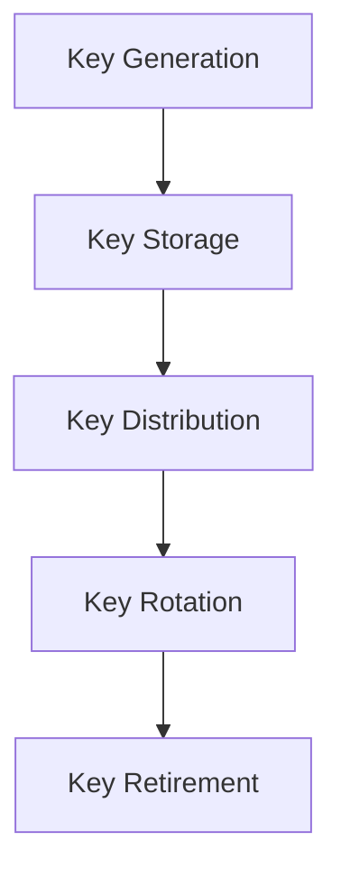
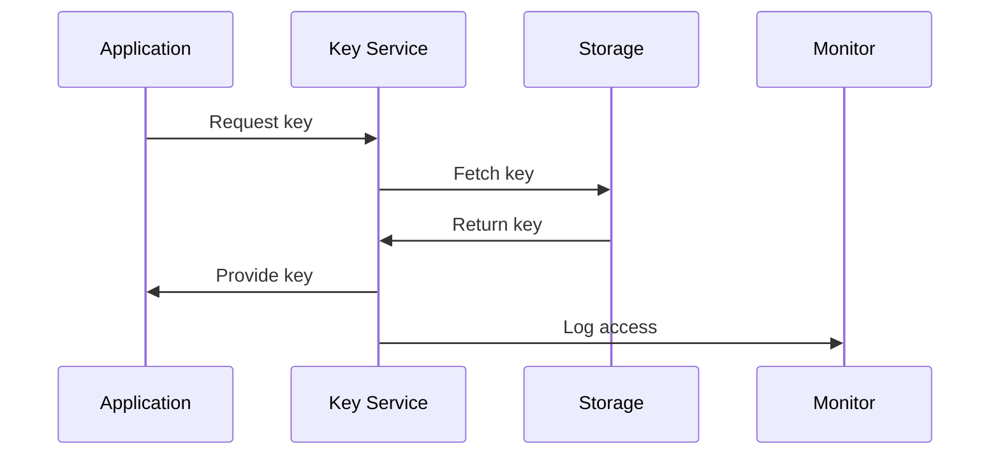

# Key Management Architecture

## Overview

This document outlines our key management architecture, designed to securely generate, store, distribute, and rotate cryptographic keys across our system.

## Components

### Key Management Stack


### Key Components
1. Key Generation
   - Random generation
   - Key derivation
   - Key hierarchy
   - Key metadata

2. Key Storage
   - Hardware security
   - Secure enclaves
   - Backup storage
   - Access control

3. Key Distribution
   - Secure transport
   - Access management
   - Key synchronization
   - Version control

4. Key Lifecycle
   - Rotation schedule
   - Version tracking
   - Usage monitoring
   - Retirement process

## Interactions

### Key Flow


## Implementation Details

### Key Configuration
```typescript
interface KeyConfig {
  type: KeyType;
  algorithm: string;
  length: number;
  usage: KeyUsage[];
  rotation: RotationPolicy;
}

interface RotationPolicy {
  interval: number;
  trigger: 'time' | 'usage' | 'manual';
  grace: number;
  notification: NotificationConfig;
}
```

### Security Controls
```typescript
interface SecurityControl {
  access: AccessPolicy[];
  audit: AuditPolicy;
  backup: BackupPolicy;
  monitoring: MonitoringConfig;
}
```

### Management Standards
- Generation requirements
- Storage specifications
- Distribution protocols
- Rotation schedules
- Audit requirements

## Related Documentation
- [Encryption](./encryption.md)
- [Security Architecture](./security.md)
- [Compliance](../infrastructure/compliance.md)
- [Access Control](../security/authorization.md)
