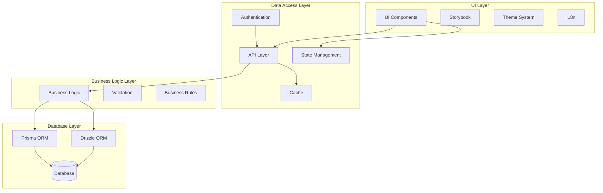

# System Layers Architecture

This diagram illustrates the main architectural layers of the system and their interactions.

## Layer Diagram

## Description

The system is divided into four main layers:

1. **UI Layer**: Handles all user interface components and interactions
2. **Data Access Layer**: Manages data access, caching, and state
3. **Business Logic Layer**: Contains core business rules and validation
4. **Database Layer**: Handles data persistence through ORMs

## Key Points

- Clear separation of concerns between layers
- Multiple ORM support for flexibility
- Centralized authentication and caching
- State management integrated with UI layer
