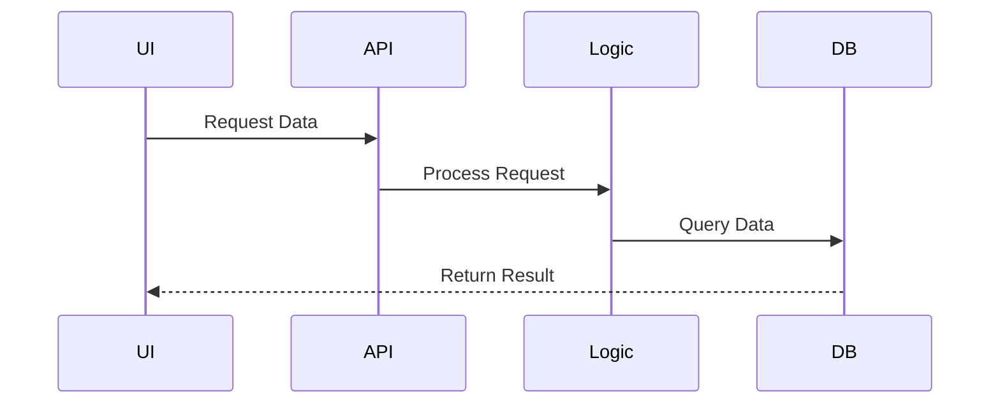
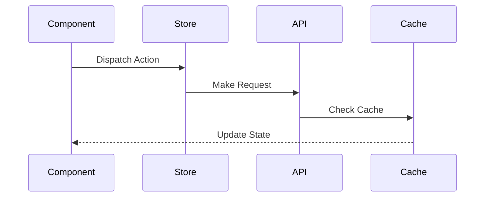
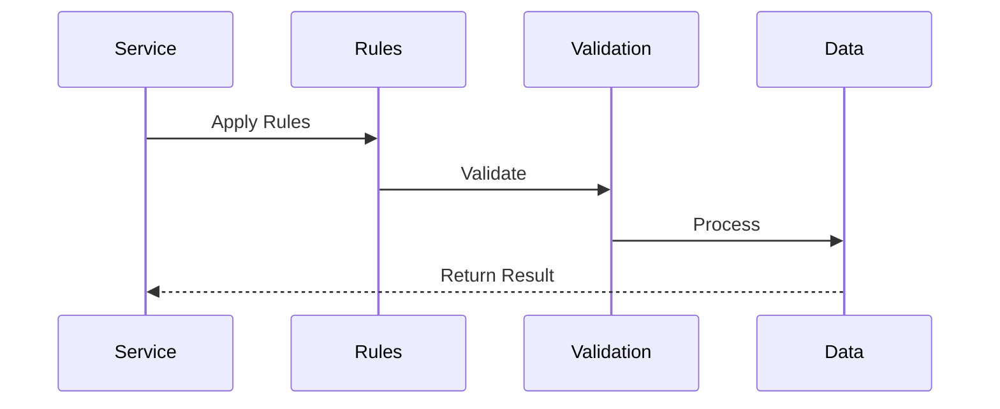
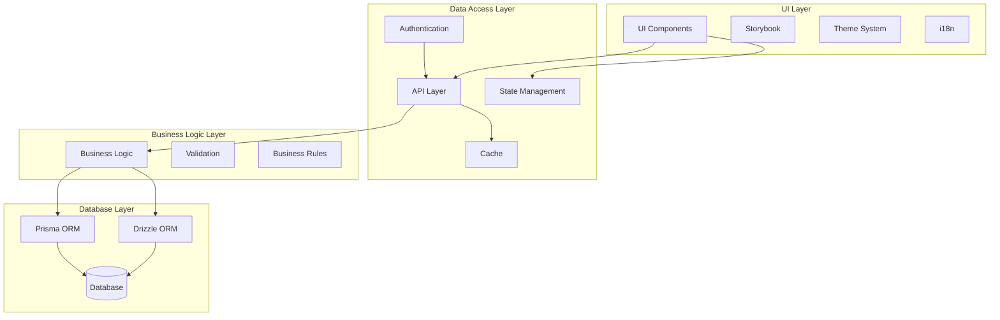

# System Layers Architecture

## Overview

The System Layers Architecture implements a clean, modular, and maintainable architecture that separates concerns into distinct layers. This layered approach ensures separation of responsibilities, improves code organization, and enables independent scaling of different system components.

Key Features:
- Clean separation of concerns
- Independent layer scaling
- Clear dependency flow
- Modular components
- Type-safe interfaces

Benefits:
- Improved maintainability
- Better testability
- Easier debugging
- Flexible deployment
- Enhanced security

## Components

### UI Layer Components
1. UI Framework
   - React components
   - Storybook integration
   - Theme system
   - i18n support
   - Accessibility features

2. State Management
   - Global state
   - Local state
   - Side effects
   - State persistence

3. UI Services
   - API clients
   - WebSocket handlers
   - Event emitters
   - Error boundaries

### Data Access Components
1. API Layer
   - REST endpoints
   - GraphQL resolvers
   - WebSocket handlers
   - Authentication middleware

2. Cache System
   - In-memory cache
   - Distributed cache
   - Cache invalidation
   - Cache policies

3. State Management
   - Redux store
   - Context providers
   - State selectors
   - Action creators

### Business Logic Components
1. Core Logic
   - Domain services
   - Business rules
   - Validation logic
   - Error handling

2. Integration Services
   - External APIs
   - Event handlers
   - Message queues
   - Background jobs

3. Utility Services
   - Logging
   - Monitoring
   - Analytics
   - Security

### Database Components
1. ORM Layer
   - Prisma models
   - Drizzle schemas
   - Query builders
   - Migrations

2. Database Services
   - Connection pool
   - Transactions
   - Backup system
   - Replication

## Interactions

The system layers interact through these key workflows:

1. Data Flow


2. State Management Flow


3. Business Logic Flow


## Implementation Details

### UI Layer Implementation
```typescript
interface ThemeConfig {
  mode: 'light' | 'dark';
  colors: ColorPalette;
  spacing: SpacingScale;
  breakpoints: Breakpoints;
}

class UIThemeProvider {
  private theme: ThemeConfig;
  private subscribers: Set<ThemeSubscriber>;
  
  constructor(config: ThemeConfig) {
    this.theme = this.processTheme(config);
    this.subscribers = new Set();
  }
  
  setTheme(theme: Partial<ThemeConfig>): void {
    this.theme = {
      ...this.theme,
      ...theme
    };
    this.notifySubscribers();
  }
  
  useTheme(): ThemeConfig {
    return this.theme;
  }
}
```

### Data Access Implementation
```typescript
interface CacheConfig {
  ttl: number;
  maxSize: number;
  strategy: 'lru' | 'fifo';
}

class CacheManager {
  private cache: Map<string, CacheEntry>;
  private config: CacheConfig;
  
  constructor(config: CacheConfig) {
    this.cache = new Map();
    this.config = config;
  }
  
  async get<T>(key: string): Promise<T | null> {
    const entry = this.cache.get(key);
    
    if (!entry || this.isExpired(entry)) {
      return null;
    }
    
    return entry.value as T;
  }
  
  async set<T>(
    key: string,
    value: T,
    ttl?: number
  ): Promise<void> {
    this.cache.set(key, {
      value,
      timestamp: Date.now(),
      ttl: ttl ?? this.config.ttl
    });
    
    this.cleanup();
  }
}
```

### Business Logic Implementation
```typescript
interface ValidationRule<T> {
  validate(value: T): ValidationResult;
  message: string;
}

class BusinessRuleEngine {
  private rules: Map<string, ValidationRule<any>[]>;
  
  constructor() {
    this.rules = new Map();
  }
  
  addRule<T>(
    domain: string,
    rule: ValidationRule<T>
  ): void {
    const domainRules = this.rules.get(domain) ?? [];
    this.rules.set(domain, [...domainRules, rule]);
  }
  
  async validate<T>(
    domain: string,
    value: T
  ): Promise<ValidationResult[]> {
    const rules = this.rules.get(domain) ?? [];
    
    return Promise.all(
      rules.map(rule => rule.validate(value))
    );
  }
}
```

## Layer Diagram



## Description

The system is divided into four main layers:

1. **UI Layer**: Handles all user interface components and interactions
2. **Data Access Layer**: Manages data access, caching, and state
3. **Business Logic Layer**: Contains core business rules and validation
4. **Database Layer**: Handles data persistence through ORMs

## Key Points

- Clear separation of concerns between layers
- Multiple ORM support for flexibility
- Centralized authentication and caching
- State management integrated with UI layer
