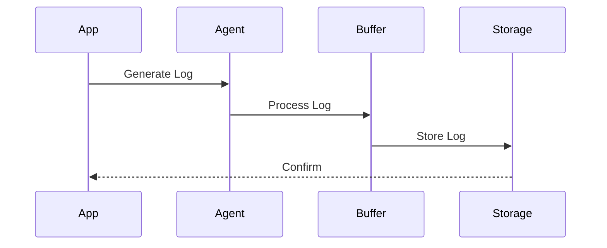
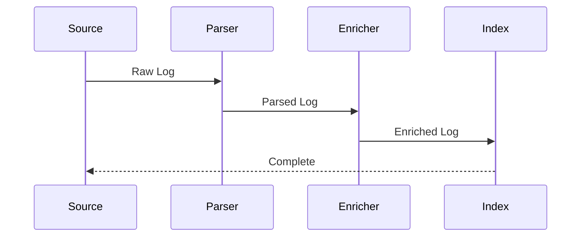
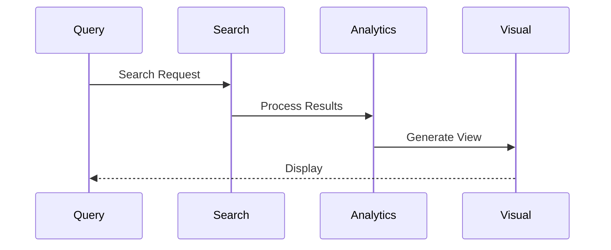
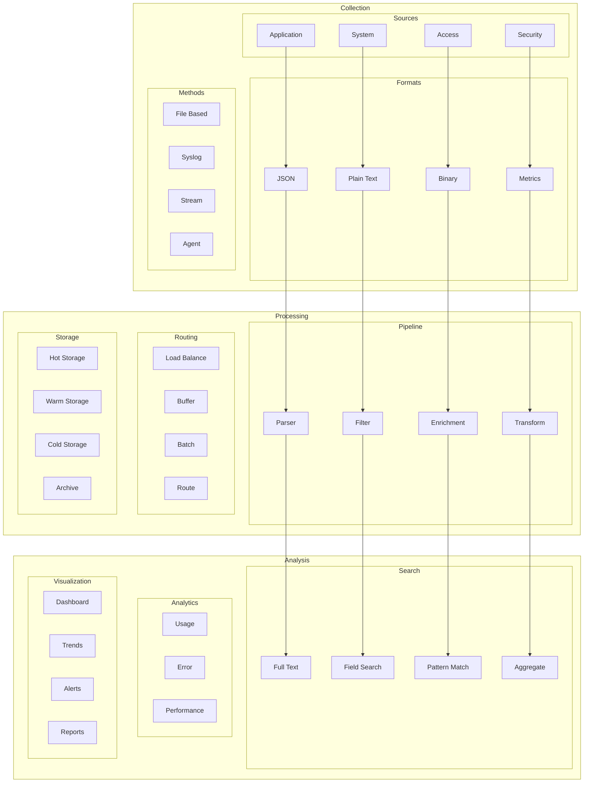

# Logging Architecture

## Overview

The Logging Architecture provides a comprehensive system for capturing, processing, and analyzing application logs across our entire infrastructure. This architecture ensures efficient log management, searchability, and insights generation.

Key Features:
- Structured logging
- Log aggregation
- Real-time processing
- Log retention policies
- Search capabilities

Benefits:
- Debugging efficiency
- Audit compliance
- Performance analysis
- Security monitoring
- Operational insights

## Components

### Collection Layer
1. Log Sources
   - Application logs
   - System logs
   - Access logs
   - Security logs

2. Log Formats
   - JSON structured
   - Plain text
   - Binary logs
   - Metrics logs

3. Collection Methods
   - File-based
   - Syslog protocol
   - Stream-based
   - Agent-based

### Processing Layer
1. Log Processing
   - Parsing
   - Filtering
   - Enrichment
   - Transformation

2. Log Routing
   - Stream routing
   - Load balancing
   - Buffer management
   - Batch processing

3. Log Storage
   - Hot storage
   - Warm storage
   - Cold storage
   - Archive storage

### Analysis Layer
1. Search & Query
   - Full-text search
   - Field-based search
   - Pattern matching
   - Aggregations

2. Analytics
   - Usage patterns
   - Error analysis
   - Performance metrics
   - Security events

3. Visualization
   - Log dashboards
   - Trend analysis
   - Alert visualization
   - Custom reports

## Interactions

The logging system follows these key workflows:

1. Log Collection Flow


2. Log Processing Flow


3. Log Analysis Flow


## Implementation Details

### Log Manager Implementation
```typescript
interface LogConfig {
  sources: SourceConfig[];
  processors: ProcessorConfig[];
  storage: StorageConfig;
}

class LogManager {
  private config: LogConfig;
  private sources: LogSource[];
  private processors: LogProcessor[];
  
  constructor(config: LogConfig) {
    this.config = config;
    this.sources = this.initSources();
    this.processors = this.initProcessors();
  }
  
  async log(
    entry: LogEntry,
    options?: LogOptions
  ): Promise<LogResult> {
    const processed = await this.process(
      entry
    );
    
    const stored = await this.store(
      processed,
      options
    );
    
    return this.confirm(stored);
  }
  
  private async process(
    entry: LogEntry
  ): Promise<ProcessedLog> {
    for (const processor of this.processors) {
      entry = await processor.process(entry);
    }
    
    return entry;
  }
}
```

### Log Search Implementation
```typescript
interface SearchConfig {
  indices: IndexConfig[];
  queries: QueryConfig[];
  aggregations: AggConfig[];
}

class LogSearch {
  private config: SearchConfig;
  private indices: SearchIndex[];
  private queries: QueryBuilder[];
  
  constructor(config: SearchConfig) {
    this.config = config;
    this.indices = this.initIndices();
    this.queries = this.initQueries();
  }
  
  async search(
    query: SearchQuery,
    options?: SearchOptions
  ): Promise<SearchResult> {
    const prepared = await this.prepare(
      query
    );
    
    const results = await this.execute(
      prepared,
      options
    );
    
    return this.format(results);
  }
  
  private async execute(
    query: PreparedQuery,
    options?: SearchOptions
  ): Promise<RawResults> {
    return this.indices.search(
      query,
      this.config.indices
    );
  }
}
```

### Log Analytics Implementation
```typescript
interface AnalyticsConfig {
  metrics: MetricConfig[];
  patterns: PatternConfig[];
  reports: ReportConfig[];
}

class LogAnalytics {
  private config: AnalyticsConfig;
  private metrics: MetricAnalyzer[];
  private patterns: PatternAnalyzer[];
  
  constructor(config: AnalyticsConfig) {
    this.config = config;
    this.metrics = this.initMetrics();
    this.patterns = this.initPatterns();
  }
  
  async analyze(
    logs: LogData[],
    options?: AnalyzeOptions
  ): Promise<AnalysisResult> {
    const metrics = await this.analyzeMetrics(
      logs
    );
    
    const patterns = await this.findPatterns(
      logs,
      options
    );
    
    return this.generateReport(metrics, patterns);
  }
  
  private async findPatterns(
    logs: LogData[],
    options?: AnalyzeOptions
  ): Promise<PatternResults> {
    return this.patterns.analyze(
      logs,
      this.config.patterns
    );
  }
}
```

## Logging Architecture Diagram


