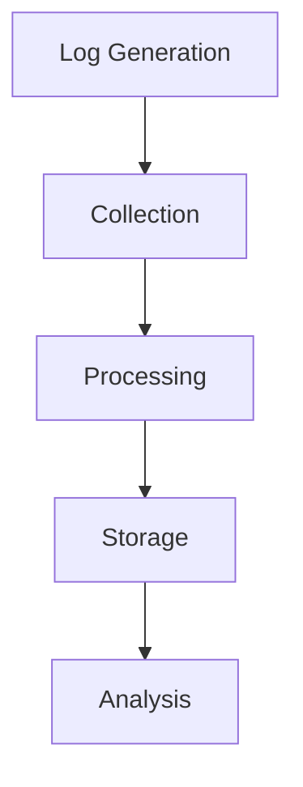
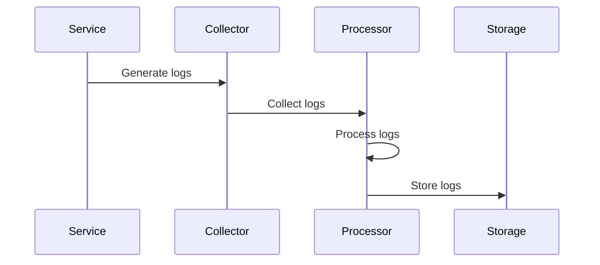

# Logging Architecture

## Overview

This document outlines our logging architecture, establishing comprehensive logging practices and management across our system.

## Components

### Logging Stack


### Key Components
1. Log Generation
   - Log levels
   - Log formats
   - Context enrichment
   - Source identification

2. Log Collection
   - Log aggregation
   - Transport methods
   - Buffer management
   - Reliability handling

3. Log Processing
   - Parsing
   - Filtering
   - Transformation
   - Enrichment

4. Log Storage
   - Storage systems
   - Retention policies
   - Archival strategies
   - Access control

## Interactions

### Logging Flow


## Implementation Details

### Logging Configuration
```typescript
interface LoggingConfig {
  generation: GenerationConfig;
  collection: CollectionConfig;
  processing: ProcessingConfig;
  storage: StorageConfig;
}

interface GenerationConfig {
  levels: LogLevel[];
  formats: LogFormat[];
  context: ContextConfig;
  sources: Source[];
}
```

### Processing Rules
```typescript
interface ProcessingRule {
  type: ProcessingType;
  filter: FilterConfig;
  transform: TransformConfig;
  enrich: EnrichmentConfig;
}
```

### Logging Standards
- Log level usage
- Format requirements
- Collection methods
- Processing rules
- Storage policies

## Related Documentation
- [Monitoring](./monitoring.md)
- [Audit Logging](../infrastructure/audit-logging.md)
- [Security Monitoring](../security/security-monitoring.md)
- [Performance Monitoring](../infrastructure/performance-monitoring.md)
