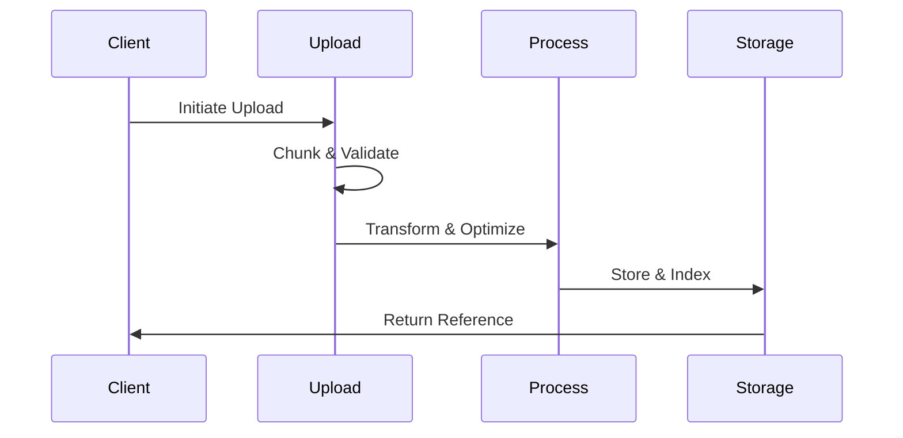
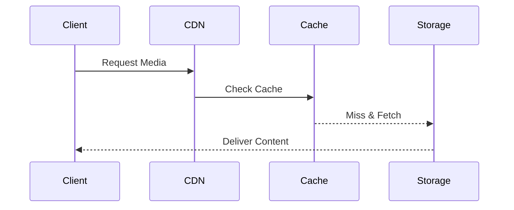
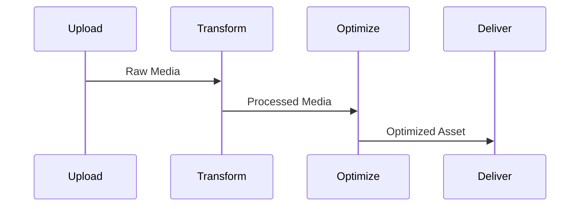

# Media Handling Architecture

## Overview

The Media Handling Architecture is a scalable and robust system designed to manage the complete lifecycle of media assets within our platform. It provides end-to-end solutions for media upload, processing, storage, and delivery while ensuring high performance, security, and reliability.

Key capabilities:
- Efficient media processing and transformation
- Multi-region content delivery
- Intelligent caching strategies
- Secure access control
- Scalable storage solutions
- Real-time analytics and monitoring

## Components

### Storage Layer
1. Cloud Storage
   - S3 Bucket: Primary storage for original media assets
   - CloudFront: CDN integration for fast content delivery
   - Cloudflare R2: Edge storage for frequently accessed content

2. Local Cache
   - Temporary Storage: For processing and validation
   - Local Cache: Frequently accessed media
   - File Buffer: Streaming and chunked uploads

3. Database
   - Media Metadata: Asset information and properties
   - File References: Content addressing and mapping
   - Version Control: Asset version management

### Processing Layer
1. Upload Processing
   - Chunked Upload Handler
   - File Validation Service
   - Virus Scanning Engine

2. Transformation Engine
   - Image Resizing Service
   - Format Conversion
   - Compression Pipeline

3. Optimization Service
   - Quality Optimization
   - Format Selection
   - Size Optimization

### Delivery Layer
1. CDN Integration
   - Edge Location Management
   - Cache Control
   - Purge Mechanisms

2. Streaming Services
   - HLS Protocol Support
   - DASH Implementation
   - Live Streaming Handler

3. Download Management
   - Direct Download Service
   - Resume Capability
   - Batch Processing

## Media Architecture Diagram

```mermaid
graph TB
    subgraph "Media Storage"
        subgraph "Cloud Storage"
            S3[S3 Bucket]
            CloudFront[CloudFront]
            R2[Cloudflare R2]
        end

        subgraph "Local Cache"
            TempStore[Temp Storage]
            LocalCache[Local Cache]
            Buffer[File Buffer]
        end

        subgraph "Database"
            Metadata[Media Metadata]
            References[File References]
            Versions[File Versions]
        end
    end

    subgraph "Media Processing"
        subgraph "Upload"
            Chunking[File Chunking]
            Validation[File Validation]
            Virus[Virus Scan]
        end

        subgraph "Transform"
            Resize[Image Resize]
            Convert[Format Convert]
            Compress[Compression]
        end

        subgraph "Optimization"
            Quality[Quality Optimize]
            Format[Format Optimize]
            Size[Size Optimize]
        end
    end

    subgraph "Delivery"
        subgraph "CDN"
            Edge[Edge Locations]
            Cache[CDN Cache]
            Purge[Cache Purge]
        end

        subgraph "Streaming"
            HLS[HLS Streaming]
            DASH[DASH Streaming]
            Live[Live Streaming]
        end

        subgraph "Download"
            Direct[Direct Download]
            Resume[Resume Support]
            Batch[Batch Download]
        end
    end

    subgraph "Features"
        subgraph "Management"
            Upload[Upload API]
            Delete[Delete API]
            List[List API]
        end

        subgraph "Security"
            Sign[Signed URLs]
            Policy[Access Policy]
            Encrypt[Encryption]
        end

        subgraph "Analytics"
            Usage[Usage Stats]
            Bandwidth[Bandwidth]
            Storage[Storage Stats]
        end
    end

    %% Storage Flow
    S3 --> TempStore
    CloudFront --> LocalCache
    R2 --> Buffer

    TempStore --> Metadata
    LocalCache --> References
    Buffer --> Versions

    %% Processing Flow
    Chunking --> Resize
    Validation --> Convert
    Virus --> Compress

    Resize --> Quality
    Convert --> Format
    Compress --> Size

    %% Delivery Flow
    Edge --> HLS
    Cache --> DASH
    Purge --> Live

    HLS --> Direct
    DASH --> Resume
    Live --> Batch

    %% Features Flow
    Upload --> Sign
    Delete --> Policy
    List --> Encrypt

    Sign --> Usage
    Policy --> Bandwidth
    Encrypt --> Storage
```



## Interactions

The media handling system follows these primary workflows:

1. Upload Flow


2. Delivery Flow


3. Processing Flow


## Implementation Details

### Upload Implementation
```typescript
interface UploadConfig {
  chunkSize: number;
  concurrency: number;
  allowedTypes: string[];
  maxFileSize: number;
}

class MediaUploadService {
  async upload(file: File, config: UploadConfig): Promise<MediaReference> {
    // Chunk validation
    const chunks = await this.createChunks(file, config.chunkSize);
    
    // Parallel upload
    const uploads = chunks.map(chunk => this.uploadChunk(chunk));
    const results = await Promise.all(uploads);
    
    // Finalize
    return this.finalizeUpload(results);
  }
}
```

### Transformation Pipeline
```typescript
interface TransformOptions {
  resize?: {
    width: number;
    height: number;
    mode: 'contain' | 'cover';
  };
  format?: 'webp' | 'avif' | 'jpeg';
  quality?: number;
}

class MediaTransformService {
  async transform(
    media: MediaReference,
    options: TransformOptions
  ): Promise<MediaReference> {
    const pipeline = new TransformPipeline()
      .resize(options.resize)
      .convert(options.format)
      .optimize(options.quality);
      
    return pipeline.process(media);
  }
}
```

### Delivery Configuration
```typescript
interface DeliveryConfig {
  cdn: {
    regions: string[];
    ttl: number;
    cacheStrategy: 'aggressive' | 'balanced' | 'disabled';
  };
  streaming: {
    protocol: 'hls' | 'dash';
    segmentSize: number;
    bufferSize: number;
  };
}

class MediaDeliveryService {
  async getDeliveryUrl(
    reference: MediaReference,
    config: DeliveryConfig
  ): Promise<string> {
    const url = await this.createSignedUrl(reference);
    return this.optimizeForDelivery(url, config);
  }
}
```

## Best Practices

1. Storage
   - Implement proper backup strategies
   - Use appropriate storage classes
   - Regular cleanup of temporary files

2. Processing
   - Validate files before processing
   - Implement retry mechanisms
   - Monitor processing queues

3. Delivery
   - Use appropriate cache headers
   - Implement rate limiting
   - Monitor CDN metrics

4. Security
   - Implement proper access controls
   - Use signed URLs
   - Regular security audits

## Related Documentation
- [Content Delivery Architecture](../infrastructure/content-delivery.md)
- [Performance Architecture](../infrastructure/performance.md)
- [Security Architecture](./security.md)
- [Backup and Recovery](../infrastructure/backup-recovery.md)
