# Media Handling Architecture

This diagram illustrates our media processing and delivery infrastructure using cloud storage and CDN.

## Media Architecture Diagram

```mermaid
graph TB
    subgraph "Media Storage"
        subgraph "Cloud Storage"
            S3[S3 Bucket]
            CloudFront[CloudFront]
            R2[Cloudflare R2]
        end

        subgraph "Local Cache"
            TempStore[Temp Storage]
            LocalCache[Local Cache]
            Buffer[File Buffer]
        end

        subgraph "Database"
            Metadata[Media Metadata]
            References[File References]
            Versions[File Versions]
        end
    end

    subgraph "Media Processing"
        subgraph "Upload"
            Chunking[File Chunking]
            Validation[File Validation]
            Virus[Virus Scan]
        end

        subgraph "Transform"
            Resize[Image Resize]
            Convert[Format Convert]
            Compress[Compression]
        end

        subgraph "Optimization"
            Quality[Quality Optimize]
            Format[Format Optimize]
            Size[Size Optimize]
        end
    end

    subgraph "Delivery"
        subgraph "CDN"
            Edge[Edge Locations]
            Cache[CDN Cache]
            Purge[Cache Purge]
        end

        subgraph "Streaming"
            HLS[HLS Streaming]
            DASH[DASH Streaming]
            Live[Live Streaming]
        end

        subgraph "Download"
            Direct[Direct Download]
            Resume[Resume Support]
            Batch[Batch Download]
        end
    end

    subgraph "Features"
        subgraph "Management"
            Upload[Upload API]
            Delete[Delete API]
            List[List API]
        end

        subgraph "Security"
            Sign[Signed URLs]
            Policy[Access Policy]
            Encrypt[Encryption]
        end

        subgraph "Analytics"
            Usage[Usage Stats]
            Bandwidth[Bandwidth]
            Storage[Storage Stats]
        end
    end

    %% Storage Flow
    S3 --> TempStore
    CloudFront --> LocalCache
    R2 --> Buffer

    TempStore --> Metadata
    LocalCache --> References
    Buffer --> Versions

    %% Processing Flow
    Chunking --> Resize
    Validation --> Convert
    Virus --> Compress

    Resize --> Quality
    Convert --> Format
    Compress --> Size

    %% Delivery Flow
    Edge --> HLS
    Cache --> DASH
    Purge --> Live

    HLS --> Direct
    DASH --> Resume
    Live --> Batch

    %% Features Flow
    Upload --> Sign
    Delete --> Policy
    List --> Encrypt

    Sign --> Usage
    Policy --> Bandwidth
    Encrypt --> Storage
```

## Component Description

### Media Storage

1. **Cloud Storage**

   - S3 buckets
   - CloudFront CDN
   - R2 storage

2. **Local Cache**

   - Temporary storage
   - Local caching
   - Buffer management

3. **Metadata Storage**
   - File metadata
   - References
   - Versioning

### Media Processing

1. **Upload Pipeline**

   - File chunking
   - Validation
   - Virus scanning

2. **Transformation**
   - Image resizing
   - Format conversion
   - Compression

## Implementation Guidelines

1. **Storage Strategy**

   - Storage selection
   - Cache policy
   - Retention rules
   - Backup strategy

2. **Processing Pipeline**

   - Upload workflow
   - Transform chain
   - Optimization rules
   - Error handling

3. **Delivery Options**

   - CDN setup
   - Streaming config
   - Download options
   - Cache rules

4. **Best Practices**

   - File naming
   - Path structure
   - Access control
   - Performance

5. **Security**

   - Access policies
   - URL signing
   - Encryption
   - Scanning

6. **Documentation**
   - API endpoints
   - Storage paths
   - Process flows
   - Security rules
