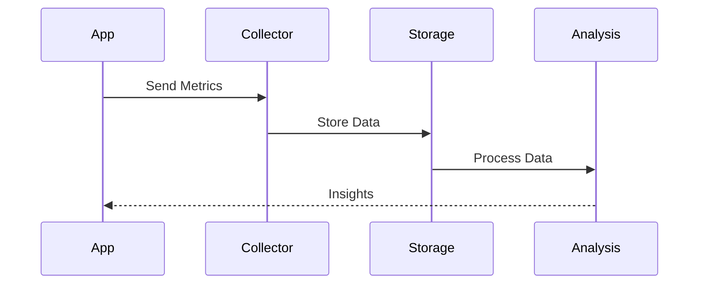
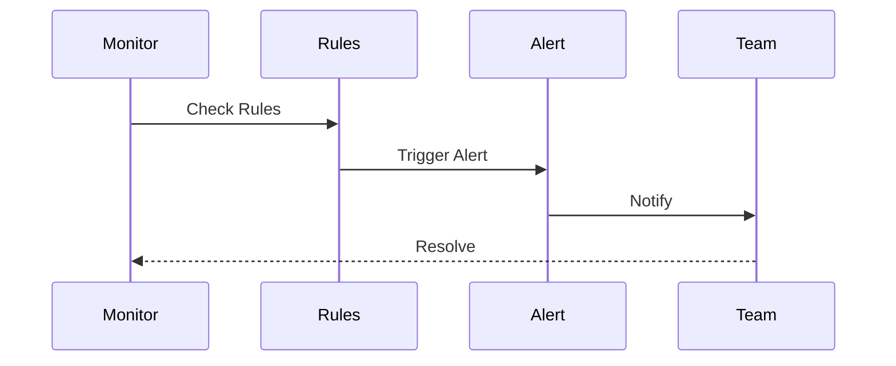
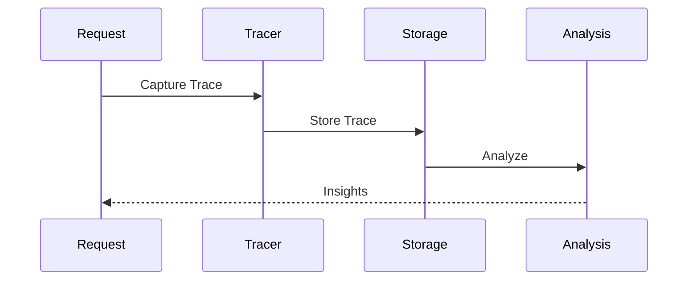

# Monitoring and Observability Architecture

## Overview

The Monitoring and Observability Architecture provides a comprehensive system for tracking, analyzing, and understanding the behavior and performance of our application. This architecture ensures visibility into system health, performance metrics, and user behavior.

Key Features:
- Real-time monitoring
- Distributed tracing
- Log aggregation
- Metrics collection
- Alerting system

Benefits:
- System visibility
- Quick troubleshooting
- Performance insights
- Proactive maintenance
- Resource optimization

## Components

### Monitoring Layer
1. Metrics Collection
   - System metrics
   - Application metrics
   - Business metrics
   - Custom metrics

2. Tracing System
   - Request tracing
   - Error tracking
   - Performance profiling
   - Dependency mapping

3. Logging Infrastructure
   - Log collection
   - Log processing
   - Log storage
   - Log analysis

### Analysis Layer
1. Metrics Analysis
   - Time-series analysis
   - Trend detection
   - Anomaly detection
   - Correlation analysis

2. Performance Analysis
   - Response times
   - Resource usage
   - Bottleneck detection
   - Capacity planning

3. Business Analysis
   - User behavior
   - Feature usage
   - Error patterns
   - SLA compliance

### Operations Layer
1. Alerting System
   - Alert rules
   - Alert routing
   - Alert aggregation
   - Alert management

2. Dashboards
   - System dashboards
   - Business dashboards
   - Custom dashboards
   - Real-time views

3. Response System
   - Incident management
   - Auto-remediation
   - Runbooks
   - Escalation paths

## Interactions

The monitoring system follows these key workflows:

1. Metrics Collection Flow


2. Alert Processing Flow


3. Trace Analysis Flow


## Implementation Details

### Metrics Manager Implementation
```typescript
interface MetricsConfig {
  collectors: CollectorConfig[];
  storage: StorageConfig;
  analysis: AnalysisConfig;
}

class MetricsManager {
  private config: MetricsConfig;
  private collectors: MetricCollector[];
  private storage: MetricStorage;
  
  constructor(config: MetricsConfig) {
    this.config = config;
    this.collectors = this.initCollectors();
    this.storage = new MetricStorage();
  }
  
  async collect(
    metric: Metric,
    options?: CollectOptions
  ): Promise<CollectionResult> {
    const processed = await this.process(
      metric
    );
    
    const stored = await this.storage.store(
      processed
    );
    
    return this.analyze(stored);
  }
  
  private async process(
    metric: Metric
  ): Promise<ProcessedMetric> {
    for (const collector of this.collectors) {
      metric = await collector.process(metric);
    }
    
    return metric;
  }
}
```

### Alert Manager Implementation
```typescript
interface AlertConfig {
  rules: RuleConfig[];
  routing: RoutingConfig;
  notification: NotificationConfig;
}

class AlertManager {
  private config: AlertConfig;
  private rules: AlertRules;
  private router: AlertRouter;
  
  constructor(config: AlertConfig) {
    this.config = config;
    this.rules = new AlertRules();
    this.router = new AlertRouter();
  }
  
  async processAlert(
    alert: Alert,
    options?: AlertOptions
  ): Promise<AlertResult> {
    const validated = await this.validate(
      alert
    );
    
    const routed = await this.route(
      validated
    );
    
    return this.notify(routed);
  }
  
  private async route(
    alert: ValidatedAlert
  ): Promise<RoutedAlert> {
    return this.router.route(
      alert,
      this.config.routing
    );
  }
}
```

### Trace Manager Implementation
```typescript
interface TraceConfig {
  samplers: SamplerConfig[];
  processors: ProcessorConfig[];
  exporters: ExporterConfig[];
}

class TraceManager {
  private config: TraceConfig;
  private samplers: TraceSampler[];
  private processors: TraceProcessor[];
  
  constructor(config: TraceConfig) {
    this.config = config;
    this.samplers = this.initSamplers();
    this.processors = this.initProcessors();
  }
  
  async captureTrace(
    trace: Trace,
    options?: TraceOptions
  ): Promise<TraceResult> {
    const sampled = await this.sample(
      trace
    );
    
    const processed = await this.process(
      sampled
    );
    
    return this.export(processed);
  }
  
  private async process(
    trace: SampledTrace
  ): Promise<ProcessedTrace> {
    for (const processor of this.processors) {
      trace = await processor.process(trace);
    }
    
    return trace;
  }
}
```

## Monitoring Architecture Diagram

```mermaid
graph TB
    subgraph "Data Collection"
        subgraph "Metrics"
            System[System Metrics]
            App[App Metrics]
            Business[Business Metrics]
        end

        subgraph "Tracing"
            Request[Request Trace]
            Error[Error Trace]
            Profile[Performance Profile]
        end

        subgraph "Logging"
            AppLog[App Logs]
            SysLog[System Logs]
            AuditLog[Audit Logs]
        end
    end

    subgraph "Processing"
        subgraph "Analysis"
            Time[Time Series]
            Anomaly[Anomaly Detection]
            Correlation[Correlation]
        end

        subgraph "Storage"
            TimeSeries[Time Series DB]
            TraceStore[Trace Storage]
            LogStore[Log Storage]
        end

        subgraph "Processing"
            Filter[Filtering]
            Transform[Transform]
            Aggregate[Aggregation]
        end
    end

    subgraph "Visualization"
        subgraph "Dashboards"
            System[System View]
            Business[Business View]
            Custom[Custom View]
        end

        subgraph "Alerts"
            Rules[Alert Rules]
            Routes[Alert Routes]
            Notify[Notifications]
        end

        subgraph "Reports"
            Performance[Performance]
            Usage[Usage]
            Trends[Trends]
        end
    end

    %% Data Flow
    System --> Time
    App --> Anomaly
    Business --> Correlation

    %% Processing Flow
    Time --> Filter
    Anomaly --> Transform
    Correlation --> Aggregate

    %% Visualization Flow
    Filter --> System
    Transform --> Business
    Aggregate --> Custom
```
