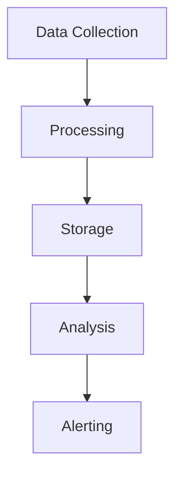
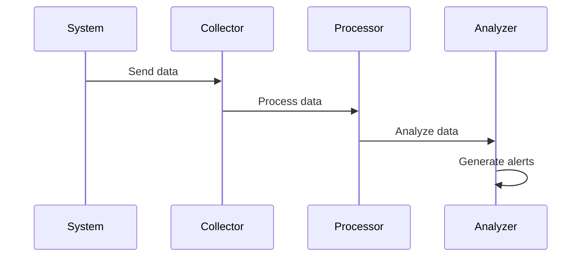

# System Monitoring Architecture

## Overview

This document outlines our system monitoring architecture, establishing comprehensive monitoring and observability across our infrastructure.

## Components

### Monitoring Stack


### Key Components
1. Data Collection
   - Metrics collection
   - Log aggregation
   - Trace collection
   - Event capture

2. Data Processing
   - Data normalization
   - Data enrichment
   - Stream processing
   - Data filtering

3. Data Storage
   - Time-series data
   - Log storage
   - Trace storage
   - Event storage

4. Data Analysis
   - Metric analysis
   - Log analysis
   - Trace analysis
   - Pattern detection

## Interactions

### Monitoring Flow


## Implementation Details

### Monitoring Configuration
```typescript
interface MonitoringConfig {
  collection: CollectionConfig;
  processing: ProcessingConfig;
  storage: StorageConfig;
  analysis: AnalysisConfig;
}

interface CollectionConfig {
  metrics: MetricConfig[];
  logs: LogConfig[];
  traces: TraceConfig[];
  events: EventConfig[];
}
```

### Alert Rules
```typescript
interface AlertRule {
  metric: string;
  condition: Condition;
  threshold: number;
  action: AlertAction;
}
```

### Monitoring Standards
- Collection methods
- Processing rules
- Storage policies
- Analysis criteria
- Alert thresholds

## Related Documentation
- [Infrastructure Monitoring](../infrastructure/infrastructure-monitoring.md)
- [Performance Monitoring](../infrastructure/performance-monitoring.md)
- [Security Monitoring](../security/security-monitoring.md)
- [Logging Architecture](../system/logging.md)
