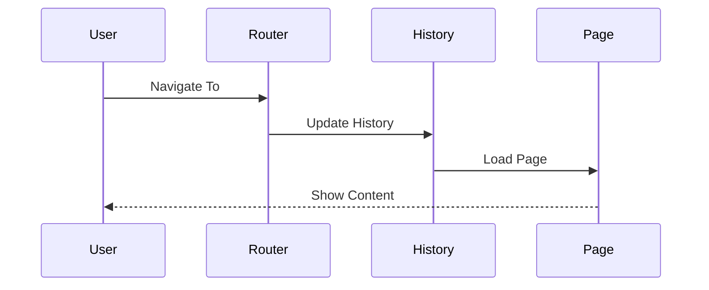
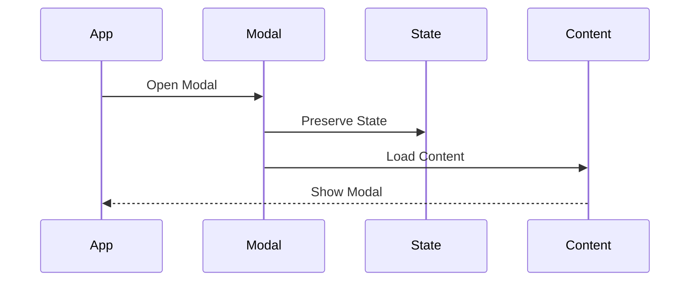
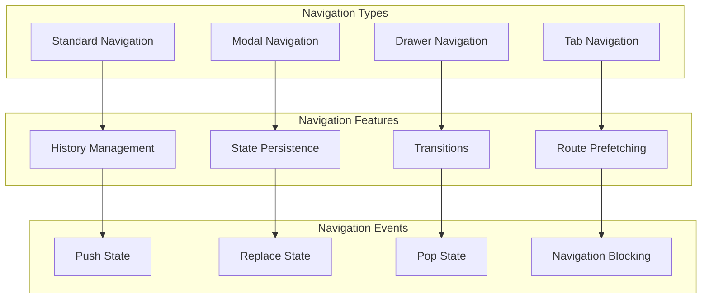

# Navigation Patterns

## Overview

The Navigation Architecture provides a flexible and performant system for handling various navigation patterns in our application. This architecture implements different navigation types including standard navigation, modal navigation, drawer navigation, and tab navigation while ensuring smooth transitions and state management.

Key Features:
- Multiple navigation patterns
- State preservation
- History management
- Route prefetching
- Transition animations

Benefits:
- Improved user experience
- Consistent navigation
- Better performance
- State persistence
- SEO optimization

## Components

### Core Components
1. Navigation Manager
   - History management
   - State persistence
   - Route matching
   - Navigation guards

2. Route Components
   - Route definitions
   - Route parameters
   - Nested routes
   - Route guards

3. Navigation UI
   - Navigation menus
   - Breadcrumbs
   - Tab bars
   - Navigation drawers

### Feature Components
1. State Management
   - Navigation state
   - Route params
   - Query params
   - Navigation history

2. Transition System
   - Page transitions
   - Loading states
   - Error boundaries
   - Animations

3. Optimization Features
   - Route prefetching
   - Code splitting
   - Cache management
   - Performance metrics

## Interactions

The navigation system follows these key workflows:

1. Standard Navigation Flow


2. Modal Navigation Flow


3. Tab Navigation Flow


## Implementation Details

### Router Implementation
```typescript
interface RouteConfig {
  path: string;
  component: ComponentType;
  guards?: RouteGuard[];
  meta?: RouteMeta;
  children?: RouteConfig[];
}

class Router {
  private routes: Map<string, RouteConfig>;
  private history: History;
  private guards: RouteGuard[];
  
  constructor(config: RouterConfig) {
    this.routes = new Map();
    this.history = window.history;
    this.guards = [];
    this.initialize(config);
  }
  
  async navigate(
    to: string,
    options?: NavigateOptions
  ): Promise<boolean> {
    const route = this.matchRoute(to);
    
    if (!route) {
      throw new RouteNotFoundError(to);
    }
    
    if (!(await this.canActivate(route))) {
      return false;
    }
    
    await this.transition(route, options);
    return true;
  }
  
  private async canActivate(
    route: RouteConfig
  ): Promise<boolean> {
    for (const guard of this.guards) {
      if (!(await guard.canActivate(route))) {
        return false;
      }
    }
    return true;
  }
}
```

### Navigation State Implementation
```typescript
interface NavigationState {
  current: Route;
  previous: Route | null;
  history: Route[];
  params: RouteParams;
  query: QueryParams;
}

class NavigationStore {
  private state: NavigationState;
  private subscribers: Set<StateSubscriber>;
  
  constructor(initial: NavigationState) {
    this.state = initial;
    this.subscribers = new Set();
  }
  
  async updateState(
    updates: Partial<NavigationState>
  ): Promise<void> {
    const nextState = {
      ...this.state,
      ...updates
    };
    
    await this.transition(nextState);
    this.notifySubscribers();
  }
  
  private async transition(
    nextState: NavigationState
  ): Promise<void> {
    const guard = this.createTransitionGuard(
      this.state,
      nextState
    );
    
    if (await guard.canTransition()) {
      this.state = nextState;
    }
  }
}
```

### Navigation Guard Implementation
```typescript
interface GuardContext {
  to: Route;
  from: Route;
  params: RouteParams;
  meta: RouteMeta;
}

class NavigationGuard {
  private validators: GuardValidator[];
  private fallback: Route;
  
  constructor(config: GuardConfig) {
    this.validators = config.validators;
    this.fallback = config.fallback;
  }
  
  async canActivate(
    context: GuardContext
  ): Promise<boolean> {
    try {
      await this.runValidations(context);
      return true;
    } catch (error) {
      await this.handleGuardFailure(error);
      return false;
    }
  }
  
  private async runValidations(
    context: GuardContext
  ): Promise<void> {
    for (const validator of this.validators) {
      await validator.validate(context);
    }
  }
  
  private async handleGuardFailure(
    error: Error
  ): Promise<void> {
    await this.navigate(this.fallback);
    this.notifyError(error);
  }
}
```

## Navigation Patterns Diagram


## Navigation Types

### 1. Standard Navigation

- Page-to-page navigation
- URL-based routing
- History management
- SEO-friendly

### 2. Modal Navigation

- Overlay content
- Preserved background state
- Focus management
- Accessibility support

### 3. Drawer Navigation

- Slide-in panels
- Nested navigation
- Mobile-friendly
- Touch gestures

### 4. Tab Navigation

- Concurrent views
- State preservation
- Quick switching
- Context retention

## Implementation Patterns

### Navigation Context

```typescript
// Navigation context provider particle
const NavigationProvider = ({ children }: PropsWithChildren) => {
  const [navigationState, setNavigationState] = useState({
    history: [],
    current: null,
    pending: null,
  });

  return <NavigationContext.Provider value={navigationState}>{children}</NavigationContext.Provider>;
};
```

### Navigation Events

```typescript
// Navigation event handler particle
const NavigationHandler = ({ onNavigate, children }: NavigationHandlerProps) => {
  const handleNavigation = useCallback(
    (event: NavigationEvent) => {
      if (onNavigate) {
        onNavigate(event);
      }
    },
    [onNavigate]
  );

  return <div onClick={handleNavigation}>{children}</div>;
};
```

### Navigation Optimization

```typescript
// Navigation performance optimizer particle
const NavigationOptimizer = ({ children, prefetch }: OptimizerProps) => {
  useEffect(() => {
    if (prefetch) {
      prefetchRoute(prefetch);
    }
  }, [prefetch]);

  return children;
};
```

## Best Practices

1. **State Management**

   - Preserve form state
   - Handle unsaved changes
   - Manage loading states
   - Cache route data

2. **Performance**

   - Implement prefetching
   - Optimize transitions
   - Lazy load routes
   - Cache responses

3. **Accessibility**
   - Manage focus
   - Provide landmarks
   - Support keyboard
   - Screen reader friendly

## Related Documentation

- [Routing Architecture](./routing-architecture.md)
- [Performance Guidelines](./performance.md)
- [Accessibility Guidelines](../components/accessibility-architecture.md)
