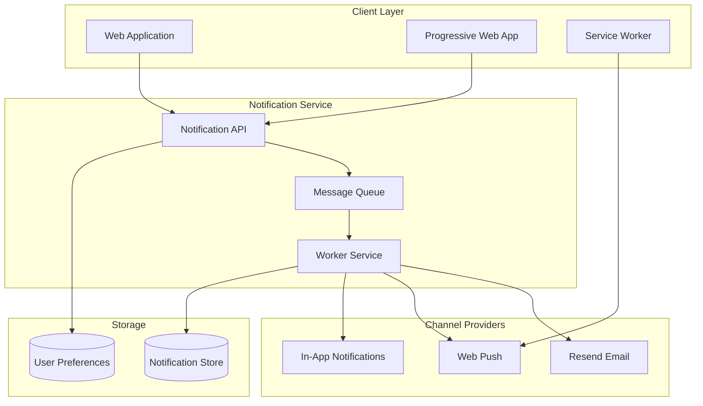

# Notification System Architecture

This diagram illustrates the notification system architecture, including email, in-app, and push notification capabilities.

## Architecture Diagram

## Component Description

### Client Layer

- **Web Application**: Main web interface
- **PWA**: Progressive Web App for mobile-like experience
- **Service Worker**: Handles push notifications and offline functionality

### Notification Service

- **Notification API**: RESTful API for notification management
- **Message Queue**: Handles notification scheduling and delivery
- **Worker Service**: Processes and distributes notifications

### Channel Providers

- **Resend Email**: Email notification delivery
- **Web Push**: Browser push notifications
- **In-App**: Real-time in-application notifications

### Storage

- **Notification Store**: Persistent storage for notification history
- **User Preferences**: User notification settings and preferences

## Implementation Notes

1. **Notification Types**

   - Transactional notifications
   - Marketing notifications
   - System alerts
   - User interaction notifications

2. **Delivery Channels**

   - Email via Resend
   - Browser push notifications
   - In-app notifications
   - Future: Mobile push notifications

3. **User Preferences**

   - Channel preferences
   - Notification frequency
   - Time-zone settings
   - Category opt-in/out

4. **Performance Considerations**

   - Queue-based processing
   - Rate limiting
   - Retry mechanisms
   - Batch processing

5. **Security Measures**
   - Authentication for notification API
   - Encryption for sensitive content
   - Rate limiting per user
   - Validation of notification sources
