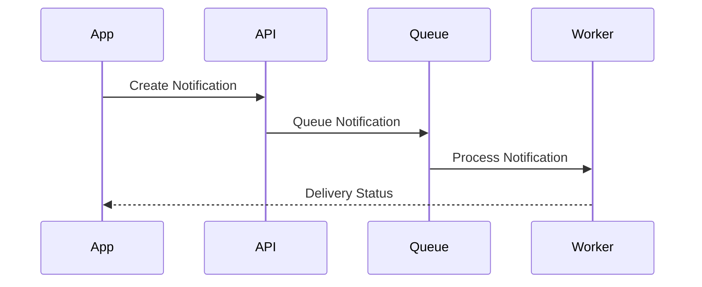
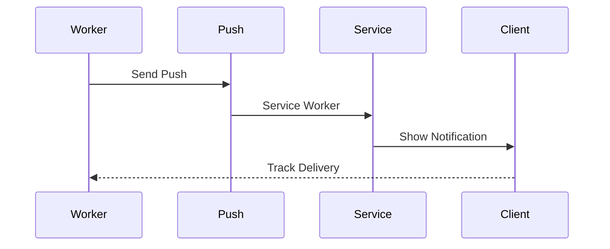
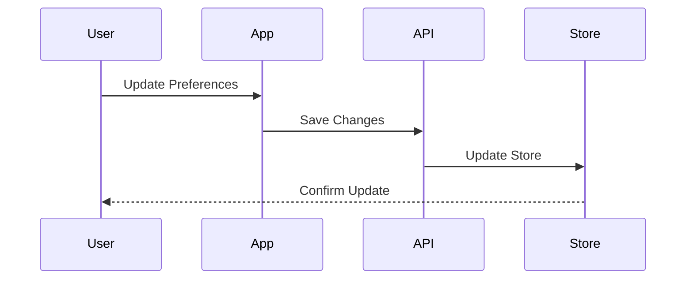
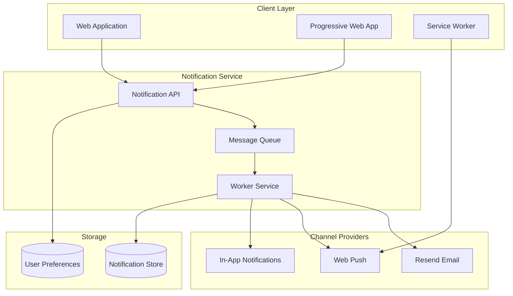

# Notification System Architecture

## Overview

The Notification System Architecture provides a scalable and flexible system for managing and delivering notifications across multiple channels. This architecture implements real-time delivery, user preferences, and reliable notification handling.

Key Features:
- Multi-channel delivery
- Real-time notifications
- User preferences
- Delivery tracking
- Queue-based processing

Benefits:
- Reliable delivery
- User engagement
- Delivery flexibility
- Performance at scale
- Analytics insights

## Components

### Client Layer
1. Web Application
   - User interface
   - Notification display
   - Preference management
   - Real-time updates

2. Progressive Web App
   - Offline support
   - Push notifications
   - Background sync
   - Installation flow

3. Service Worker
   - Push handling
   - Offline caching
   - Background sync
   - Notification display

### Notification Service
1. Notification API
   - REST endpoints
   - GraphQL resolvers
   - WebSocket connections
   - Rate limiting

2. Message Queue
   - Priority queuing
   - Retry logic
   - Dead letter handling
   - Load balancing

3. Worker Service
   - Queue processing
   - Channel routing
   - Template rendering
   - Analytics tracking

### Channel Providers
1. Email Service (Resend)
   - Template management
   - Delivery tracking
   - Bounce handling
   - Analytics

2. Push Notifications
   - Service worker
   - Subscription management
   - Payload encryption
   - Delivery status

3. In-App Notifications
   - Real-time delivery
   - Read status
   - Action handling
   - Archive management

## Interactions

The notification system follows these key workflows:

1. Notification Creation Flow


2. Push Notification Flow


3. Preference Management Flow


## Implementation Details

### Notification Manager Implementation
```typescript
interface NotificationConfig {
  channels: ChannelConfig[];
  templates: TemplateConfig[];
  queue: QueueConfig;
}

class NotificationManager {
  private config: NotificationConfig;
  private queue: MessageQueue;
  private templates: TemplateManager;
  
  constructor(config: NotificationConfig) {
    this.config = config;
    this.queue = new MessageQueue();
    this.templates = new TemplateManager();
  }
  
  async send(
    notification: Notification,
    options?: SendOptions
  ): Promise<DeliveryResult> {
    const prepared = await this.prepare(
      notification,
      options
    );
    
    const queued = await this.queue.add(
      prepared,
      this.getPriority(notification)
    );
    
    return this.trackDelivery(queued);
  }
  
  private async prepare(
    notification: Notification,
    options?: SendOptions
  ): Promise<PreparedNotification> {
    const template = await this.templates.render(
      notification
    );
    
    return this.formatForChannels(
      template,
      options?.channels
    );
  }
}
```

### Channel Manager Implementation
```typescript
interface ChannelConfig {
  type: ChannelType;
  provider: ProviderConfig;
  templates: TemplateMap;
}

class ChannelManager {
  private config: ChannelConfig;
  private providers: Map<ChannelType, Provider>;
  private analytics: ChannelAnalytics;
  
  constructor(config: ChannelConfig) {
    this.config = config;
    this.providers = this.initProviders();
    this.analytics = new ChannelAnalytics();
  }
  
  async deliver(
    notification: PreparedNotification,
    channel: ChannelType
  ): Promise<DeliveryStatus> {
    const provider = this.providers.get(channel);
    
    if (!provider) {
      throw new Error(`No provider for ${channel}`);
    }
    
    const result = await provider.send(
      notification
    );
    
    await this.trackDelivery(result);
    return result;
  }
  
  private initProviders(): Map<ChannelType, Provider> {
    return new Map(
      this.config.providers.map(config => [
        config.type,
        this.createProvider(config)
      ])
    );
  }
}
```

### Preference Manager Implementation
```typescript
interface PreferenceConfig {
  defaults: DefaultPreferences;
  storage: StorageConfig;
  validation: ValidationRules;
}

class PreferenceManager {
  private config: PreferenceConfig;
  private storage: PreferenceStorage;
  private validator: PreferenceValidator;
  
  constructor(config: PreferenceConfig) {
    this.config = config;
    this.storage = new PreferenceStorage();
    this.validator = new PreferenceValidator();
  }
  
  async getPreferences(
    userId: string
  ): Promise<UserPreferences> {
    const stored = await this.storage.get(userId);
    
    if (!stored) {
      return this.getDefaults(userId);
    }
    
    return this.mergeWithDefaults(stored);
  }
  
  async updatePreferences(
    userId: string,
    updates: PreferenceUpdates
  ): Promise<UserPreferences> {
    const current = await this.getPreferences(
      userId
    );
    
    const validated = await this.validator.validate(
      updates
    );
    
    const merged = this.mergePreferences(
      current,
      validated
    );
    
    await this.storage.save(userId, merged);
    return merged;
  }
}

## Architecture Diagram



## Component Description

### Client Layer

- **Web Application**: Main web interface
- **PWA**: Progressive Web App for mobile-like experience
- **Service Worker**: Handles push notifications and offline functionality

### Notification Service

- **Notification API**: RESTful API for notification management
- **Message Queue**: Handles notification scheduling and delivery
- **Worker Service**: Processes and distributes notifications

### Channel Providers

- **Resend Email**: Email notification delivery
- **Web Push**: Browser push notifications
- **In-App**: Real-time in-application notifications

### Storage

- **Notification Store**: Persistent storage for notification history
- **User Preferences**: User notification settings and preferences

## Implementation Notes

1. **Notification Types**

   - Transactional notifications
   - Marketing notifications
   - System alerts
   - User interaction notifications

2. **Delivery Channels**

   - Email via Resend
   - Browser push notifications
   - In-app notifications
   - Future: Mobile push notifications

3. **User Preferences**

   - Channel preferences
   - Notification frequency
   - Time-zone settings
   - Category opt-in/out

4. **Performance Considerations**

   - Queue-based processing
   - Rate limiting
   - Retry mechanisms
   - Batch processing

5. **Security Measures**
   - Authentication for notification API
   - Encryption for sensitive content
   - Rate limiting per user
   - Validation of notification sources
