# Performance Architecture

This diagram illustrates our performance optimization strategies and implementation patterns.

## Implementation

Our performance optimizations heavily utilize specialized particle components from our [Atomic Design Structure](../components/atomic-design.md#particles), including Virtual List for efficient rendering, Performance Optimizers for component updates, and various wrapper components for optimization techniques.

## Performance Architecture Diagram

```mermaid
graph TB
    subgraph "Client Performance"
        subgraph "Runtime Optimization"
            Virtual[Virtualization]
            Lazy[Lazy Loading]
            Memo[Memoization]
            Bundle[Bundle Optimization]
        end

        subgraph "Resource Optimization"
            Assets[Asset Loading]
            Cache[Browser Caching]
            Prefetch[Prefetching]
            Compress[Compression]
        end
    end

    subgraph "Server Performance"
        subgraph "Response Optimization"
            CDN[CDN Delivery]
            Edge[Edge Computing]
            Cache[Response Caching]
        end

        subgraph "Processing Optimization"
            Queue[Task Queues]
            Worker[Worker Threads]
            Batch[Batch Processing]
        end
    end

    Virtual --> Performance
    Lazy --> Performance
    Memo --> Performance
    Bundle --> Performance
    Assets --> Performance
    Cache --> Performance
    Prefetch --> Performance
    CDN --> Performance
    Edge --> Performance
    Queue --> Performance
```



## Performance Patterns

### 1. Virtualization

```typescript
// Virtual List implementation using our particle component
const VirtualizedList = <T extends unknown>({ items, itemHeight, containerHeight }: VirtualListProps<T>) => {
  return <VirtualList items={items} itemHeight={itemHeight} height={containerHeight} renderItem={(item) => <ListItem item={item} />} />;
};
```

### 2. Lazy Loading

```typescript
// Lazy loading wrapper particle
const LazyLoadWrapper = ({ children }: PropsWithChildren) => {
  const [isVisible, setIsVisible] = useState(false);
  const containerRef = useRef<HTMLDivElement>(null);

  useEffect(() => {
    const observer = new IntersectionObserver(([entry]) => setIsVisible(entry.isIntersecting));

    if (containerRef.current) {
      observer.observe(containerRef.current);
    }

    return () => observer.disconnect();
  }, []);

  return <div ref={containerRef}>{isVisible && children}</div>;
};
```

### 3. Memoization

```typescript
// Memoization wrapper particle
const MemoWrapper = memo(({ component: Component, props, dependencies }: MemoWrapperProps) => {
  const memoizedProps = useMemo(() => props, dependencies);

  return <Component {...memoizedProps} />;
});
```

## Best Practices

### 1. Component Optimization

- Use virtualization for long lists
- Implement lazy loading
- Apply proper memoization
- Optimize bundle size

### 2. Resource Management

- Optimize asset loading
- Implement proper caching
- Use prefetching
- Enable compression

### 3. Server-side Optimization

- Utilize CDN delivery
- Implement edge computing
- Enable response caching
- Use worker threads

## Related Diagrams

- [State Management](../data-flow/state-management.md)
- [Caching Strategy](../data-flow/caching.md)
- [Component Interactions](../components/interactions.md)
