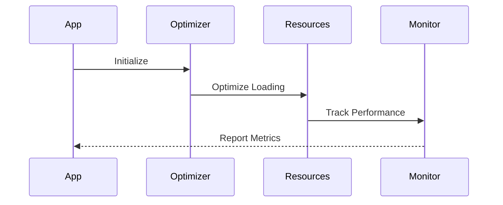
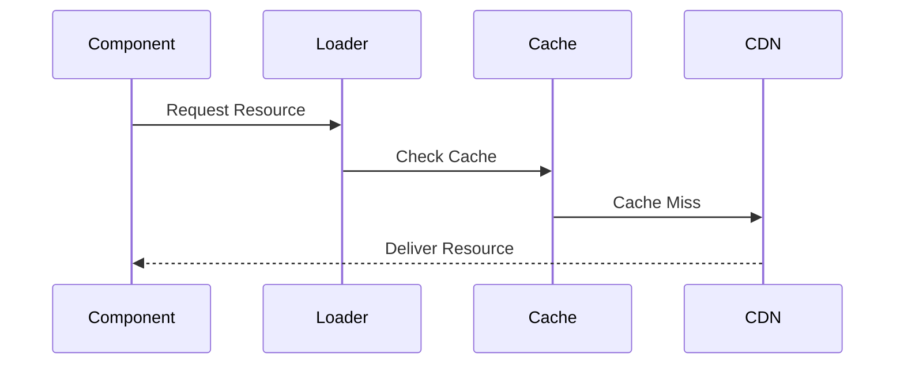
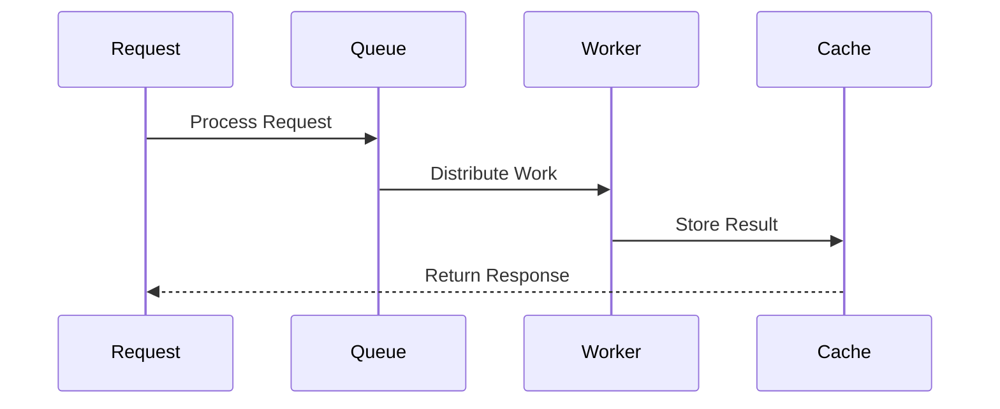

# Performance Architecture

## Overview

The Performance Architecture provides a comprehensive approach to optimizing application performance across both client and server components. This architecture implements various optimization techniques including virtualization, lazy loading, caching, and distributed processing to ensure optimal user experience and system efficiency.

Key Features:
- Client-side optimizations
- Server-side optimizations
- Resource management
- Performance monitoring
- Automated optimization

Benefits:
- Improved user experience
- Reduced resource usage
- Better scalability
- Lower operating costs
- Enhanced reliability

## Components

### Client-Side Components
1. Runtime Optimizations
   - Virtualization engine
   - Lazy loading system
   - Memoization manager
   - Bundle optimizer

2. Resource Management
   - Asset loader
   - Cache manager
   - Prefetch controller
   - Compression handler

3. Monitoring Tools
   - Performance metrics
   - Resource tracking
   - User timing
   - Error monitoring

### Server-Side Components
1. Response Optimization
   - CDN integration
   - Edge computing
   - Response cache
   - Load balancer

2. Processing Optimization
   - Task queues
   - Worker threads
   - Batch processor
   - Connection pool

3. Monitoring Systems
   - APM integration
   - Resource metrics
   - Error tracking
   - Performance alerts

## Interactions

The performance optimization system follows these key workflows:

1. Client Optimization Flow


2. Resource Loading Flow


3. Server Optimization Flow


## Implementation Details

### Performance Monitor Implementation
```typescript
interface PerformanceMetrics {
  fcp: number;
  lcp: number;
  fid: number;
  cls: number;
  ttfb: number;
}

class PerformanceMonitor {
  private metrics: PerformanceMetrics;
  private observers: Set<MetricObserver>;
  
  constructor() {
    this.metrics = this.initializeMetrics();
    this.observers = new Set();
    this.setupObservers();
  }
  
  private setupObservers(): void {
    new PerformanceObserver((list) => {
      const entries = list.getEntries();
      this.processEntries(entries);
      this.notifyObservers();
    }).observe({ entryTypes: ['paint', 'layout-shift'] });
  }
  
  private processEntries(
    entries: PerformanceEntry[]
  ): void {
    entries.forEach(entry => {
      this.updateMetric(entry);
    });
  }
}
```

### Resource Optimizer Implementation
```typescript
interface ResourceConfig {
  preload: string[];
  prefetch: string[];
  preconnect: string[];
  compression: {
    images: boolean;
    fonts: boolean;
    scripts: boolean;
  };
}

class ResourceOptimizer {
  private config: ResourceConfig;
  private loaded: Set<string>;
  
  constructor(config: ResourceConfig) {
    this.config = config;
    this.loaded = new Set();
  }
  
  async optimizeResources(): Promise<void> {
    await Promise.all([
      this.preloadCritical(),
      this.prefetchResources(),
      this.setupPreconnect()
    ]);
  }
  
  private async preloadCritical(): Promise<void> {
    const links = this.config.preload.map(url => ({
      rel: 'preload',
      href: url,
      as: this.getResourceType(url)
    }));
    
    this.injectLinks(links);
  }
}
```

### Worker Pool Implementation
```typescript
interface WorkerConfig {
  poolSize: number;
  taskTimeout: number;
  retryAttempts: number;
}

class WorkerPool {
  private workers: Worker[];
  private taskQueue: Task[];
  private config: WorkerConfig;
  
  constructor(config: WorkerConfig) {
    this.config = config;
    this.workers = this.initializeWorkers();
    this.taskQueue = [];
  }
  
  async processTask<T>(
    task: Task<T>
  ): Promise<T> {
    const worker = await this.getAvailableWorker();
    
    return new Promise((resolve, reject) => {
      const timeout = setTimeout(() => {
        reject(new Error('Task timeout'));
        this.recycleWorker(worker);
      }, this.config.taskTimeout);
      
      worker.onmessage = (event) => {
        clearTimeout(timeout);
        resolve(event.data);
        this.recycleWorker(worker);
      };
      
      worker.postMessage(task);
    });
  }
  
  private recycleWorker(worker: Worker): void {
    if (this.taskQueue.length > 0) {
      const nextTask = this.taskQueue.shift();
      this.processTask(nextTask);
    } else {
      this.workers.push(worker);
    }
  }
}
```

## Performance Architecture Diagram

```mermaid
graph TB
    subgraph "Client Performance"
        subgraph "Runtime Optimization"
            Virtual[Virtualization]
            Lazy[Lazy Loading]
            Memo[Memoization]
            Bundle[Bundle Optimization]
        end

        subgraph "Resource Optimization"
            Assets[Asset Loading]
            Cache[Browser Caching]
            Prefetch[Prefetching]
            Compress[Compression]
        end
    end

    subgraph "Server Performance"
        subgraph "Response Optimization"
            CDN[CDN Delivery]
            Edge[Edge Computing]
            Cache[Response Caching]
        end

        subgraph "Processing Optimization"
            Queue[Task Queues]
            Worker[Worker Threads]
            Batch[Batch Processing]
        end
    end

    Virtual --> Performance
    Lazy --> Performance
    Memo --> Performance
    Bundle --> Performance
    Assets --> Performance
    Cache --> Performance
    Prefetch --> Performance
    CDN --> Performance
    Edge --> Performance
    Queue --> Performance
```



## Performance Patterns

### 1. Virtualization

```typescript
// Virtual List implementation using our particle component
const VirtualizedList = <T extends unknown>({ items, itemHeight, containerHeight }: VirtualListProps<T>) => {
  return <VirtualList items={items} itemHeight={itemHeight} height={containerHeight} renderItem={(item) => <ListItem item={item} />} />;
};
```

### 2. Lazy Loading

```typescript
// Lazy loading wrapper particle
const LazyLoadWrapper = ({ children }: PropsWithChildren) => {
  const [isVisible, setIsVisible] = useState(false);
  const containerRef = useRef<HTMLDivElement>(null);

  useEffect(() => {
    const observer = new IntersectionObserver(([entry]) => setIsVisible(entry.isIntersecting));

    if (containerRef.current) {
      observer.observe(containerRef.current);
    }

    return () => observer.disconnect();
  }, []);

  return <div ref={containerRef}>{isVisible && children}</div>;
};
```

### 3. Memoization

```typescript
// Memoization wrapper particle
const MemoWrapper = memo(({ component: Component, props, dependencies }: MemoWrapperProps) => {
  const memoizedProps = useMemo(() => props, dependencies);

  return <Component {...memoizedProps} />;
});
```

## Best Practices

### 1. Component Optimization

- Use virtualization for long lists
- Implement lazy loading
- Apply proper memoization
- Optimize bundle size

### 2. Resource Management

- Optimize asset loading
- Implement proper caching
- Use prefetching
- Enable compression

### 3. Server-side Optimization

- Utilize CDN delivery
- Implement edge computing
- Enable response caching
- Use worker threads

## Related Diagrams

- [State Management](../data-flow/state-management.md)
- [Caching Strategy](../data-flow/caching.md)
- [Component Interactions](../components/interactions.md)
