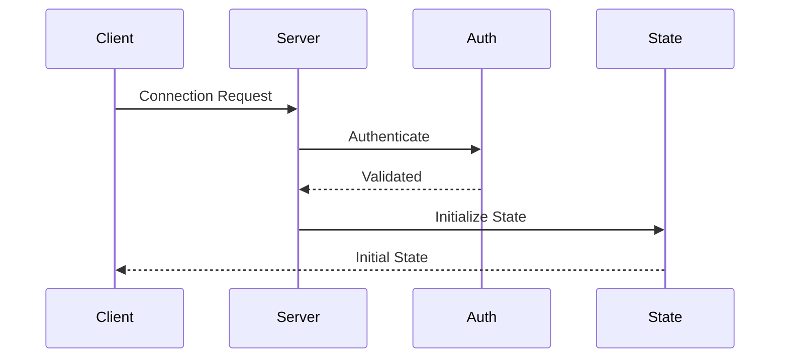
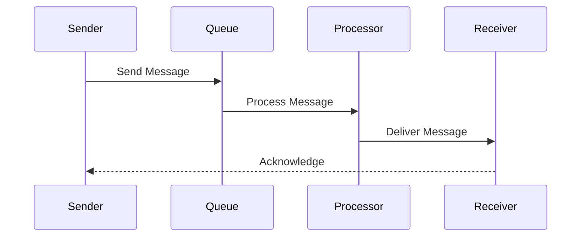
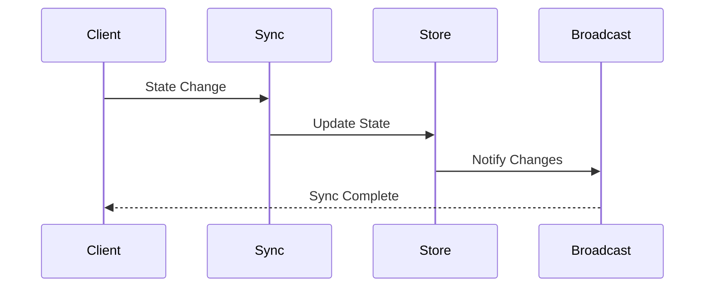

# Real-Time Communication Architecture

## Overview

The Real-Time Communication Architecture provides a robust and scalable system for handling real-time data exchange between clients and servers. This architecture implements multiple communication protocols with fallback strategies to ensure reliable real-time communication.

Key Features:
- WebSocket communication
- Server-Sent Events
- Fallback mechanisms
- Message queuing
- State synchronization

Benefits:
- Real-time updates
- High reliability
- Scalable design
- Protocol flexibility
- Efficient communication

## Components

### Communication Protocols
1. WebSocket
   - Bi-directional communication
   - Connection management
   - Frame handling
   - Protocol upgrade

2. Server-Sent Events
   - One-way streaming
   - Auto-reconnection
   - Event formatting
   - Native browser support

3. Fallback Mechanisms
   - Long polling
   - Short polling
   - HTTP streaming
   - Graceful degradation

### Message Handling
1. Message Processing
   - Encoding/Decoding
   - Queue management
   - Priority handling
   - Rate limiting

2. Communication Patterns
   - Publish/Subscribe
   - Broadcasting
   - Peer-to-peer
   - Room-based

3. Message Types
   - Event messages
   - Command messages
   - State updates
   - System messages

### Client Integration
1. Connection Management
   - Connection setup
   - Reconnection logic
   - Heartbeat mechanism
   - Connection pooling

2. State Management
   - Online/Offline states
   - State synchronization
   - Conflict resolution
   - Cache management

3. Real-time Features
   - Presence detection
   - Typing indicators
   - Status updates
   - Activity tracking

## Interactions

The real-time system follows these key workflows:

1. Connection Establishment Flow


2. Message Exchange Flow


3. State Synchronization Flow


## Implementation Details

### Connection Manager Implementation
```typescript
interface ConnectionConfig {
  protocols: ProtocolConfig[];
  retry: RetryConfig;
  heartbeat: HeartbeatConfig;
}

class ConnectionManager {
  private config: ConnectionConfig;
  private connection: Connection;
  private heartbeat: HeartbeatMonitor;
  
  constructor(config: ConnectionConfig) {
    this.config = config;
    this.connection = this.createConnection();
    this.heartbeat = new HeartbeatMonitor();
  }
  
  async connect(
    options?: ConnectOptions
  ): Promise<ConnectionStatus> {
    const protocol = await this.selectProtocol(
      options
    );
    
    const connection = await this.establish(
      protocol
    );
    
    await this.initializeState(connection);
    return connection.status;
  }
  
  private async selectProtocol(
    options?: ConnectOptions
  ): Promise<Protocol> {
    return this.negotiateProtocol(
      this.config.protocols,
      options
    );
  }
}
```

### Message Manager Implementation
```typescript
interface MessageConfig {
  queue: QueueConfig;
  processors: ProcessorConfig[];
  patterns: PatternConfig[];
}

class MessageManager {
  private config: MessageConfig;
  private queue: MessageQueue;
  private processors: MessageProcessor[];
  
  constructor(config: MessageConfig) {
    this.config = config;
    this.queue = new MessageQueue();
    this.processors = this.initProcessors();
  }
  
  async send(
    message: Message,
    options?: SendOptions
  ): Promise<DeliveryStatus> {
    const processed = await this.process(
      message
    );
    
    const queued = await this.queue.add(
      processed,
      options
    );
    
    return this.deliver(queued);
  }
  
  private async process(
    message: Message
  ): Promise<ProcessedMessage> {
    for (const processor of this.processors) {
      message = await processor.process(message);
    }
    
    return message;
  }
}
```

### State Manager Implementation
```typescript
interface StateConfig {
  sync: SyncConfig;
  storage: StorageConfig;
  conflict: ConflictConfig;
}

class StateManager {
  private config: StateConfig;
  private store: StateStore;
  private sync: StateSync;
  
  constructor(config: StateConfig) {
    this.config = config;
    this.store = new StateStore();
    this.sync = new StateSync();
  }
  
  async updateState(
    update: StateUpdate,
    options?: UpdateOptions
  ): Promise<StateResult> {
    const validated = await this.validateUpdate(
      update
    );
    
    const resolved = await this.resolveConflicts(
      validated
    );
    
    await this.store.apply(resolved);
    return this.broadcastUpdate(resolved);
  }
  
  private async resolveConflicts(
    update: StateUpdate
  ): Promise<ResolvedUpdate> {
    const conflicts = await this.detectConflicts(
      update
    );
    
    return this.config.conflict.resolve(
      update,
      conflicts
    );
  }
}
```

## Real-Time Architecture Diagram

```mermaid
graph TB
    subgraph "Communication Protocols"
        subgraph "WebSocket"
            WSConnect[WS Connection]
            WSHandshake[WS Handshake]
            WSFraming[WS Framing]
        end

        subgraph "Server-Sent Events"
            SSEStream[SSE Stream]
            SSEConnect[SSE Connection]
            SSERetry[SSE Retry]
        end

        subgraph "Fallbacks"
            LongPoll[Long Polling]
            ShortPoll[Short Polling]
            HTTPStream[HTTP Streaming]
        end
    end

    subgraph "Message Handling"
        subgraph "Processing"
            Encode[Message Encode]
            Decode[Message Decode]
            Queue[Message Queue]
        end

        subgraph "Patterns"
            PubSub[Pub/Sub]
            Broadcast[Broadcast]
            P2P[Peer to Peer]
        end

        subgraph "Types"
            Event[Event Message]
            Command[Command Message]
            State[State Update]
        end
    end

    subgraph "Client Integration"
        subgraph "Connection"
            Connect[Connect]
            Reconnect[Reconnect]
            Heartbeat[Heartbeat]
        end

        subgraph "State"
            Online[Online State]
            Offline[Offline State]
            Sync[State Sync]
        end

        subgraph "Features"
            Presence[Presence]
            Typing[Typing Indicator]
            Status[Status Update]
        end
    end

    subgraph "Infrastructure"
        subgraph "Scaling"
            LoadBalance[Load Balancer]
            Cluster[Node Cluster]
            Sticky[Sticky Sessions]
        end

        subgraph "Reliability"
            Recovery[Connection Recovery]
            Backoff[Exponential Backoff]
            Circuit[Circuit Breaker]
        end

        subgraph "Monitoring"
            Metrics[RT Metrics]
            Latency[Latency]
            Health[Health Check]
        end
    end

    %% Protocol Flow
    WSConnect --> Encode
    SSEStream --> Decode
    LongPoll --> Queue

    %% Message Flow
    PubSub --> Event
    Broadcast --> Command
    P2P --> State

    %% Client Flow
    Connect --> Online
    Reconnect --> Offline
    Heartbeat --> Sync

    Online --> Presence
    Offline --> Typing
    Sync --> Status

    %% Infrastructure Flow
    LoadBalance --> Recovery
    Cluster --> Backoff
    Sticky --> Circuit

    Recovery --> Metrics
    Backoff --> Latency
    Circuit --> Health
```



## Component Description

### Communication Protocols

1. **WebSocket**

   - Connection handling
   - Protocol handshake
   - Frame management

2. **Server-Sent Events**

   - Event streaming
   - Connection management
   - Retry mechanism

3. **Fallback Options**
   - Long polling
   - Short polling
   - HTTP streaming

### Message Handling

1. **Message Processing**

   - Message encoding
   - Message decoding
   - Queue management

2. **Message Patterns**
   - Pub/Sub system
   - Broadcast handling
   - P2P communication

## Implementation Guidelines

1. **Protocol Selection**

   - Use case analysis
   - Protocol features
   - Fallback strategy
   - Browser support

2. **Message Design**

   - Message format
   - Event types
   - State updates
   - Error handling

3. **Client Integration**

   - Connection management
   - State handling
   - Feature support
   - Error recovery

4. **Best Practices**

   - Connection pooling
   - Message batching
   - Rate limiting
   - Error handling

5. **Performance**

   - Message optimization
   - Connection pooling
   - Load balancing
   - Scaling strategy

6. **Documentation**
   - Protocol specs
   - Message formats
   - Integration guides
   - Error codes
