# Real-Time Communication Architecture

This diagram illustrates our real-time communication strategy using WebSocket, SSE, and related patterns.

## Real-Time Architecture Diagram

```mermaid
graph TB
    subgraph "Communication Protocols"
        subgraph "WebSocket"
            WSConnect[WS Connection]
            WSHandshake[WS Handshake]
            WSFraming[WS Framing]
        end

        subgraph "Server-Sent Events"
            SSEStream[SSE Stream]
            SSEConnect[SSE Connection]
            SSERetry[SSE Retry]
        end

        subgraph "Fallbacks"
            LongPoll[Long Polling]
            ShortPoll[Short Polling]
            HTTPStream[HTTP Streaming]
        end
    end

    subgraph "Message Handling"
        subgraph "Processing"
            Encode[Message Encode]
            Decode[Message Decode]
            Queue[Message Queue]
        end

        subgraph "Patterns"
            PubSub[Pub/Sub]
            Broadcast[Broadcast]
            P2P[Peer to Peer]
        end

        subgraph "Types"
            Event[Event Message]
            Command[Command Message]
            State[State Update]
        end
    end

    subgraph "Client Integration"
        subgraph "Connection"
            Connect[Connect]
            Reconnect[Reconnect]
            Heartbeat[Heartbeat]
        end

        subgraph "State"
            Online[Online State]
            Offline[Offline State]
            Sync[State Sync]
        end

        subgraph "Features"
            Presence[Presence]
            Typing[Typing Indicator]
            Status[Status Update]
        end
    end

    subgraph "Infrastructure"
        subgraph "Scaling"
            LoadBalance[Load Balancer]
            Cluster[Node Cluster]
            Sticky[Sticky Sessions]
        end

        subgraph "Reliability"
            Recovery[Connection Recovery]
            Backoff[Exponential Backoff]
            Circuit[Circuit Breaker]
        end

        subgraph "Monitoring"
            Metrics[RT Metrics]
            Latency[Latency]
            Health[Health Check]
        end
    end

    %% Protocol Flow
    WSConnect --> Encode
    SSEStream --> Decode
    LongPoll --> Queue

    %% Message Flow
    PubSub --> Event
    Broadcast --> Command
    P2P --> State

    %% Client Flow
    Connect --> Online
    Reconnect --> Offline
    Heartbeat --> Sync

    Online --> Presence
    Offline --> Typing
    Sync --> Status

    %% Infrastructure Flow
    LoadBalance --> Recovery
    Cluster --> Backoff
    Sticky --> Circuit

    Recovery --> Metrics
    Backoff --> Latency
    Circuit --> Health
```

## Component Description

### Communication Protocols

1. **WebSocket**

   - Connection handling
   - Protocol handshake
   - Frame management

2. **Server-Sent Events**

   - Event streaming
   - Connection management
   - Retry mechanism

3. **Fallback Options**
   - Long polling
   - Short polling
   - HTTP streaming

### Message Handling

1. **Message Processing**

   - Message encoding
   - Message decoding
   - Queue management

2. **Message Patterns**
   - Pub/Sub system
   - Broadcast handling
   - P2P communication

## Implementation Guidelines

1. **Protocol Selection**

   - Use case analysis
   - Protocol features
   - Fallback strategy
   - Browser support

2. **Message Design**

   - Message format
   - Event types
   - State updates
   - Error handling

3. **Client Integration**

   - Connection management
   - State handling
   - Feature support
   - Error recovery

4. **Best Practices**

   - Connection pooling
   - Message batching
   - Rate limiting
   - Error handling

5. **Performance**

   - Message optimization
   - Connection pooling
   - Load balancing
   - Scaling strategy

6. **Documentation**
   - Protocol specs
   - Message formats
   - Integration guides
   - Error codes
