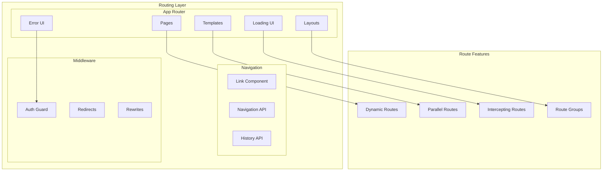

# Routing Architecture

This diagram illustrates our routing implementation using Next.js App Router and related patterns.

## Implementation

Our routing system utilizes several particle components from our [Atomic Design Structure](../components/atomic-design.md#particles):

- Route Guard wrappers for access control
- Layout Context Providers for route-based layouts
- Error Boundary particles for route error handling
- Performance Optimizers for route transitions

## Routing Architecture Diagram



## Route Types

### 1. Static Routes

- Pre-rendered at build time
- Optimal performance
- SEO-friendly content
- Cached responses

### 2. Dynamic Routes

- Generated on-demand
- Parameter-based
- Catch-all routes
- Optional segments

### 3. Parallel Routes

- Simultaneous loading
- Independent navigation
- Shared layouts
- Modal patterns

## Implementation Patterns

### Route Guards

```typescript
// Route guard particle
const RouteGuard = ({ children }: PropsWithChildren) => {
  const { isAuthenticated, loading } = useAuth();
  const router = useRouter();

  useEffect(() => {
    if (!loading && !isAuthenticated) {
      router.push('/login');
    }
  }, [isAuthenticated, loading, router]);

  if (loading) {
    return <LoadingSpinner />;
  }

  return isAuthenticated ? children : null;
};
```

### Layout Context

```typescript
// Layout context provider particle
const LayoutProvider = ({ children }: PropsWithChildren) => {
  const { pathname } = useRouter();
  const layout = useLayoutConfig(pathname);

  return <LayoutContext.Provider value={layout}>{children}</LayoutContext.Provider>;
};
```

### Error Handling

```typescript
// Route error boundary particle
const RouteErrorBoundary = ({ children, fallback }: RouteErrorBoundaryProps) => {
  return (
    <ErrorBoundary
      fallback={fallback}
      onError={(error) => {
        // Log route error
        logRouteError(error);
      }}
    >
      {children}
    </ErrorBoundary>
  );
};
```

## Best Practices

1. **Route Organization**

   - Group related routes
   - Use meaningful names
   - Implement proper nesting
   - Maintain route consistency

2. **Performance**

   - Implement route prefetching
   - Use proper caching
   - Optimize route transitions
   - Handle loading states

3. **Security**
   - Implement route guards
   - Validate parameters
   - Handle unauthorized access
   - Secure sensitive routes

## Related Diagrams

- [Navigation Patterns](./navigation.md)
- [Authentication Flow](../security/authentication.md)
- [Performance Architecture](./performance.md)
