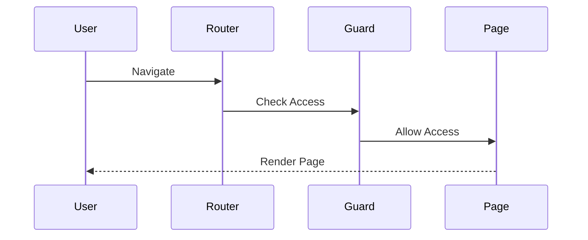
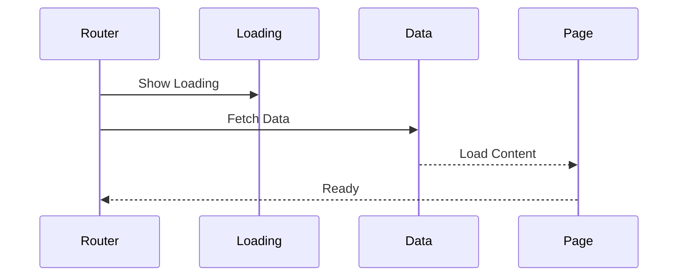
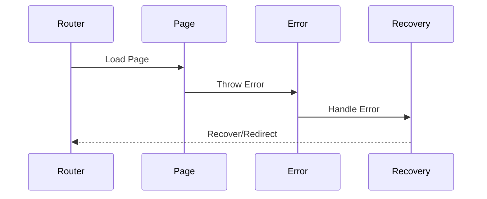
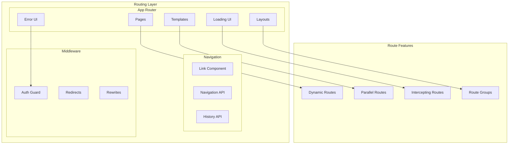

# Routing Architecture

## Overview

The Routing Architecture provides a comprehensive system for managing application navigation and route handling using Next.js App Router. This architecture implements various routing patterns for different use cases while ensuring optimal performance and user experience.

Key Features:
- App router integration
- Dynamic routing
- Route guards
- Parallel routes
- Loading states

Benefits:
- Type-safe routing
- Performance optimization
- Code splitting
- SEO optimization
- User experience

## Components

### Core Components
1. App Router
   - Pages
   - Layouts
   - Templates
   - Loading UI
   - Error UI

2. Navigation
   - Link component
   - Navigation API
   - History API
   - Router hooks

3. Middleware
   - Auth guards
   - Redirects
   - Rewrites
   - Middleware chain

### Route Components
1. Static Routes
   - Pre-rendered pages
   - Static paths
   - Cached content
   - Build optimization

2. Dynamic Routes
   - Parameter routes
   - Catch-all routes
   - Optional segments
   - Query parameters

3. Special Routes
   - Parallel routes
   - Intercepting routes
   - Route groups
   - Modal routes

## Interactions

The routing system follows these key workflows:

1. Navigation Flow


2. Route Loading Flow


3. Error Flow


## Implementation Details

### Router Implementation
```typescript
interface RouteConfig {
  path: string;
  component: ComponentType;
  layout?: ComponentType;
  guard?: RouteGuard;
  loading?: ComponentType;
}

class AppRouter {
  private routes: Map<string, RouteConfig>;
  private guards: RouteGuard[];
  private history: History;
  
  constructor(config: RouterConfig) {
    this.routes = new Map();
    this.guards = [];
    this.history = window.history;
    this.initialize(config);
  }
  
  async navigate(
    to: string,
    options?: NavigateOptions
  ): Promise<boolean> {
    const route = this.matchRoute(to);
    
    if (!route) {
      throw new RouteNotFoundError(to);
    }
    
    if (!(await this.canActivate(route))) {
      return false;
    }
    
    await this.transition(route, options);
    return true;
  }
  
  private async canActivate(
    route: RouteConfig
  ): Promise<boolean> {
    for (const guard of this.guards) {
      if (!(await guard.canActivate(route))) {
        return false;
      }
    }
    return true;
  }
}
```

### Guard Implementation
```typescript
interface GuardConfig {
  rules: GuardRule[];
  fallback: string;
  cache?: boolean;
}

class RouteGuard {
  private config: GuardConfig;
  private cache: GuardCache;
  
  constructor(config: GuardConfig) {
    this.config = config;
    this.cache = new GuardCache();
  }
  
  async canActivate(
    route: RouteConfig
  ): Promise<boolean> {
    const cached = this.cache.get(route.path);
    
    if (this.config.cache && cached !== undefined) {
      return cached;
    }
    
    const result = await this.evaluate(route);
    
    if (this.config.cache) {
      this.cache.set(route.path, result);
    }
    
    return result;
  }
  
  private async evaluate(
    route: RouteConfig
  ): Promise<boolean> {
    for (const rule of this.config.rules) {
      if (!(await rule.evaluate(route))) {
        return false;
      }
    }
    return true;
  }
}
```

### Navigation Manager Implementation
```typescript
interface NavigationConfig {
  mode: NavigationMode;
  scroll: ScrollBehavior;
  timeout: number;
}

class NavigationManager {
  private config: NavigationConfig;
  private router: AppRouter;
  private loader: PageLoader;
  
  constructor(config: NavigationConfig) {
    this.config = config;
    this.router = new AppRouter();
    this.loader = new PageLoader();
  }
  
  async navigateTo(
    path: string,
    options?: NavigateOptions
  ): Promise<void> {
    const route = await this.router.resolveRoute(
      path
    );
    
    await this.startTransition(route);
    
    try {
      await this.loadRoute(route);
      await this.completeTransition(route);
    } catch (error) {
      await this.handleError(error);
    }
  }
  
  private async startTransition(
    route: RouteConfig
  ): Promise<void> {
    if (route.loading) {
      await this.loader.showLoading(route.loading);
    }
    
    await this.updateHistory(route);
  }
}
```

## Implementation

This diagram illustrates our routing implementation using Next.js App Router and related patterns.

## Routing Architecture Diagram



## Route Types

### 1. Static Routes

- Pre-rendered at build time
- Optimal performance
- SEO-friendly content
- Cached responses

### 2. Dynamic Routes

- Generated on-demand
- Parameter-based
- Catch-all routes
- Optional segments

### 3. Parallel Routes

- Simultaneous loading
- Independent navigation
- Shared layouts
- Modal patterns

## Implementation Patterns

### Route Guards

```typescript
// Route guard particle
const RouteGuard = ({ children }: PropsWithChildren) => {
  const { isAuthenticated, loading } = useAuth();
  const router = useRouter();

  useEffect(() => {
    if (!loading && !isAuthenticated) {
      router.push('/login');
    }
  }, [isAuthenticated, loading, router]);

  if (loading) {
    return <LoadingSpinner />;
  }

  return isAuthenticated ? children : null;
};
```

### Layout Context

```typescript
// Layout context provider particle
const LayoutProvider = ({ children }: PropsWithChildren) => {
  const { pathname } = useRouter();
  const layout = useLayoutConfig(pathname);

  return <LayoutContext.Provider value={layout}>{children}</LayoutContext.Provider>;
};
```

### Error Handling

```typescript
// Route error boundary particle
const RouteErrorBoundary = ({ children, fallback }: RouteErrorBoundaryProps) => {
  return (
    <ErrorBoundary
      fallback={fallback}
      onError={(error) => {
        // Log route error
        logRouteError(error);
      }}
    >
      {children}
    </ErrorBoundary>
  );
};
```

## Best Practices

1. **Route Organization**

   - Group related routes
   - Use meaningful names
   - Implement proper nesting
   - Maintain route consistency

2. **Performance**

   - Implement route prefetching
   - Use proper caching
   - Optimize route transitions
   - Handle loading states

3. **Security**
   - Implement route guards
   - Validate parameters
   - Handle unauthorized access
   - Secure sensitive routes

## Related Diagrams

- [Navigation Patterns](./navigation.md)
- [Authentication Flow](../security/authentication.md)
- [Performance Architecture](./performance.md)
